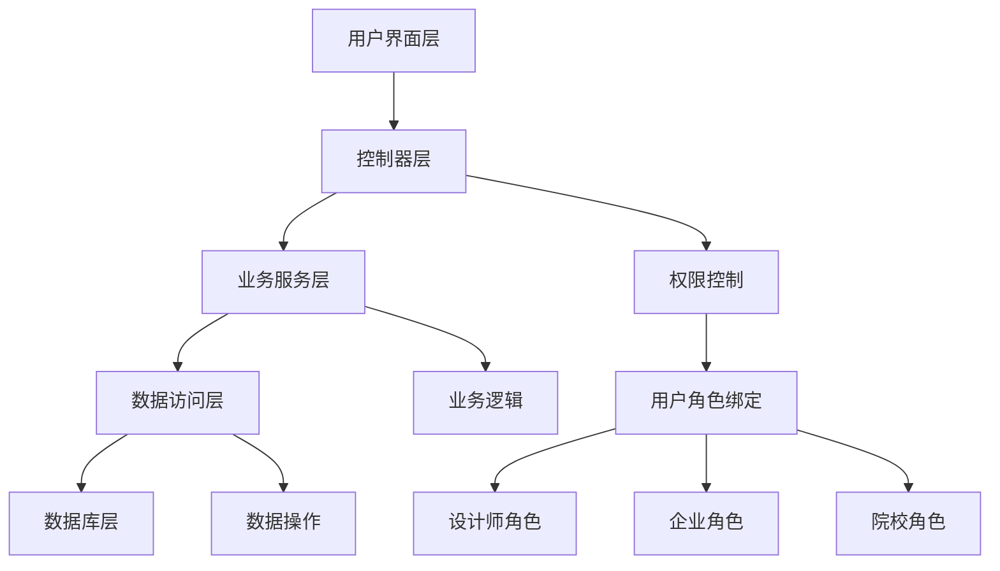

# 设计师管理模块

## 模块简介

设计师管理模块是基于若依框架开发的设计师生态管理系统，支持企业、院校、设计师三方的完整业务流程。该模块已集成用户绑定功能，实现了若依框架的用户系统与设计师、企业、院校实体的无缝关联。

## 功能特性

### 1. 设计师管理
- **职业分类**：支持插画师、交互设计师、品牌设计师、UI设计师等多种职业
- **技能标签**：动效设计、原型设计、角色设计等多样化技能标签
- **作品管理**：支持图片和视频作品上传、展示
- **身份管理**：支持学生、企业员工、独立设计师等不同身份

### 2. 院校管理
- **学生管理**：院校可以管理在校学生信息
- **就业统计**：查看毕业生就业数据和企业分布
- **毕业跟踪**：跟踪毕业生的职业发展轨迹

### 3. 企业管理
- **岗位发布**：企业可以发布设计师招聘岗位
- **人才筛选**：根据职业和技能要求筛选合适的设计师
- **申请处理**：处理设计师的岗位申请

### 4. 岗位招聘系统
- **岗位发布**：企业发布招聘需求
- **智能匹配**：根据职业和技能进行智能匹配
- **申请管理**：设计师申请岗位，企业处理申请

### 5. 用户绑定系统
- **多身份支持**：用户可以同时拥有设计师、企业、院校等多种身份
- **权限隔离**：不同角色的用户只能访问其权限范围内的数据
- **自动绑定**：系统自动维护用户与实体的绑定关系
- **灵活注册**：提供分角色的用户注册流程

## 数据库设计

### 核心表结构

1. **des_enterprise** - 企业信息表
2. **des_school** - 院校信息表
3. **des_designer** - 设计师信息表
4. **des_work** - 设计师作品表
5. **des_job_posting** - 岗位招聘表
6. **des_job_application** - 岗位申请表
7. **des_user_binding** - 用户绑定关系表
8. **des_user_type** - 用户类型枚举表

### 用户绑定设计

#### 表结构修改
```sql
-- 为现有表添加用户ID字段
ALTER TABLE `des_enterprise` ADD COLUMN `user_id` BIGINT COMMENT '关联用户ID';
ALTER TABLE `des_school` ADD COLUMN `user_id` BIGINT COMMENT '关联用户ID';
ALTER TABLE `des_designer` ADD COLUMN `user_id` BIGINT COMMENT '关联用户ID';
```

#### 新增角色
- 设计师角色 (`designer`) - 个人设计师用户，数据范围仅本人
- 企业管理员角色 (`enterprise`) - 企业管理员，数据范围自定义
- 院校管理员角色 (`school`) - 院校管理员，数据范围自定义

### 关系设计

- 设计师可以属于院校（学生身份）
- 设计师可以属于企业（员工身份）
- 设计师可以独立存在（自由职业者）
- 企业可以发布多个岗位
- 设计师可以申请多个岗位
- 用户可以绑定多种身份（通过绑定关系表管理）

## API接口

### 设计师管理接口

```
GET    /designer/designer/list           # 查询设计师列表
GET    /designer/designer/{id}           # 获取设计师详情
POST   /designer/designer                # 新增设计师
PUT    /designer/designer                # 修改设计师
DELETE /designer/designer/{ids}          # 删除设计师
GET    /designer/designer/profession/{profession}  # 按职业查询
GET    /designer/designer/skills         # 按技能查询
GET    /designer/designer/professions    # 获取职业选项
GET    /designer/designer/skillTags      # 获取技能标签选项
```

### 院校管理接口

```
GET    /designer/school/list             # 查询院校列表
GET    /designer/school/{id}             # 获取院校详情
POST   /designer/school                  # 新增院校
PUT    /designer/school                  # 修改院校
DELETE /designer/school/{ids}            # 删除院校
GET    /designer/school/{id}/employment/statistics    # 就业统计
GET    /designer/school/{id}/employment/distribution  # 就业分布
```

### 企业管理接口

```
GET    /designer/enterprise/list         # 查询企业列表
GET    /designer/enterprise/{id}         # 获取企业详情
POST   /designer/enterprise              # 新增企业
PUT    /designer/enterprise              # 修改企业
DELETE /designer/enterprise/{ids}        # 删除企业
GET    /designer/enterprise/user/{userId} # 根据用户ID查询企业
```

### 岗位招聘接口

```
GET    /designer/job/list                # 查询岗位列表
GET    /designer/job/{id}                # 获取岗位详情
POST   /designer/job                     # 发布岗位
PUT    /designer/job                     # 修改岗位
DELETE /designer/job/{ids}               # 删除岗位
GET    /designer/job/enterprise/{id}     # 企业岗位查询
GET    /designer/job/profession/{profession}  # 按职业查询岗位
GET    /designer/job/skills              # 按技能查询岗位（精确匹配）
GET    /designer/job/skills-any          # 按技能查询岗位（任意匹配）
```

### 岗位申请接口

```
GET    /designer/application/list        # 查询申请列表
GET    /designer/application/{id}        # 获取申请详情
POST   /designer/application/apply       # 申请岗位
PUT    /designer/application/process     # 处理申请
PUT    /designer/application/withdraw    # 撤回申请
GET    /designer/application/job/{id}    # 岗位的申请列表
GET    /designer/application/designer/{id} # 设计师的申请列表
```

### 用户注册绑定接口

```
POST   /designer/user/register/designer  # 注册设计师身份
POST   /designer/user/register/enterprise # 注册企业身份
POST   /designer/user/register/school    # 注册院校身份
GET    /designer/user/bindings           # 获取用户绑定信息
GET    /designer/user/designer/profile   # 获取设计师档案
GET    /designer/user/enterprise/profile # 获取企业档案
GET    /designer/user/school/profile     # 获取院校档案
PUT    /designer/user/unbind/{entityType} # 解绑身份
POST   /designer/user/bind               # 管理员绑定用户实体
GET    /designer/user/available/enterprises # 查看可绑定的企业列表
POST   /designer/user/bind/enterprise    # 绑定到指定企业
GET    /designer/user/available/schools  # 查看可绑定的院校列表
POST   /designer/user/bind/school        # 绑定到指定院校
```

## 使用方法

### 1. 用户注册流程

#### 注册设计师身份
```bash
POST /designer/user/register/designer
Content-Type: application/json

{
    "designerName": "张三",
    "profession": "UI_DESIGNER",
    "email": "zhangsan@example.com",
    "phone": "13800138000",
    "skillTags": "[\"PROTOTYPE_DESIGN\", \"VISUAL_DESIGN\"]",
    "description": "专业UI设计师"
}
```

#### 注册企业身份
```bash
POST /designer/user/register/enterprise
Content-Type: application/json

{
    "enterpriseName": "科技有限公司",
    "description": "专注于互联网产品设计",
    "industry": "互联网",
    "scale": "100-500人",
    "address": "北京市朝阳区",
    "email": "hr@example.com",
    "phone": "010-12345678"
}
```

**注意：企业名称必须唯一，系统会自动检查重名并拒绝重复的企业名称。**

#### 注册院校身份
```bash
POST /designer/user/register/school
Content-Type: application/json

{
    "schoolName": "设计学院",
    "schoolType": "UNIVERSITY",
    "level": "本科",
    "address": "上海市浦东新区",
    "description": "知名设计院校"
}
```

**注意：院校名称必须唯一，系统会自动检查重名并拒绝重复的院校名称。**

#### 绑定已有企业
```bash
# 查看可绑定的企业列表
GET /designer/user/available/enterprises?pageNum=1&pageSize=10&enterpriseName=科技

# 绑定到指定企业
POST /designer/user/bind/enterprise?enterpriseId=1&inviteCode=INVITE123
```

#### 绑定已有院校
```bash
# 查看可绑定的院校列表
GET /designer/user/available/schools?pageNum=1&pageSize=10&schoolName=设计

# 绑定到指定院校
POST /designer/user/bind/school?schoolId=1&studentId=2020001234
```

### 2. 用户档案查询

#### 获取当前用户绑定信息
```bash
GET /designer/user/bindings
```

#### 获取设计师档案
```bash
GET /designer/user/designer/profile
```

#### 获取企业档案
```bash
GET /designer/user/enterprise/profile
```

#### 获取院校档案
```bash
GET /designer/user/school/profile
```

### 3. 权限控制

#### 使用权限工具类
```java
@Autowired
private DesignerPermissionUtils permissionUtils;

public void someMethod() {
    // 检查是否为设计师
    if (permissionUtils.isDesigner()) {
        // 设计师相关操作
    }

    // 检查是否为企业用户
    if (permissionUtils.isEnterprise()) {
        // 企业相关操作
    }

    // 检查是否为院校用户
    if (permissionUtils.isSchool()) {
        // 院校相关操作
    }

    // 获取当前用户的设计师ID
    Long designerId = permissionUtils.getCurrentDesignerId();

    // 检查用户权限
    if (permissionUtils.hasDesignerPermission(designerId)) {
        // 有权限操作该设计师信息
    }
}
```

#### 在Controller中使用权限注解
```java
@SaCheckPermission("designer:designer:edit")
@PutMapping("/{designerId}")
public R<Void> updateDesigner(@PathVariable Long designerId,
                              @RequestBody Designer designer) {
    // 检查用户是否有权限编辑该设计师
    if (!permissionUtils.hasDesignerPermission(designerId)) {
        return R.fail("无权限操作");
    }

    return toAjax(designerService.updateDesigner(designer));
}
```

### 4. 技能查询接口使用

#### 技能查询逻辑对比
```bash
# 精确匹配查询（交集查询 - AND逻辑）
# 要求岗位必须同时包含所有指定技能
GET /designer/job/skills?skillTags=PROTOTYPE_DESIGN,VISUAL_DESIGN

# 任意匹配查询（并集查询 - OR逻辑）
# 要求岗位包含任意一个指定技能即可
GET /designer/job/skills-any?skillTags=PROTOTYPE_DESIGN,VISUAL_DESIGN
```

#### 支持的技能标签
- **动效设计**: ANIMATION_DESIGN
- **原型设计**: PROTOTYPE_DESIGN
- **角色设计**: CHARACTER_DESIGN
- **视觉设计**: VISUAL_DESIGN
- **用户界面设计**: USER_INTERFACE_DESIGN
- **用户体验设计**: USER_EXPERIENCE_DESIGN
- **平面设计**: GRAPHIC_DESIGN
- **品牌设计**: BRANDING_DESIGN
- **插画**: ILLUSTRATION
- **网页设计**: WEB_DESIGN
- **移动设计**: MOBILE_DESIGN
- **印刷设计**: PRINT_DESIGN

#### 使用场景

**宽松技能匹配**：
```bash
# 查找具备UI、UX或视觉设计任意一种技能的岗位
GET /designer/job/skills-any?skillTags=USER_INTERFACE_DESIGN,USER_EXPERIENCE_DESIGN,VISUAL_DESIGN
```

**扩大搜索范围**：
```bash
# 当精确匹配结果太少时，使用任意匹配扩大搜索范围
GET /designer/job/skills-any?skillTags=PROTOTYPE_DESIGN,ANIMATION_DESIGN
```

**相关技能探索**：
```bash
# 查找Web相关的设计岗位
GET /designer/job/skills-any?skillTags=WEB_DESIGN,MOBILE_DESIGN,USER_INTERFACE_DESIGN
```

### 5. 数据过滤

#### 基于用户绑定的数据查询
```java
public List<Designer> getMyDesigners() {
    Long userId = LoginHelper.getUserId();

    if (permissionUtils.isSchool()) {
        // 院校用户查看本校设计师
        Long schoolId = permissionUtils.getCurrentSchoolId();
        return designerService.selectDesignersBySchool(schoolId);
    } else if (permissionUtils.isEnterprise()) {
        // 企业用户查看本企业设计师
        Long enterpriseId = permissionUtils.getCurrentEnterpriseId();
        return designerService.selectDesignersByEnterprise(enterpriseId);
    } else if (permissionUtils.isDesigner()) {
        // 设计师查看自己的信息
        Long designerId = permissionUtils.getCurrentDesignerId();
        return Arrays.asList(designerService.selectDesignerById(designerId));
    }

    return Collections.emptyList();
}
```

## 业务流程

### 1. 设计师注册流程
1. 用户注册系统账号
2. 通过注册接口创建设计师身份并绑定到用户
3. 选择职业类型（只能选择一种）
4. 选择技能标签（可以选择多个）
5. 可选择关联院校或企业
6. 上传作品展示

### 2. 企业招聘流程
1. 用户注册系统账号
2. 通过注册接口创建企业身份并绑定到用户
3. 完善企业信息
4. 发布岗位需求，设置职业和技能要求
5. 系统根据要求推荐合适的设计师
6. 查看设计师申请并进行筛选
7. 处理申请（通过/拒绝）并给出反馈

### 3. 院校管理流程
1. 用户注册系统账号
2. 通过注册接口创建院校身份并绑定到用户
3. 完善院校信息
4. 管理在校学生信息
5. 跟踪毕业生就业情况
6. 查看就业统计数据和企业分布

## 权限设计

### 权限码规范
- `designer:designer:*` - 设计师管理权限
- `designer:school:*` - 院校管理权限
- `designer:enterprise:*` - 企业管理权限
- `designer:job:*` - 岗位管理权限
- `designer:application:*` - 申请管理权限
- `designer:user:*` - 用户绑定管理权限

### 角色权限
- **系统管理员**：拥有所有权限
- **企业管理员**：管理本企业岗位和申请
- **院校管理员**：管理本院校学生和就业数据
- **设计师**：管理个人信息和申请岗位

### 用户绑定机制
1. 每个系统用户可以绑定到设计师、企业或院校实体
2. 通过 `des_user_binding` 表管理绑定关系
3. 支持一个用户绑定多种身份（如设计师同时是企业员工）
4. 自动维护用户权限和数据访问范围

### 权限矩阵

| 操作 | 系统管理员 | 设计师 | 企业管理员 | 院校管理员 |
|------|------------|---------|------------|------------|
| 查看所有设计师 | ✓ | ✗ | ✓(公开信息) | ✓(本校) |
| 编辑设计师信息 | ✓ | ✓(自己) | ✗ | ✗ |
| 发布岗位 | ✓ | ✗ | ✓ | ✗ |
| 申请岗位 | ✓ | ✓ | ✗ | ✗ |
| 处理申请 | ✓ | ✗ | ✓ | ✗ |
| 查看就业统计 | ✓ | ✗ | ✗ | ✓ |
| 管理企业信息 | ✓ | ✗ | ✓(自己) | ✗ |
| 管理院校信息 | ✓ | ✗ | ✗ | ✓(自己) |

## 部署说明

### 1. 数据库初始化
执行以下SQL文件创建相关表结构和初始数据：
- `script/sql/designer_tables.sql` - 基础表结构
- `script/sql/designer_user_binding.sql` - 用户绑定相关表和角色
- `script/sql/designer_user_binding_safe.sql` - 安全更新脚本（推荐）

### 2. 模块配置
确保在主应用的 `pom.xml` 中包含了 `ruoyi-designer` 模块依赖。

### 3. 权限配置
在系统管理中配置相应的菜单和权限。

### 4. 验证安装
执行安全脚本后，检查以下内容：
```sql
-- 检查必需的角色
SELECT role_id, role_name, role_key FROM sys_role
WHERE role_key IN ('designer', 'enterprise', 'school');

-- 检查用户绑定表
SHOW TABLES LIKE 'des_user_binding';

-- 检查字段是否添加
SHOW COLUMNS FROM des_designer LIKE 'user_id';
```

## 系统架构

### 代码结构

#### 新增实体类
- `UserBinding` - 用户绑定关系实体
- `UserEntityType` - 用户实体类型枚举
- `UserProfileVo` - 用户档案视图对象

#### 新增服务
- `IUserBindingService` - 用户绑定服务接口
- `UserBindingServiceImpl` - 用户绑定服务实现
- `IEnterpriseService` - 企业服务接口
- `EnterpriseServiceImpl` - 企业服务实现

#### 新增控制器
- `UserRegistrationController` - 用户注册绑定控制器
- `EnterpriseController` - 企业管理控制器

#### 工具类
- `DesignerPermissionUtils` - 权限控制工具类

### 架构图



## 注意事项

1. **唯一性约束**：每个用户在同一实体类型下只能有一个绑定关系
2. **名称唯一性**：企业名称和院校名称在系统中必须唯一，注册时会自动检查重名
3. **数据一致性**：删除用户时需要处理相关绑定关系
4. **权限继承**：用户的权限由其绑定的角色决定
5. **多身份支持**：用户可以同时绑定多种身份（如设计师 + 企业员工）
6. **数据隔离**：不同角色的用户只能访问其权限范围内的数据
7. 数据库需要支持 JSON 类型字段
8. 建议使用 MySQL 8.0 以上版本
9. 技能标签和社交链接采用 JSON 格式存储
10. 文件上传需要配置 OSS 存储服务
11. 定期清理过期的岗位和申请记录

## 扩展功能

### 1. 作品评分系统
- 设计师作品可以被评分和评论
- 建立作品质量评估体系

### 2. 技能认证系统
- 引入技能认证机制
- 与外部认证机构对接

### 3. 推荐算法优化
- 基于机器学习的人才推荐
- 岗位匹配度算法优化

### 4. 数据分析功能
- 就业趋势分析
- 薪资水平统计
- 技能需求分析

### 5. 用户系统扩展
- **SSO集成**：与企业SSO系统集成，实现统一登录
- **多租户支持**：基于租户隔离不同机构的数据
- **角色模板**：为不同类型的用户提供预设的权限模板
- **审批流程**：新用户注册需要管理员审批
- **数据同步**：与HR系统或学籍系统同步用户信息

## 技术栈

- **后端框架**：Spring Boot + MyBatis-Plus
- **数据库**：MySQL 8.0+
- **权限管理**：Sa-Token
- **文档工具**：Knife4j
- **工具库**：Hutool、Lombok

## 故障排除

如果在部署过程中遇到问题，请参考：
- `TROUBLESHOOTING.md` - 详细的故障排除指南
- 常见问题包括：重复索引错误、角色创建失败、权限检查失败等

## 开发团队

本模块基于若依框架开发，整合了用户绑定系统，提供了完整的设计师生态管理解决方案。
