# 设计师管理模块

## 模块简介

设计师管理模块是基于若依框架开发的设计师生态管理系统，支持企业、院校、设计师三方的完整业务流程。该模块已集成用户绑定功能，实现了若依框架的用户系统与设计师、企业、院校实体的无缝关联。

## 功能特性

### 1. 设计师管理
- **职业分类**：支持插画师、交互设计师、品牌设计师、UI设计师等多种职业
- **技能标签**：动效设计、原型设计、角色设计等多样化技能标签
- **作品管理**：支持图片和视频作品上传、展示
- **身份管理**：支持学生、企业员工、独立设计师等不同身份

### 2. 院校管理
- **学生管理**：院校可以管理在校学生信息
- **就业统计**：查看毕业生就业数据和企业分布
- **毕业跟踪**：跟踪毕业生的职业发展轨迹

### 3. 企业管理
- **岗位发布**：企业可以发布设计师招聘岗位
- **人才筛选**：根据职业和技能要求筛选合适的设计师
- **申请处理**：处理设计师的岗位申请

### 4. 岗位招聘系统
- **岗位发布**：企业发布招聘需求
- **智能匹配**：根据职业和技能进行智能匹配
- **申请管理**：设计师申请岗位，企业处理申请

### 5. 用户绑定系统
- **多身份支持**：用户可以同时拥有设计师、企业、院校等多种身份
- **权限隔离**：不同角色的用户只能访问其权限范围内的数据
- **自动绑定**：系统自动维护用户与实体的绑定关系
- **灵活注册**：提供分角色的用户注册流程

## 数据库设计

### 核心表结构

1. **des_enterprise** - 企业信息表
2. **des_school** - 院校信息表
3. **des_designer** - 设计师信息表
4. **des_work** - 设计师作品表
5. **des_job_posting** - 岗位招聘表
6. **des_job_application** - 岗位申请表
7. **des_user_binding** - 用户绑定关系表
8. **des_user_type** - 用户类型枚举表

### 用户绑定设计

#### 表结构修改
```sql
-- 为现有表添加用户ID字段
ALTER TABLE `des_enterprise` ADD COLUMN `user_id` BIGINT COMMENT '关联用户ID';
ALTER TABLE `des_school` ADD COLUMN `user_id` BIGINT COMMENT '关联用户ID';
ALTER TABLE `des_designer` ADD COLUMN `user_id` BIGINT COMMENT '关联用户ID';
```

#### 新增角色
- 设计师角色 (`designer`) - 个人设计师用户，数据范围仅本人
- 企业管理员角色 (`enterprise`) - 企业管理员，数据范围自定义
- 院校管理员角色 (`school`) - 院校管理员，数据范围自定义

### 关系设计

- 设计师可以属于院校（学生身份）
- 设计师可以属于企业（员工身份）
- 设计师可以独立存在（自由职业者）
- 企业可以发布多个岗位
- 设计师可以申请多个岗位
- 用户可以绑定多种身份（通过绑定关系表管理）

## 数据结构定义

### 院校相关数据结构

#### 基础院校信息
```typescript
interface School {
  id: number
  schoolName: string
  schoolType: 'COMPREHENSIVE' | 'ART' | 'ENGINEERING' | 'NORMAL' | 'FINANCE'
  location: string
  province: string
  city: string
  level: 'UNDERGRADUATE' | 'GRADUATE' | 'VOCATIONAL'
  ranking: number
  description: string
  logo: string
  website: string
  address: string
  phone: string
  email: string
  totalStudents: number
  totalTeachers: number
  facultyCount: number
  majorCount: number
  status: 'ACTIVE' | 'INACTIVE'
  isKey: boolean
  is985: boolean
  is211: boolean
  isDoubleFirst: boolean
  createdAt: string
  updatedAt: string
}
```

#### 专业分类数据
```typescript
interface MajorCategoryData {
  name: string        // 专业名称，如"信息艺术设计"
  icon: string        // 图标，如"ri-computer-line"
  description: string // 专业描述
  skills: string[]    // 技能列表
}
```

#### 课程体系数据
```typescript
interface CourseGroup {
  name: string      // 课程组名称，如"通识基础课程"
  courses: string[] // 课程列表
}
```

#### 师资统计数据
```typescript
interface FacultyStatsData {
  totalFaculty: number      // 师资总数
  professors: number        // 教授人数
  doctorDegree: number      // 博士学位人数
  overseasBackground: number // 海外背景人数
  description: string       // 师资描述
}

interface TeacherData {
  id: number          // 教师ID
  name: string        // 教师姓名
  title: string       // 职称
  expertise: string[] // 专业领域
  description: string // 教师描述
}
```

#### 就业统计数据
```typescript
interface EmploymentStatsData {
  employmentRate: string       // 就业率，如"96.8%"
  averageSalary: string        // 平均薪资，如"18.5K"
  furtherStudyRate: string     // 深造率，如"38.2%"
  overseasEmploymentRate: string // 海外就业率，如"22.1%"
  description: string          // 就业描述
}

interface EmployerData {
  id: number      // 雇主ID
  name: string    // 雇主名称
  industry: string // 行业类型
}

interface ChartData {
  industryData: Array<{
    value: number                    // 数值
    name: string                     // 行业名称
  }>
  salaryData: number[]               // 薪资分布数据
  salaryLabels: string[]             // 薪资区间标签
}
```

#### 学生成果数据
```typescript
interface AchievementStatsData {
  internationalAwards: number // 国际奖项数量
  nationalAwards: number      // 国家级奖项数量
  provincialAwards: number    // 省级奖项数量
  patents: number             // 专利数量
  description: string         // 成果描述
}

interface TrendData {
  years: string[]            // 年份数组
  internationalData: number[] // 国际奖项数据
  nationalData: number[]      // 国家级奖项数据
  provincialData: number[]    // 省级奖项数据
}

interface AwardWorkData {
  id: number          // 作品ID
  title: string       // 作品标题
  award: string       // 奖项名称
  description: string // 作品描述
}
```

#### 卡片统计数据
```typescript
interface SchoolCardStatsData {
  employmentRates: string[]                           // 就业率数组
  facultyStrengths: string[]                          // 师资力量评分数组
  studentScores: string[]                             // 学生评分数组
  advantagePrograms: Record<string, string[]>         // 优势专业按院校类型分类
}
```

#### 综合数据结构
```typescript
interface SchoolFullInfo {
  basicInfo: School                      // 基础院校信息
  majorCategories: MajorCategoryData[]   // 专业分类数据
  courseSystem: CourseGroup[]            // 课程体系数据
  facultyStats: FacultyStatsData         // 师资统计数据
  facultyMembers: TeacherData[]          // 代表性教师数据
  employmentStats: EmploymentStatsData   // 就业统计数据
  employers: EmployerData[]              // 代表性雇主数据
  chartData: ChartData                   // 图表数据
  achievementStats: AchievementStatsData // 学生成果统计
  trendData: TrendData                   // 获奖趋势数据
  awardWorks: AwardWorkData[]            // 获奖作品数据
  cardStats: SchoolCardStatsData         // 卡片统计数据
}
```

#### 设计师完整详情数据结构
```typescript
interface DesignerCompleteInfo {
  designer: Designer                    // 设计师基本信息
  works: Work[]                        // 设计师作品集
  workExperience: WorkExperience[]     // 工作经历列表
  education: Education[]               // 教育背景列表
  awards: Award[]                      // 获奖记录列表
}

interface Designer {
  id: number
  designerName: string
  profession: string
  email: string
  phone: string
  skillTags: string
  description: string
  avatar: string
  location: string
  experience: number
  workStatus: string
  company: string
  // ... 其他设计师字段
}

interface Work {
  id: number
  title: string
  description: string
  imageUrl: string
  category: string
  designerId: number
  // ... 其他作品字段
}

interface WorkExperience {
  id: number
  company: string
  position: string
  startDate: string
  endDate: string | null
  description: string
  isCurrent: boolean
  designerId: number
  // ... 其他工作经历字段
}

interface Education {
  id: number
  school: string
  degree: string
  major: string
  startDate: string
  endDate: string
  description: string
  designerId: number
  // ... 其他教育背景字段
}

interface Award {
  id: number
  title: string
  organization: string
  year: string
  description: string
  designerId: number
  level: string
  category: string
  // ... 其他获奖字段
}
```

#### 标准响应格式
```typescript
interface ApiResponse<T> {
  code: number    // 状态码，200表示成功
  msg: string     // 响应消息
  data: T         // 响应数据
}

interface SchoolListResponse {
  total: number
  rows: School[]
}
```

## API接口

### 设计师管理接口

#### 基础设计师管理接口
```
GET    /designer/designer/list           # 查询设计师列表
GET    /designer/designer/{id}           # 获取设计师详情
GET    /designer/designer/{id}/complete  # 获取设计师完整详情（聚合API）
POST   /designer/designer                # 新增设计师
PUT    /designer/designer                # 修改设计师
DELETE /designer/designer/{ids}          # 删除设计师
```

#### 设计师查询接口
```
GET    /designer/designer/profession/{profession}  # 按职业查询
GET    /designer/designer/skills         # 按技能查询
GET    /designer/designer/professions    # 获取职业选项
GET    /designer/designer/skillTags      # 获取技能标签选项
```

### 院校管理接口

#### 基础院校管理接口
```
GET    /designer/school/list             # 查询院校列表
GET    /designer/school/{id}             # 获取院校详情
POST   /designer/school                  # 新增院校
PUT    /designer/school                  # 修改院校
DELETE /designer/school/{ids}            # 删除院校
GET    /designer/school/user/{userId}    # 根据用户ID查询院校
GET    /designer/school/{id}/full-info   # 获取院校完整信息
```

#### 院校专业与课程接口
```
GET    /designer/school/{id}/major-categories  # 获取院校专业分类
GET    /designer/school/{id}/course-system     # 获取院校课程体系
GET    /designer/school/{id}/majors            # 查询院校专业列表
```

#### 师资管理接口
```
GET    /designer/school/{id}/faculty-stats     # 获取院校师资统计
GET    /designer/school/{id}/faculty-members   # 获取院校代表性教师
```

#### 就业统计接口
```
GET    /designer/school/{id}/employment-stats      # 获取院校就业统计
GET    /designer/school/{id}/employment/statistics # 就业统计（原有接口）
GET    /designer/school/{id}/employment/distribution # 就业分布（原有接口）
GET    /designer/school/{id}/employment-charts     # 获取院校就业图表数据
GET    /designer/school/{id}/employers             # 获取院校代表性雇主
```

#### 学生管理接口
```
GET    /designer/school/{id}/students          # 查询院校学生列表
```

#### 学生成果接口
```
GET    /designer/school/{id}/achievement-stats # 获取院校学生成果统计
GET    /designer/school/{id}/award-trends      # 获取院校获奖趋势数据
GET    /designer/school/{id}/award-works       # 获取院校获奖作品
GET    /designer/school/{id}/achievements      # 查询院校获奖成果（原有接口）
```

#### 院校展示数据接口
```
GET    /designer/school/{id}/card-stats        # 获取院校卡片统计数据
```

#### 格式化数据接口
```
GET    /designer/school/{id}/formatted/employment-rate     # 获取格式化就业率
GET    /designer/school/{id}/formatted/faculty-strength    # 获取格式化师资力量评分
GET    /designer/school/{id}/formatted/student-score       # 获取格式化学生评分
GET    /designer/school/{id}/formatted/advantage-programs  # 获取格式化优势专业
```

#### 院校收藏接口
```
POST   /designer/school/{id}/favorite    # 收藏院校
DELETE /designer/school/{id}/favorite    # 取消收藏院校
GET    /designer/school/favorites        # 获取我的收藏院校
```

### 企业管理接口

```
GET    /designer/enterprise/list         # 查询企业列表
GET    /designer/enterprise/{id}         # 获取企业详情
POST   /designer/enterprise              # 新增企业
PUT    /designer/enterprise              # 修改企业
DELETE /designer/enterprise/{ids}        # 删除企业
GET    /designer/enterprise/user/{userId} # 根据用户ID查询企业
```

### 岗位招聘接口

#### 基础岗位管理接口
```
GET    /designer/job/list                # 查询岗位列表
GET    /designer/job/{id}                # 获取岗位详情
POST   /designer/job                     # 发布岗位
PUT    /designer/job                     # 修改岗位
DELETE /designer/job/{ids}               # 删除岗位
```

#### 岗位查询接口
```
GET    /designer/job/enterprise/{id}     # 企业岗位查询
GET    /designer/job/profession/{profession}  # 按职业查询岗位
GET    /designer/job/skills              # 按技能查询岗位（精确匹配）
GET    /designer/job/skills-any          # 按技能查询岗位（任意匹配）
```

### 岗位申请接口

```
GET    /designer/application/list        # 查询申请列表
GET    /designer/application/{id}        # 获取申请详情
POST   /designer/application/apply       # 申请岗位
PUT    /designer/application/process     # 处理申请
PUT    /designer/application/withdraw    # 撤回申请
GET    /designer/application/job/{id}    # 岗位的申请列表
GET    /designer/application/designer/{id} # 设计师的申请列表
```

### 设计师作品管理接口

```
GET    /designer/work/list               # 查询作品列表
GET    /designer/work/{id}               # 获取作品详情
POST   /designer/work                    # 新增作品
PUT    /designer/work                    # 修改作品
DELETE /designer/work/{ids}              # 删除作品
GET    /designer/work/designer/{id}      # 查询设计师作品列表
PUT    /designer/work/{id}/featured      # 设置代表作品
```

### 工作经历管理接口

```
GET    /designer/work-experience/list    # 查询工作经历列表
GET    /designer/work-experience/{id}    # 获取工作经历详情
POST   /designer/work-experience         # 新增工作经历
PUT    /designer/work-experience         # 修改工作经历
DELETE /designer/work-experience/{ids}   # 删除工作经历
GET    /designer/work-experience/designer/{id} # 查询设计师工作经历
PUT    /designer/work-experience/{id}/current  # 设置当前工作
```

### 教育背景管理接口

```
GET    /designer/education/list          # 查询教育背景列表
GET    /designer/education/{id}          # 获取教育背景详情
POST   /designer/education               # 新增教育背景
PUT    /designer/education               # 修改教育背景
DELETE /designer/education/{ids}         # 删除教育背景
GET    /designer/education/designer/{id} # 查询设计师教育背景
```

### 获奖记录管理接口

```
GET    /designer/award/list              # 查询获奖记录列表
GET    /designer/award/{id}              # 获取获奖记录详情
POST   /designer/award                   # 新增获奖记录
PUT    /designer/award                   # 修改获奖记录
DELETE /designer/award/{ids}             # 删除获奖记录
GET    /designer/award/designer/{id}     # 查询设计师获奖记录
PUT    /designer/award/{id}/sort         # 调整获奖记录排序
```

### 用户注册绑定接口

#### 用户注册接口
```
POST   /designer/user/register/designer  # 注册设计师身份
POST   /designer/user/register/enterprise # 注册企业身份
POST   /designer/user/register/school    # 注册院校身份
```

#### 用户绑定管理接口
```
GET    /designer/user/bindings           # 获取用户绑定信息
GET    /designer/user/designer/profile   # 获取设计师档案
GET    /designer/user/enterprise/profile # 获取企业档案
GET    /designer/user/school/profile     # 获取院校档案
PUT    /designer/user/unbind/{entityType} # 解绑身份
POST   /designer/user/bind               # 管理员绑定用户实体
```

#### 绑定已有实体接口
```
GET    /designer/user/available/enterprises  # 查看可绑定的企业列表
POST   /designer/user/bind/enterprise        # 绑定到指定企业
GET    /designer/user/available/schools      # 查看可绑定的院校列表
POST   /designer/user/bind/school            # 绑定到指定院校
```

## 使用方法

### 1. 用户注册流程

#### 注册设计师身份
```bash
POST /designer/user/register/designer
Content-Type: application/json

{
    "designerName": "张三",
    "profession": "UI_DESIGNER",
    "email": "zhangsan@example.com",
    "phone": "13800138000",
    "skillTags": "[\"PROTOTYPE_DESIGN\", \"VISUAL_DESIGN\"]",
    "description": "专业UI设计师"
}
```

#### 注册企业身份
```bash
POST /designer/user/register/enterprise
Content-Type: application/json

{
    "enterpriseName": "科技有限公司",
    "description": "专注于互联网产品设计",
    "industry": "互联网",
    "scale": "100-500人",
    "address": "北京市朝阳区",
    "email": "hr@example.com",
    "phone": "010-12345678"
}
```

**注意：企业名称必须唯一，系统会自动检查重名并拒绝重复的企业名称。**

#### 注册院校身份
```bash
POST /designer/user/register/school
Content-Type: application/json

{
    "schoolName": "设计学院",
    "schoolType": "UNIVERSITY",
    "level": "本科",
    "address": "上海市浦东新区",
    "description": "知名设计院校"
}
```

**注意：院校名称必须唯一，系统会自动检查重名并拒绝重复的院校名称。**

### 2. 用户档案查询

#### 获取当前用户绑定信息
```bash
GET /designer/user/bindings
```

#### 获取设计师档案
```bash
GET /designer/user/designer/profile
```

#### 获取企业档案
```bash
GET /designer/user/enterprise/profile
```

#### 获取院校档案
```bash
GET /designer/user/school/profile
```

### 3. 绑定已有实体

#### 绑定已有企业
```bash
# 1. 查看可绑定的企业列表
GET /designer/user/available/enterprises?pageNum=1&pageSize=10&enterpriseName=科技

# 2. 绑定到指定企业
POST /designer/user/bind/enterprise?enterpriseId=1&inviteCode=INVITE123
```

**企业绑定参数**:
- `enterpriseId` (必须): 企业ID
- `inviteCode` (可选): 企业邀请码

#### 绑定已有院校
```bash
# 1. 查看可绑定的院校列表
GET /designer/user/available/schools?pageNum=1&pageSize=10&schoolName=设计

# 2. 绑定到指定院校
POST /designer/user/bind/school?schoolId=1&studentId=2020001234
```

**院校绑定参数**:
- `schoolId` (必须): 院校ID
- `studentId` (可选): 学号

#### 绑定限制说明
- 每个用户在同一实体类型下只能绑定一个实体
- 如需切换绑定，必须先解绑当前实体
- 解绑操作：
  ```bash
  # 解绑企业身份
  PUT /designer/user/unbind/enterprise

  # 解绑院校身份
  PUT /designer/user/unbind/school
  ```

#### 管理员绑定接口
```bash
# 管理员为任意用户绑定实体
POST /designer/user/bind?userId=123&entityType=enterprise&entityId=1
```

**管理员绑定参数**:
- `userId` (必须): 用户ID
- `entityType` (必须): 实体类型 (`designer`/`enterprise`/`school`)
- `entityId` (必须): 实体ID

### 4. 设计师档案管理

#### 获取设计师完整详情（聚合API）
```bash
# 获取设计师完整信息（包含基本信息、作品、工作经历、教育背景、获奖记录）
GET /designer/designer/1/complete
```

**响应示例**:
```json
{
  "code": 200,
  "msg": "操作成功",
  "data": {
    "designer": {
      "id": 1,
      "designerName": "张雨",
      "profession": "UI_UX_DESIGNER",
      "email": "zhangyu@example.com",
      "phone": "13888888888",
      "skillTags": "[\"figma\",\"sketch\",\"ui_design\"]",
      "description": "...",
      "avatar": "...",
      "location": "北京市",
      "experience": 5,
      "workStatus": "EMPLOYED",
      "company": "腾讯"
    },
    "works": [
      {
        "id": 1,
        "title": "移动支付APP界面设计",
        "description": "...",
        "imageUrl": "...",
        "category": "移动应用",
        "designerId": 1
      }
    ],
    "workExperience": [
      {
        "id": 1,
        "company": "腾讯",
        "position": "高级UI设计师",
        "startDate": "2022-01-01",
        "endDate": null,
        "description": "...",
        "isCurrent": true,
        "designerId": 1
      }
    ],
    "education": [
      {
        "id": 1,
        "school": "清华大学",
        "degree": "学士",
        "major": "视觉传达设计",
        "startDate": "2018-09-01",
        "endDate": "2022-06-30",
        "description": "...",
        "designerId": 1
      }
    ],
    "awards": [
      {
        "id": 1,
        "title": "Red Dot Design Award",
        "organization": "Red Dot",
        "year": "2023",
        "description": "...",
        "designerId": 1,
        "level": "GOLD",
        "category": "DESIGN_AWARD"
      }
    ]
  }
}
```

**性能优势**:
- 🚀 减少网络请求次数：5个请求 → 1个请求
- ⚡ 并行数据查询：4个数据源并行获取，响应时间更短
- 📦 数据一致性：一次性获取完整数据，避免数据不一致

#### 管理工作经历
```bash
# 新增工作经历
POST /designer/work-experience
Content-Type: application/json

{
    "designerId": 1,
    "company": "腾讯科技有限公司",
    "position": "高级UI设计师",
    "startDate": "2022-03-01",
    "endDate": null,
    "isCurrent": true,
    "description": "负责腾讯社交产品的用户体验设计，主导产品界面改版与优化。",
    "location": "深圳市南山区",
    "industry": "互联网"
}

# 查询设计师工作经历
GET /designer/work-experience/designer/1

# 设置当前工作
PUT /designer/work-experience/1/current
```

#### 管理教育背景
```bash
# 新增教育背景
POST /designer/education
Content-Type: application/json

{
    "designerId": 1,
    "school": "中国美术学院",
    "degree": "硕士",
    "major": "设计学",
    "startDate": "2015-09-01",
    "endDate": "2018-06-30",
    "isCurrent": false,
    "description": "专业方向：数字媒体艺术，研究方向：交互设计与用户体验",
    "gpa": 3.8
}

# 查询设计师教育背景
GET /designer/education/designer/1
```

#### 管理获奖记录
```bash
# 新增获奖记录
POST /designer/award
Content-Type: application/json

{
    "designerId": 1,
    "title": "2023 iF 设计奖",
    "organization": "iF International Forum Design",
    "year": "2023",
    "level": "优秀奖",
    "category": "产品设计",
    "workTitle": "腾讯社交产品界面设计",
    "description": "该作品在用户体验和视觉设计方面表现出色",
    "sort": 1
}

# 查询设计师获奖记录
GET /designer/award/designer/1

# 调整获奖记录排序
PUT /designer/award/1/sort
Content-Type: application/json

{
    "sort": 1
}
```

#### 管理作品集
```bash
# 新增作品
POST /designer/work
Content-Type: application/json

{
    "designerId": 1,
    "title": "社交媒体应用 UI 设计",
    "description": "移动应用界面设计，采用现代化的设计语言",
    "workType": "image",
    "fileUrl": "https://example.com/work/design.jpg",
    "thumbnailUrl": "https://example.com/work/design_thumb.jpg",
    "tags": "[\"UI设计\", \"移动应用\", \"用户体验\"]",
    "isFeatured": "1"
}

# 查询设计师作品列表
GET /designer/work/designer/1

# 设置代表作品
PUT /designer/work/1/featured
```

### 4. 权限控制

#### 使用权限工具类
```java
@Autowired
private DesignerPermissionUtils permissionUtils;

public void someMethod() {
    // 检查是否为设计师
    if (permissionUtils.isDesigner()) {
        // 设计师相关操作
    }

    // 检查是否为企业用户
    if (permissionUtils.isEnterprise()) {
        // 企业相关操作
    }

    // 检查是否为院校用户
    if (permissionUtils.isSchool()) {
        // 院校相关操作
    }

    // 获取当前用户的设计师ID
    Long designerId = permissionUtils.getCurrentDesignerId();

    // 检查用户权限
    if (permissionUtils.hasDesignerPermission(designerId)) {
        // 有权限操作该设计师信息
    }
}
```

#### 在Controller中使用权限注解
```java
@SaCheckPermission("designer:designer:edit")
@PutMapping("/{designerId}")
public R<Void> updateDesigner(@PathVariable Long designerId,
                              @RequestBody Designer designer) {
    // 检查用户是否有权限编辑该设计师
    if (!permissionUtils.hasDesignerPermission(designerId)) {
        return R.fail("无权限操作");
    }

    return toAjax(designerService.updateDesigner(designer));
}
```

### 4. 数据过滤

#### 基于用户绑定的数据查询
```java
public List<Designer> getMyDesigners() {
    Long userId = LoginHelper.getUserId();

    if (permissionUtils.isSchool()) {
        // 院校用户查看本校设计师
        Long schoolId = permissionUtils.getCurrentSchoolId();
        return designerService.selectDesignersBySchool(schoolId);
    } else if (permissionUtils.isEnterprise()) {
        // 企业用户查看本企业设计师
        Long enterpriseId = permissionUtils.getCurrentEnterpriseId();
        return designerService.selectDesignersByEnterprise(enterpriseId);
    } else if (permissionUtils.isDesigner()) {
        // 设计师查看自己的信息
        Long designerId = permissionUtils.getCurrentDesignerId();
        return Arrays.asList(designerService.selectDesignerById(designerId));
    }

    return Collections.emptyList();
}
```

## 业务流程

### 1. 设计师注册流程
1. 用户注册系统账号
2. 通过注册接口创建设计师身份并绑定到用户
3. 选择职业类型（只能选择一种）
4. 选择技能标签（可以选择多个）
5. 可选择关联院校或企业
6. 上传作品展示

### 2. 企业招聘流程
1. 用户注册系统账号
2. 通过注册接口创建企业身份并绑定到用户
3. 完善企业信息
4. 发布岗位需求，设置职业和技能要求
5. 系统根据要求推荐合适的设计师
6. 查看设计师申请并进行筛选
7. 处理申请（通过/拒绝）并给出反馈

### 3. 院校管理流程
1. 用户注册系统账号
2. 通过注册接口创建院校身份并绑定到用户
3. 完善院校信息
4. 管理在校学生信息
5. 跟踪毕业生就业情况
6. 查看就业统计数据和企业分布
7. 查看院校专业设置和就业率
8. 管理院校获奖成果展示

### 5. 岗位技能查询使用方法

#### 技能查询接口对比
```bash
# 精确匹配查询（要求岗位包含所有搜索技能）
GET /designer/job/skills?skillTags=PROTOTYPE_DESIGN,VISUAL_DESIGN

# 任意匹配查询（要求岗位包含任意一个搜索技能）
GET /designer/job/skills-any?skillTags=PROTOTYPE_DESIGN,VISUAL_DESIGN
```

**查询逻辑对比**:
| 接口 | 查询逻辑 | 示例 | 应用场景 |
|------|----------|------|----------|
| `/skills` | 交集查询（AND） | 搜索 A,B 时，岗位必须同时包含 A 和 B | 精确匹配，要求岗位具备所有技能 |
| `/skills-any` | 并集查询（OR） | 搜索 A,B 时，岗位包含 A 或 B 即可 | 宽松匹配，扩大搜索范围 |

**支持的技能标签**:
- **动效设计**: ANIMATION_DESIGN
- **原型设计**: PROTOTYPE_DESIGN
- **角色设计**: CHARACTER_DESIGN
- **视觉设计**: VISUAL_DESIGN
- **用户界面设计**: USER_INTERFACE_DESIGN
- **用户体验设计**: USER_EXPERIENCE_DESIGN
- **平面设计**: GRAPHIC_DESIGN
- **品牌设计**: BRANDING_DESIGN
- **插画**: ILLUSTRATION
- **网页设计**: WEB_DESIGN
- **移动设计**: MOBILE_DESIGN
- **印刷设计**: PRINT_DESIGN

**使用场景示例**:
```bash
# 1. 宽松技能匹配 - 找到具备某些技能中任意一种的设计师
GET /designer/job/skills-any?skillTags=UI_DESIGN,UX_DESIGN,VISUAL_DESIGN

# 2. 扩大搜索范围 - 当精确匹配结果太少时
GET /designer/job/skills-any?skillTags=PROTOTYPE_DESIGN,ANIMATION_DESIGN

# 3. 相关技能探索 - 查找相关技能的岗位
GET /designer/job/skills-any?skillTags=WEB_DESIGN,MOBILE_DESIGN,USER_INTERFACE_DESIGN
```

### 6. 院校数据查询使用方法

#### 查询院校列表（扩展）
```bash
GET /designer/school/list?pageNum=1&pageSize=20&schoolName=设计学院&schoolType=ART&province=北京&city=北京&level=UNDERGRADUATE&isKey=true&is985=false&is211=true&isDoubleFirst=true
```

**请求参数：**
```typescript
interface SchoolListParams {
  pageNum?: number      // 页码，默认1
  pageSize?: number     // 每页大小，默认20
  schoolName?: string   // 院校名称模糊查询
  schoolType?: string   // 院校类型: COMPREHENSIVE/ART/ENGINEERING/NORMAL/FINANCE
  province?: string     // 省份
  city?: string         // 城市
  level?: string        // 办学层次: UNDERGRADUATE/GRADUATE/VOCATIONAL
  isKey?: boolean       // 是否重点院校
  is985?: boolean       // 是否985院校
  is211?: boolean       // 是否211院校
  isDoubleFirst?: boolean // 是否双一流院校
}
```

#### 查询院校学生列表
```bash
GET /designer/school/1/students?status=current&profession=UI设计&pageNum=1&pageSize=20
```

**参数说明：**
- `status`: 学生状态（current-在校, graduate-毕业）
- `profession`: 专业筛选（模糊匹配）
- `graduationYear`: 毕业年份筛选
- `pageNum`: 页码（默认1）
- `pageSize`: 每页大小（默认20）

#### 查询院校专业分类
```bash
GET /designer/school/1/major-categories
```

**返回数据包含：**
- 专业名称、图标、描述
- 相关技能列表

#### 查询院校课程体系
```bash
GET /designer/school/1/course-system
```

**返回数据包含：**
- 课程组名称
- 每个课程组的课程列表

#### 查询院校师资统计
```bash
GET /designer/school/1/faculty-stats
```

**返回数据包含：**
- 师资总数、教授人数
- 博士学位人数、海外背景人数
- 师资描述信息

#### 查询院校就业统计
```bash
GET /designer/school/1/employment-stats
```

**返回数据包含：**
- 就业率、平均薪资
- 深造率、海外就业率
- 就业描述信息

#### 查询院校就业图表数据
```bash
GET /designer/school/1/employment-charts
```

**返回数据包含：**
- 行业分布数据（饼图）
- 薪资分布数据（柱状图）

#### 查询院校获奖成果统计
```bash
GET /designer/school/1/achievement-stats
```

**返回数据包含：**
- 国际、国家级、省级奖项数量
- 专利数量和成果描述

#### 查询院校获奖趋势
```bash
GET /designer/school/1/award-trends
```

**返回数据包含：**
- 年份数组
- 各级别奖项的趋势数据

#### 查询院校卡片统计
```bash
GET /designer/school/1/card-stats
```

**返回数据包含：**
- 就业率、师资力量、学生评分数组
- 按院校类型分类的优势专业

#### 格式化数据查询
```bash
# 获取格式化就业率
GET /designer/school/1/formatted/employment-rate

# 获取格式化师资力量评分
GET /designer/school/1/formatted/faculty-strength

# 获取格式化学生评分
GET /designer/school/1/formatted/student-score

# 获取格式化优势专业
GET /designer/school/1/formatted/advantage-programs
```

#### 查询院校完整信息
```bash
GET /designer/school/1/full-info
```

**返回数据包含：**
- 基础信息、专业分类、课程体系
- 师资统计、就业统计、成果统计
- 图表数据、趋势数据、卡片统计

#### 查询院校专业列表（原有）
```bash
GET /designer/school/1/majors
```

**返回数据包含：**
- 专业名称和学生数量
- 就业人数和就业率
- 按学生数量排序

#### 查询院校获奖成果（原有）
```bash
GET /designer/school/1/achievements
```

**返回数据包含：**
- 获奖作品标题和类别
- 获奖级别和年份
- 颁发机构和获奖学生

#### 院校收藏功能
```bash
# 收藏院校
POST /designer/school/1/favorite

# 取消收藏
DELETE /designer/school/1/favorite

# 获取我的收藏
GET /designer/school/favorites
```


## 权限设计

### 权限码规范
- `designer:designer:*` - 设计师管理权限
- `designer:work:*` - 作品管理权限
- `designer:work-experience:*` - 工作经历管理权限
- `designer:education:*` - 教育背景管理权限
- `designer:award:*` - 获奖记录管理权限
- `designer:school:*` - 院校管理权限
- `designer:enterprise:*` - 企业管理权限
- `designer:job:*` - 岗位管理权限
- `designer:application:*` - 申请管理权限
- `designer:user:*` - 用户绑定管理权限

### 角色权限
- **系统管理员**：拥有所有权限
- **企业管理员**：管理本企业岗位和申请
- **院校管理员**：管理本院校学生和就业数据
- **设计师**：管理个人信息和申请岗位

### 用户绑定机制
1. 每个系统用户可以绑定到设计师、企业或院校实体
2. 通过 `des_user_binding` 表管理绑定关系
3. 支持一个用户绑定多种身份（如设计师同时是企业员工）
4. 自动维护用户权限和数据访问范围

### 权限矩阵

| 操作 | 系统管理员 | 设计师 | 企业管理员 | 院校管理员 |
|------|------------|---------|------------|------------|
| 查看所有设计师 | ✓ | ✗ | ✓(公开信息) | ✓(本校) |
| 编辑设计师信息 | ✓ | ✓(自己) | ✗ | ✗ |
| 管理作品集 | ✓ | ✓(自己) | ✗ | ✗ |
| 管理工作经历 | ✓ | ✓(自己) | ✗ | ✗ |
| 管理教育背景 | ✓ | ✓(自己) | ✗ | ✗ |
| 管理获奖记录 | ✓ | ✓(自己) | ✗ | ✗ |
| 查看设计师档案 | ✓ | ✓(公开信息) | ✓(公开信息) | ✓(本校详细) |
| 发布岗位 | ✓ | ✗ | ✓ | ✗ |
| 申请岗位 | ✓ | ✓ | ✗ | ✗ |
| 处理申请 | ✓ | ✗ | ✓ | ✗ |
| 查看就业统计 | ✓ | ✗ | ✗ | ✓ |
| 查看院校学生列表 | ✓ | ✗ | ✗ | ✓(本校) |
| 查看院校专业信息 | ✓ | ✓(公开信息) | ✓(公开信息) | ✓(本校详细) |
| 查看院校获奖成果 | ✓ | ✓(公开信息) | ✓(公开信息) | ✓(本校详细) |
| 收藏院校 | ✓ | ✓ | ✓ | ✓ |
| 管理企业信息 | ✓ | ✗ | ✓(自己) | ✗ |
| 管理院校信息 | ✓ | ✗ | ✗ | ✓(自己) |

## 部署说明

### 1. 数据库初始化
执行以下SQL文件创建相关表结构和初始数据：
- `script/sql/designer_tables.sql` - 基础表结构
- `script/sql/designer_user_binding.sql` - 用户绑定相关表和角色
- `script/sql/designer_user_binding_safe.sql` - 安全更新脚本（推荐）
- `script/sql/des_user_favorite.sql` - 用户收藏功能表（新增）

### 2. 模块配置
确保在主应用的 `pom.xml` 中包含了 `ruoyi-designer` 模块依赖。

### 3. 权限配置
在系统管理中配置相应的菜单和权限。

### 4. 验证安装
执行安全脚本后，检查以下内容：
```sql
-- 检查必需的角色
SELECT role_id, role_name, role_key FROM sys_role
WHERE role_key IN ('designer', 'enterprise', 'school');

-- 检查用户绑定表
SHOW TABLES LIKE 'des_user_binding';

-- 检查字段是否添加
SHOW COLUMNS FROM des_designer LIKE 'user_id';
```

## 系统架构

### 代码结构

#### 新增实体类
- `UserBinding` - 用户绑定关系实体
- `UserEntityType` - 用户实体类型枚举
- `UserProfileVo` - 用户档案视图对象
- `WorkExperience` - 工作经历实体
- `Education` - 教育背景实体
- `Award` - 获奖记录实体
- `WorkStatus` - 工作状态枚举

#### 新增服务
- `IUserBindingService` - 用户绑定服务接口
- `UserBindingServiceImpl` - 用户绑定服务实现
- `IEnterpriseService` - 企业服务接口
- `EnterpriseServiceImpl` - 企业服务实现
- `IWorkExperienceService` - 工作经历服务接口
- `WorkExperienceServiceImpl` - 工作经历服务实现
- `IEducationService` - 教育背景服务接口
- `EducationServiceImpl` - 教育背景服务实现
- `IAwardService` - 获奖记录服务接口
- `AwardServiceImpl` - 获奖记录服务实现

#### 新增控制器
- `UserRegistrationController` - 用户注册绑定控制器
- `EnterpriseController` - 企业管理控制器

#### 工具类
- `DesignerPermissionUtils` - 权限控制工具类

### 架构图

```mermaid
graph TB
    A[用户界面层] --> B[控制器层]
    B --> C[业务服务层]
    C --> D[数据访问层]
    D --> E[数据库层]

    B --> F[权限控制]
    C --> G[业务逻辑]
    D --> H[数据操作]

    F --> I[用户角色绑定]
    I --> J[设计师角色]
    I --> K[企业角色]
    I --> L[院校角色]
```



## 注意事项

1. **唯一性约束**：每个用户在同一实体类型下只能有一个绑定关系
2. **名称唯一性**：企业名称和院校名称在系统中必须唯一，注册时会自动检查重名
3. **数据一致性**：删除用户时需要处理相关绑定关系
4. **权限继承**：用户的权限由其绑定的角色决定
5. **多身份支持**：用户可以同时绑定多种身份（如设计师 + 企业员工）
6. **数据隔离**：不同角色的用户只能访问其权限范围内的数据
7. 数据库需要支持 JSON 类型字段
8. 建议使用 MySQL 8.0 以上版本
9. 技能标签和社交链接采用 JSON 格式存储
10. 文件上传需要配置 OSS 存储服务
11. 定期清理过期的岗位和申请记录
12. 院校收藏功能需要先创建 `des_user_favorite` 表
13. 院校数据查询支持多维度筛选和分页

## 扩展功能

### 1. 设计师档案增强
- **作品评分系统**：设计师作品可以被评分和评论，建立作品质量评估体系
- **简历导入导出**：支持从主流简历平台导入数据，导出PDF格式简历
- **档案完整度检测**：自动检测档案信息完整度，提供改进建议
- **工作经历验证**：与企业HR系统对接，验证工作经历真实性
- **证书管理**：支持上传和管理各类设计证书、认证文件

### 2. 智能推荐系统
- **基于机器学习的人才推荐**：分析设计师技能、作品质量和工作经历，为企业推荐最合适的候选人
- **岗位匹配度算法**：根据设计师档案信息计算与岗位的匹配度分数
- **职业发展建议**：基于行业趋势和个人背景，为设计师提供职业发展建议

### 3. 技能认证体系
- **技能标签验证**：引入技能认证机制，与外部认证机构对接
- **作品技能分析**：通过AI分析作品内容，自动标注技能标签
- **技能发展轨迹**：记录设计师技能成长历程，可视化展示技能发展

### 4. 数据分析与统计
- **就业趋势分析**：分析不同专业、技能的就业趋势和薪资水平
- **院校就业报告**：为院校提供毕业生就业质量报告
- **行业技能需求**：分析当前设计行业最热门的技能需求
- **个人数据洞察**：为设计师提供个人档案数据分析报告

### 5. 用户系统扩展
- **SSO集成**：与企业SSO系统集成，实现统一登录
- **多租户支持**：基于租户隔离不同机构的数据
- **角色模板**：为不同类型的用户提供预设的权限模板
- **审批流程**：新用户注册需要管理员审批
- **数据同步**：与HR系统或学籍系统同步用户信息

## 技术栈

- **后端框架**：Spring Boot + MyBatis-Plus
- **数据库**：MySQL 8.0+
- **权限管理**：Sa-Token
- **文档工具**：Knife4j
- **工具库**：Hutool、Lombok

## 故障排除

如果在部署过程中遇到问题，请参考：
- `TROUBLESHOOTING.md` - 详细的故障排除指南
- 常见问题包括：重复索引错误、角色创建失败、权限检查失败等

## API集成说明

### 本次更新内容

本版本已完整集成了多个重要功能模块的API接口，包括院校Mock数据API、设计师完整详情聚合API、技能查询优化API和绑定已有实体API：

#### ✅ 新增接口统计
- **设计师聚合API**: 1个 (设计师完整详情查询)
- **技能查询优化**: 1个 (任意匹配技能查询)
- **绑定已有实体**: 4个 (企业/院校绑定相关接口)
- **院校展示接口**: 16个 (专业分类、师资统计、就业统计等)

#### ✅ 功能特性
- **性能优化**: 设计师聚合API减少5个网络请求到1个
- **查询灵活性**: 技能查询支持精确匹配和任意匹配两种模式
- **绑定灵活性**: 支持绑定已有实体，无需重复注册
- **数据完整性**: 院校接口覆盖所有Mock数据源和函数

#### ✅ 架构兼容性
- **URL规范统一**: 所有接口采用 `/designer/*` 路径结构
- **权限体系集成**: 继承现有权限码体系
- **原有接口保留**: 完全兼容已有的管理接口
- **前端无缝切换**: Mock数据与API响应结构完全一致

### 院校API集成详情

#### ✅ 新增接口统计
- **基础管理接口**: 1个 (院校完整信息查询)
- **专业课程接口**: 2个 (专业分类、课程体系)
- **师资管理接口**: 2个 (师资统计、代表性教师)
- **就业统计接口**: 3个 (就业统计、图表数据、代表性雇主)
- **学生成果接口**: 3个 (成果统计、获奖趋势、获奖作品)
- **展示数据接口**: 1个 (卡片统计)
- **格式化接口**: 4个 (各类格式化数据)

#### ✅ 数据结构覆盖
- **12个核心数据结构**全部定义
- **支持所有筛选参数**（pageNum, pageSize, schoolType等）
- **统一响应格式**（ApiResponse<T>）
- **完整数据关系**（SchoolFullInfo综合结构）

#### ✅ 架构兼容性
- **URL规范统一**：所有接口采用 `/designer/school/*` 路径结构
- **权限体系集成**：继承 `designer:school:*` 权限码体系
- **原有接口保留**：完全兼容已有的院校管理接口
- **前端无缝切换**：Mock数据与API响应结构完全一致

### Mock数据覆盖验证

#### 📊 数据源覆盖率 100%
1. ✅ mockSchools → `/designer/school/list` & `/designer/school/{id}`
2. ✅ mockMajorCategoriesBySchool → `/designer/school/{id}/major-categories`
3. ✅ mockCourseSystemBySchool → `/designer/school/{id}/course-system`
4. ✅ mockFacultyStatsBySchool → `/designer/school/{id}/faculty-stats`
5. ✅ mockFacultyMembersBySchool → `/designer/school/{id}/faculty-members`
6. ✅ mockEmploymentStatsBySchool → `/designer/school/{id}/employment-stats`
7. ✅ mockEmployersBySchool → `/designer/school/{id}/employers`
8. ✅ mockChartDataBySchool → `/designer/school/{id}/employment-charts`
9. ✅ mockAchievementStatsBySchool → `/designer/school/{id}/achievement-stats`
10. ✅ mockTrendDataBySchool → `/designer/school/{id}/award-trends`
11. ✅ mockAwardWorksBySchool → `/designer/school/{id}/award-works`
12. ✅ mockSchoolCardStatsBySchool → `/designer/school/{id}/card-stats`

#### 🔧 函数映射覆盖率 100%
- **基础查询函数**: getMockSchools, getMockSchoolById
- **专业课程函数**: getMockMajorCategories, getMockCourseSystem
- **师资相关函数**: getMockFacultyStats, getMockFacultyMembers
- **就业统计函数**: getMockEmploymentStats, getMockEmployers, getMockChartData
- **成果统计函数**: getMockAchievementStats, getMockTrendData, getMockAwardWorks
- **格式化函数**: getMockEmploymentRate, getMockFacultyStrength, getMockStudentScore, getMockAdvantagePrograms

### 实施建议

#### 开发优先级
1. **P1 (立即实施)**: 基础院校数据接口、院校完整信息接口
2. **P2 (核心功能)**: 专业分类、课程体系、师资统计、就业统计接口
3. **P3 (增强展示)**: 代表性教师、雇主、图表数据、学生成果接口
4. **P4 (完善功能)**: 获奖趋势、获奖作品、卡片统计、格式化接口

#### 缓存策略建议
- **基础数据**: 1小时缓存 (院校信息、专业分类、课程体系)
- **统计数据**: 30分钟缓存 (师资统计、就业统计、成果统计)
- **图表数据**: 15分钟缓存 (就业图表、获奖趋势)
- **格式化数据**: 1小时缓存 (各类格式化展示数据)

通过本次集成，院校数据展示功能已与整个设计师生态管理系统完全融合，为用户提供了完整的院校信息查询和展示能力。

### 设计师聚合API集成详情

#### ✅ 实现状态
- **后端实现**: ✅ 完成 (`DesignerController.getDesignerComplete()`)
- **API路径**: `GET /designer/designer/{designerId}/complete`
- **性能优化**: 并行查询4个数据源，响应时间显著提升
- **权限控制**: 支持不同角色的访问控制

#### ✅ 数据结构覆盖
- **设计师基本信息**: Designer
- **作品集**: Work[]
- **工作经历**: WorkExperience[]
- **教育背景**: Education[]
- **获奖记录**: Award[]

#### ✅ 性能优势
- 🚀 减少网络请求次数：5个请求 → 1个请求
- ⚡ 并行数据查询：4个数据源并行获取，响应时间更短
- 📦 数据一致性：一次性获取完整数据，避免数据不一致

### 技能查询优化API集成详情

#### ✅ 新增接口
- **精确匹配**: `GET /designer/job/skills` (原有)
- **任意匹配**: `GET /designer/job/skills-any` (新增)

#### ✅ 查询逻辑对比
| 接口 | 查询逻辑 | 应用场景 |
|------|----------|----------|
| `/skills` | 交集查询（AND） | 精确匹配，要求岗位具备所有技能 |
| `/skills-any` | 并集查询（OR） | 宽松匹配，扩大搜索范围 |

#### ✅ 支持的技能标签
12种设计技能标签，包括动效设计、原型设计、视觉设计、UI/UX设计等

### 绑定已有实体API集成详情

#### ✅ 新增接口
- **企业绑定**: `GET /designer/user/available/enterprises`, `POST /designer/user/bind/enterprise`
- **院校绑定**: `GET /designer/user/available/schools`, `POST /designer/user/bind/school`

#### ✅ 功能特性
- **灵活绑定**: 支持绑定已有实体，无需重复注册
- **身份验证**: 支持邀请码和学号验证（待完善）
- **权限控制**: 管理员可为任意用户绑定实体
- **绑定限制**: 每个用户在同一实体类型下只能绑定一个实体

#### ✅ 使用场景
- **员工加入已有企业**: 通过邀请码绑定企业身份
- **学生绑定院校**: 通过学号绑定院校身份
- **管理员管理**: 为任意用户绑定或解绑身份

### 总体集成效果

通过本次全面的API集成，设计师生态管理系统现在具备了：

1. **完整的院校数据展示能力** - 16个专业接口覆盖所有展示需求
2. **高性能的设计师详情查询** - 聚合API大幅提升前端性能
3. **灵活的岗位技能匹配** - 支持精确和宽松两种查询模式
4. **便捷的实体绑定机制** - 支持绑定已有实体，提升用户体验

所有新增接口都严格遵循现有的架构规范和权限体系，确保系统的整体一致性和安全性。

## 开发团队

本模块基于若依框架开发，整合了用户绑定系统，提供了完整的设计师生态管理解决方案。 