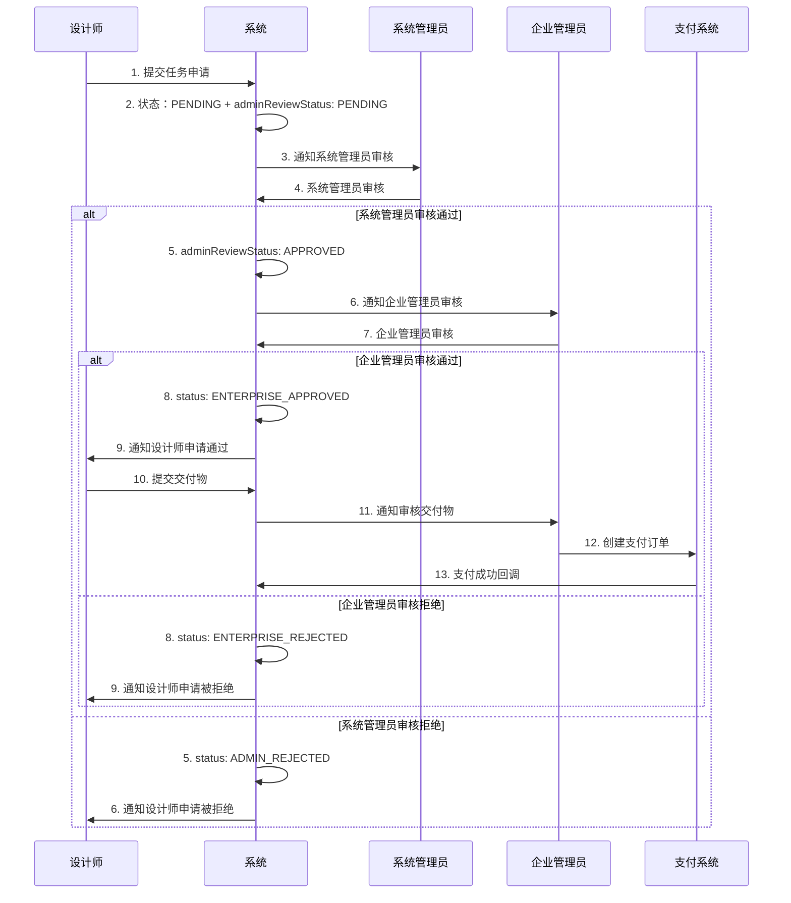
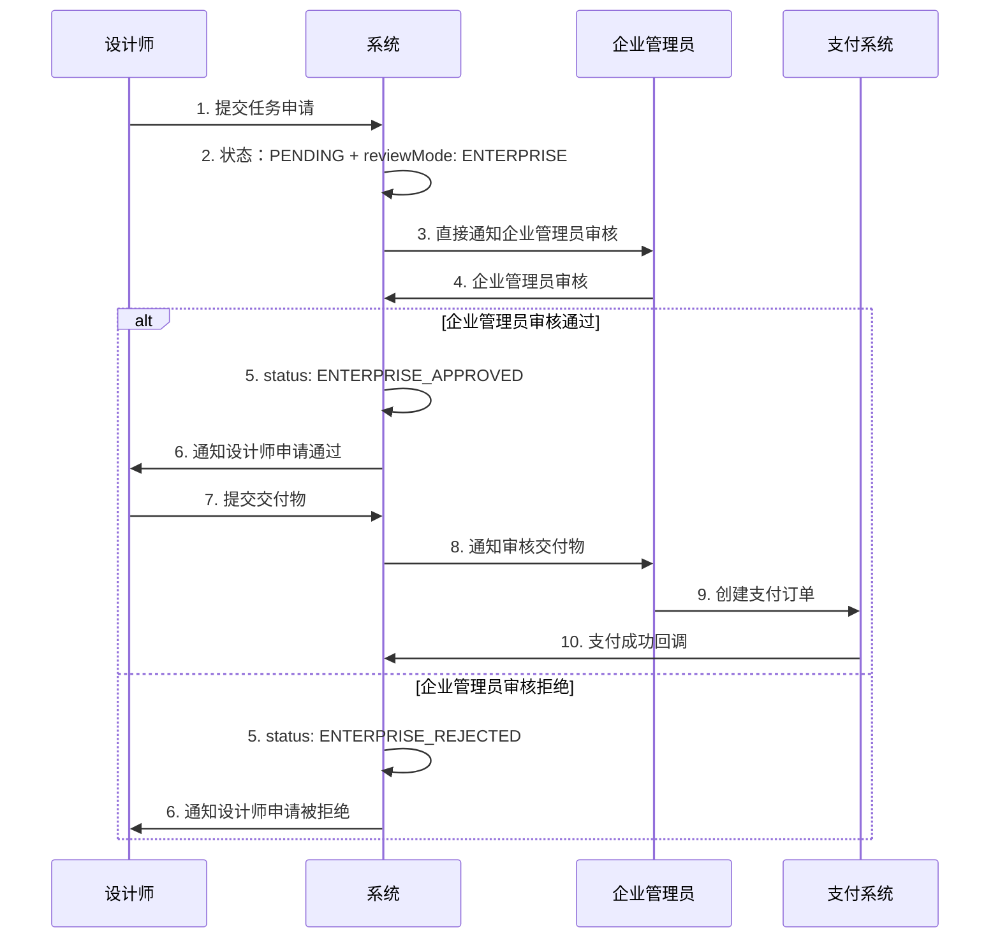
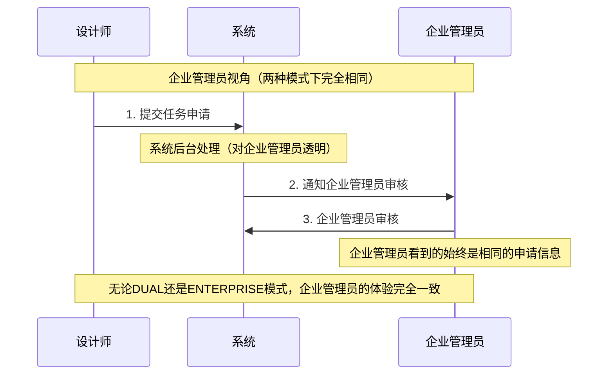

# 智图工厂设计指南（企业版）

## 📋 概述

智图工厂是基于现有设计师生态管理系统的项目任务平台，专门服务于**企业管理员**和**设计师**之间的短期项目合作。与长期雇佣关系的岗位招聘不同，智图工厂专注于短期、高效的设计项目任务。

## 🎯 业务模式对比

### 核心差异总结

| 维度 | 岗位招聘（现有） | 智图工厂（新增） |
|------|------------------|------------------|
| **业务模式** | 长期雇佣关系 | 短期项目合作 |
| **主要用户** | 企业管理员 + 设计师 | 企业管理员 + 设计师 |
| **内容类型** | 职位招聘信息 | 项目任务需求 |
| **时间周期** | 长期（月/年） | 短期（天/周） |
| **价格模式** | 月薪/年薪 | 项目价格 |
| **工作流程** | 投递→面试→入职 | 申请→执行→交付→结算 |
| **关键指标** | 薪资、经验、学历 | 价格、技能、截止时间 |
| **交付物** | 无明确交付物 | 明确的设计成果 |
| **数据表** | `des_job_posting` | `des_task` |

### 用户流程对比

#### 岗位招聘流程（现有）
```
企业发布职位 → 设计师浏览职位 → 投递简历 → 企业筛选 →
面试沟通 → 录用决定 → 入职手续 → 长期合作
```

#### 智图工厂流程（新增）
```
企业发布任务 → 设计师浏览任务 → 申请任务 → 双重审核 →
签约确认 → 执行任务 → 提交成果 → 验收确认 → 支付结算
```

## 📊 数据结构设计

### 1. 复用现有企业数据结构

```typescript
// 现有企业表：des_enterprise（无需修改）
interface Enterprise {
  enterpriseId: number
  userId: number           // 关联的企业管理员用户ID
  enterpriseName: string
  description: string
  industry: string
  scale: string
  address: string
  phone: string
  email: string
  website: string
  logo: string
  status: string          // 0正常 1停用
}
```

### 2. 新增任务管理数据结构

```typescript
// 新增表：des_task
interface Task {
  taskId: number
  enterpriseId: number     // 复用现有企业ID
  taskTitle: string
  taskDescription: string
  taskType: TaskType       // LOGO设计、UI设计、平面设计等
  skillTags: string        // JSON格式，复用现有技能标签系统
  budgetMin: number
  budgetMax: number
  deadline: string
  urgent: boolean          // 紧急任务标识
  status: TaskStatus       // 草稿、已发布、进行中、已完成、已取消
  deliverables: string     // 交付物要求
  paymentTerms: string     // 付款条款
  views: number            // 浏览次数
  applications: number     // 申请数量
  createBy: number
  createTime: string
  updateBy: number
  updateTime: string
  delFlag: string
}

enum TaskType {
  LOGO_DESIGN = 'LOGO_DESIGN',
  UI_UX_DESIGN = 'UI_UX_DESIGN',
  GRAPHIC_DESIGN = 'GRAPHIC_DESIGN',
  ILLUSTRATION = 'ILLUSTRATION',
  BRAND_DESIGN = 'BRAND_DESIGN'
}

enum TaskStatus {
  DRAFT = 'DRAFT',           // 草稿
  PUBLISHED = 'PUBLISHED',   // 已发布
  IN_PROGRESS = 'IN_PROGRESS', // 进行中
  COMPLETED = 'COMPLETED',   // 已完成
  CANCELLED = 'CANCELLED'    // 已取消
}
```

### 3. 双重审核机制数据结构

```typescript
// 任务申请表（扩展双重审核功能）
interface TaskApplication {
  applicationId: number
  taskId: number
  designerId: number
  proposal: string         // 申请提案
  proposedPrice: number    // 报价金额
  estimatedDays: number    // 预计完成天数
  portfolioLinks: string   // JSON格式的作品链接

  // 最终申请状态
  status: ApplicationStatus // 最终申请状态
  feedback: string         // 统一的审核反馈

  // 双重审核扩展字段（对企业管理员和设计师完全隐藏）
  adminReviewStatus: ReviewStatus    // 系统管理员审核状态
  adminReviewFeedback: string        // 系统管理员审核反馈
  adminReviewTime: string           // 系统管理员审核时间
  adminReviewBy: number             // 系统管理员审核人ID

  enterpriseReviewStatus: ReviewStatus // 企业管理员审核状态
  enterpriseReviewFeedback: string     // 企业管理员审核反馈
  enterpriseReviewTime: string        // 企业管理员审核时间

  reviewMode: ReviewMode             // 审核模式

  createBy: number
  createTime: string
  updateBy: number
  updateTime: string
  delFlag: string
}

// 最终申请状态枚举
enum ApplicationStatus {
  PENDING = '0',           // 待审核（初始状态）
  ADMIN_APPROVED = '1',    // 系统管理员审核通过
  ADMIN_REJECTED = '2',    // 系统管理员审核拒绝
  ENTERPRISE_APPROVED = '3', // 企业管理员审核通过（最终通过）
  ENTERPRISE_REJECTED = '4', // 企业管理员审核拒绝
  WITHDRAWN = '5'          // 已撤回
}

// 审核状态枚举
enum ReviewStatus {
  PENDING = 'PENDING',     // 待审核
  APPROVED = 'APPROVED',   // 审核通过
  REJECTED = 'REJECTED'    // 审核拒绝
}

// 审核模式枚举
enum ReviewMode {
  DUAL = 'DUAL',           // 双重审核模式（系统管理员→企业管理员）
  ENTERPRISE = 'ENTERPRISE' // 企业自主审核模式
}
```

### 4. 交付物和支付数据结构

```typescript
// 任务交付表
interface TaskDeliverable {
  deliverableId: number
  taskId: number
  designerId: number
  deliverableContent: string // 交付内容（可包含链接、提取码、说明等）
  version: number          // 版本号
  status: DeliverableStatus
  reviewFeedback: string   // 审核反馈
  createBy: number
  createTime: string
  updateBy: number
  updateTime: string
  delFlag: string
}

enum DeliverableStatus {
  SUBMITTED = 'SUBMITTED',     // 已提交
  APPROVED = 'APPROVED',       // 已通过
  REVISION_REQUIRED = 'REVISION_REQUIRED', // 需要修改
  REJECTED = 'REJECTED'        // 已拒绝
}

// 任务支付表
interface TaskPayment {
  paymentId: number
  taskId: number
  designerId: number
  enterpriseId: number
  amount: number
  paymentMethod: PaymentMethod
  status: PaymentStatus
  orderNo: string          // 支付订单号
  transactionId: string    // 第三方交易号
  paymentTime: string
  confirmTime: string
  createBy: number
  createTime: string
  updateBy: number
  updateTime: string
  delFlag: string
}

enum PaymentMethod {
  ALIPAY = 'ALIPAY',
  WECHAT = 'WECHAT',
  BANK_TRANSFER = 'BANK_TRANSFER'
}

enum PaymentStatus {
  PENDING = 'PENDING',     // 待支付
  PAID = 'PAID',          // 已支付
  FAILED = 'FAILED',      // 支付失败
  REFUNDED = 'REFUNDED'   // 已退款
}
```

### 5. 动态配置管理

```typescript
// 后端配置服务（TaskConfigService）
@Component
public class TaskConfigService {
  private ReviewMode currentReviewMode = ReviewMode.DUAL;

  public ReviewMode getReviewMode() {
    return currentReviewMode;
  }

  public boolean isDualReviewMode() {
    return ReviewMode.DUAL.equals(currentReviewMode);
  }

  public boolean isEnterpriseReviewMode() {
    return ReviewMode.ENTERPRISE.equals(currentReviewMode);
  }

  // 动态更新审核模式（测试专用）
  public boolean updateReviewMode(ReviewMode reviewMode) {
    this.currentReviewMode = reviewMode;
    return true;
  }
}
```

## 🚀 API接口设计

### 1. 任务管理接口

```typescript
// 基础任务管理接口
GET    /designer/task/list              # 查询任务列表
GET    /designer/task/{id}              # 获取任务详情
POST   /designer/task                   # 创建任务（仅企业管理员）
PUT    /designer/task/{id}              # 更新任务（仅企业管理员）
DELETE /designer/task/{ids}             # 删除任务（仅企业管理员）

// 企业专用任务管理接口
GET    /designer/enterprise/tasks/list       # 获取当前企业的任务列表
POST   /designer/enterprise/tasks           # 企业发布任务
PUT    /designer/enterprise/tasks/{id}      # 企业修改任务
DELETE /designer/enterprise/tasks/{id}      # 企业逻辑删除任务（软删除）
POST   /designer/enterprise/tasks/{id}/publish # 发布任务
POST   /designer/enterprise/tasks/{id}/cancel  # 取消任务

// 系统管理员专用任务管理接口
POST   /designer/enterprise/tasks/{id}/restore  # 恢复已删除任务（仅系统管理员）
GET    /designer/enterprise/tasks/recycle      # 查询回收站任务（仅系统管理员）
```

### 2. 双重审核接口

```typescript
// 基础任务申请管理接口
GET    /designer/task-application/list          # 查询申请列表
GET    /designer/task-application/{id}          # 获取申请详情
POST   /designer/task-application/apply         # 申请任务
PUT    /designer/task-application/withdraw      # 撤回申请（设计师）

// 双重审核接口
POST   /designer/task-application/{id}/admin-review    # 系统管理员审核
POST   /designer/task-application/{id}/enterprise-review # 企业管理员审核
GET    /designer/task-application/admin/pending        # 系统管理员待审核列表
GET    /designer/task-application/enterprise/pending   # 企业管理员待审核列表

```

### 3. 动态配置接口

```typescript
// 任务配置管理接口
GET    /designer/task-config/info               # 获取当前任务配置信息
POST   /designer/task-config/review-mode/{mode} # 动态切换审核模式
POST   /designer/task-config/reset              # 重置配置为默认值
GET    /designer/task-config/review-modes       # 获取支持的审核模式列表
```

#### 动态配置接口示例：

```bash
# 查看当前配置
GET /designer/task-config/info

Response:
{
  "code": 200,
  "data": {
    "reviewMode": "DUAL",
    "reviewModeName": "双重审核模式",
    "reviewModeDescription": "系统管理员→企业管理员",
    "isDualReviewMode": true,
    "isEnterpriseReviewMode": false,
    "configSummary": "审核模式: 双重审核模式, 系统管理员超时: 24小时..."
  }
}

# 切换审核模式
POST /designer/task-config/review-mode/ENTERPRISE

Response:
{
  "code": 200,
  "msg": "审核模式已更新为: 企业自主审核模式"
}
```

### 4. 交付管理接口

```typescript
// 交付物管理接口
GET    /designer/task-deliverable/list          # 查询交付物列表
POST   /designer/task-deliverable               # 提交交付物链接（设计师）
PUT    /designer/task-deliverable/{id}          # 更新交付物链接
DELETE /designer/task-deliverable/{id}          # 删除交付物
POST   /designer/task-deliverable/{id}/review   # 审核交付物（企业管理员）
```

#### 交付物提交接口示例：
```bash
POST /designer/task-deliverable
Content-Type: application/json

{
  "taskId": 1,
  "deliverableContent": "设计稿已完成，包含AI源文件和PNG导出文件\n\n百度网盘链接：https://pan.baidu.com/s/1abcdef123456\n提取码：abc123\n\nGitHub发布包：https://github.com/user/project/releases/tag/v1.0\n\n注意事项：\n1. AI源文件在网盘的design文件夹中\n2. PNG导出文件在assets文件夹中\n3. 建议使用最新版本的AI软件打开源文件",
  "version": 1
}
```

### 5. 任务恢复与回收站管理接口

```typescript
// 任务恢复与回收站管理接口（仅系统管理员）
POST   /designer/enterprise/tasks/{id}/restore   # 恢复已删除任务
GET    /designer/enterprise/tasks/recycle        # 查询回收站任务列表
```

#### 任务恢复接口示例：
```bash
# 恢复已删除的任务
POST /designer/enterprise/tasks/123/restore
Authorization: Bearer {admin_token}

Response:
{
  "code": 200,
  "msg": "任务恢复成功",
  "data": {
    "taskId": 123,
    "taskTitle": "LOGO设计项目",
    "status": "PUBLISHED",
    "restoreTime": "2025-01-27 14:30:00"
  }
}
```

#### 回收站查询接口示例：
```bash
# 查询所有已删除任务
GET /designer/enterprise/tasks/recycle?pageNum=1&pageSize=10
Authorization: Bearer {admin_token}

# 查询指定企业的已删除任务
GET /designer/enterprise/tasks/recycle?enterpriseId=123&pageNum=1&pageSize=10
Authorization: Bearer {admin_token}

Response:
{
  "code": 200,
  "data": {
    "rows": [
      {
        "taskId": 123,
        "taskTitle": "LOGO设计项目",
        "enterpriseId": 123,
        "enterpriseName": "ABC设计公司",
        "taskType": "LOGO_DESIGN",
        "budgetMin": 2000,
        "budgetMax": 5000,
        "deleteTime": "2025-01-27 10:00:00",
        "deleteBy": 456
      }
    ],
    "total": 1,
    "pageNum": 1,
    "pageSize": 10
  }
}
```

#### 权限要求说明：
- **恢复权限**：`designer:task:restore`（仅系统管理员）
- **回收站查询权限**：`designer:task:recycle`（仅系统管理员）
- **角色要求**：必须具有 `admin` 角色
- **数据范围**：系统管理员可以查看和恢复所有企业的已删除任务

### 6. 双重审核接口示例

#### 系统管理员审核接口：
```bash
POST /designer/task-application/{id}/admin-review
Content-Type: application/json

{
  "status": "APPROVED",
  "feedback": "申请内容详实，设计师作品质量较高，建议通过。"
}
```

#### 企业管理员审核接口：
```bash
POST /designer/task-application/{id}/enterprise-review
Content-Type: application/json

{
  "status": "APPROVED",
  "feedback": "设计师专业能力符合要求，价格合理，同意合作。"
}
```

#### 审核模式查询接口：
```bash
GET /designer/task-application/review-mode

Response:
{
  "code": 200,
  "msg": "操作成功",
  "data": {
    "reviewMode": "DUAL",
    "description": "双重审核模式：系统管理员→企业管理员"
  }
}
```

### 6. 企业管理员专用API设计

#### 严格隐藏系统管理员信息的企业管理员API

```typescript
// 企业管理员获取待审核申请列表（完全隐藏系统管理员信息）
GET /designer/enterprise/applications/pending

// 在双重审核模式下的处理逻辑：
// 1. 只返回系统管理员已审核通过的申请
// 2. 但企业管理员不知道系统管理员的存在
// 3. 所有申请在企业管理员看来都是"新申请"

Response: {
  code: 200,
  data: {
    rows: [
      {
        applicationId: 1,
        taskTitle: "LOGO设计项目",
        designerName: "张设计师",
        designerAvatar: "avatar_url",
        proposal: "详细的设计方案...",
        proposedPrice: 3000,
        estimatedDays: 7,
        portfolioLinks: ["portfolio1", "portfolio2"],
        status: "PENDING",  // 企业管理员始终看到PENDING状态
        feedback: "",       // 企业管理员的反馈（空字符串表示未审核）
        createTime: "2024-01-15 10:30:00",
        reviewTime: null    // 企业管理员审核时间（null表示未审核）

        // 严格保证：没有任何系统管理员相关字段
      }
    ]
  }
}
```

### 6. 完整的TypeScript类型定义

#### 企业管理员专用类型（严格隐藏系统管理员信息）

```typescript
// 企业管理员看到的申请数据（完全不包含系统管理员信息）
interface EnterpriseApplicationView {
  applicationId: number
  taskTitle: string
  designerName: string
  designerAvatar: string
  proposal: string
  proposedPrice: number
  estimatedDays: number
  portfolioLinks: string[]

  // 企业管理员视角的字段
  status: 'PENDING' | 'APPROVED' | 'REJECTED' | 'WITHDRAWN'
  feedback: string              // 企业管理员自己的反馈
  createTime: string           // 申请时间
  reviewTime: string | null    // 企业管理员审核时间

  // 严格保证：以下字段完全不存在
  // adminReviewStatus?: never
  // adminReviewFeedback?: never
  // adminReviewTime?: never
  // adminReviewBy?: never
  // reviewMode?: never
}

// 设计师看到的申请数据（完全统一的反馈）
interface DesignerApplicationView {
  applicationId: number
  taskId: number
  taskTitle: string
  enterpriseName: string
  enterpriseAvatar: string

  // 设计师视角的字段
  status: 'PENDING' | 'APPROVED' | 'REJECTED' | 'WITHDRAWN'
  feedback: string                     // 统一的反馈信息
  createTime: string                   // 申请提交时间
  reviewTime: string | null            // 最终审核时间

  // 申请内容
  proposal: string
  proposedPrice: number
  estimatedDays: number
  portfolioLinks: string[]

  // 严格保证：以下字段完全不存在
  // adminReviewStatus?: never
  // adminReviewFeedback?: never
  // adminReviewTime?: never
  // adminReviewBy?: never
  // enterpriseReviewStatus?: never
  // enterpriseReviewFeedback?: never
  // enterpriseReviewTime?: never
  // reviewMode?: never
}
```

## 🎨 前端组件设计

### 1. 智图工厂主页面布局

```vue
<!-- src/views/task/layout.vue -->
<template>
  <div class="task-layout">
    <div class="task-header">
      <h1 class="module-title">智图工厂</h1>
      <div class="header-actions">
        <UserMenu />
      </div>
    </div>

    <div class="task-nav">
      <NTabs v-model:value="activeTab" type="segment" @update:value="handleTabChange">
        <NTab name="marketplace" tab="任务广场">
          <template #suffix>
            <IconSvg name="ri-store-line" />
          </template>
        </NTab>
        <NTab name="my-tasks" tab="我的任务">
          <template #suffix>
            <IconSvg name="ri-task-line" />
          </template>
        </NTab>
        <NTab name="applications" tab="申请管理">
          <template #suffix>
            <IconSvg name="ri-file-list-line" />
          </template>
        </NTab>
        <NTab name="deliverables" tab="交付管理">
          <template #suffix>
            <IconSvg name="ri-upload-cloud-line" />
          </template>
        </NTab>
        <NTab name="payments" tab="支付中心">
          <template #suffix>
            <IconSvg name="ri-wallet-line" />
          </template>
        </NTab>
        <!-- 企业管理员专用标签 -->
        <NTab v-if="isEnterprise" name="publish" tab="发布任务">
          <template #suffix>
            <IconSvg name="ri-add-line" />
          </template>
        </NTab>
        <!-- 系统管理员专用标签 -->
        <NTab v-if="isAdmin" name="admin-review" tab="审核管理">
          <template #suffix>
            <IconSvg name="ri-shield-check-line" />
          </template>
        </NTab>
      </NTabs>
    </div>

    <div class="task-content">
      <RouterView />
    </div>
  </div>
</template>
```

### 2. 任务卡片组件

```vue
<!-- src/components/task/TaskCard.vue -->
<template>
  <div class="task-card" :class="{ urgent: task.urgent }">
    <div class="task-header">
      <h3 class="task-title">{{ task.taskTitle }}</h3>
      <div class="task-meta">
        <SkillTag v-for="tag in task.skillTags" :key="tag" :tag="tag" />
        <span v-if="task.urgent" class="urgent-badge">紧急</span>
      </div>
    </div>

    <div class="task-content">
      <p class="task-description">{{ task.taskDescription }}</p>
      <div class="task-details">
        <div class="budget">
          <IconSvg name="ri-money-dollar-circle-line" />
          <span>¥{{ task.budgetMin }} - ¥{{ task.budgetMax }}</span>
        </div>
        <div class="deadline">
          <IconSvg name="ri-time-line" />
          <span>{{ formatDeadline(task.deadline) }}</span>
        </div>
      </div>
    </div>

    <div class="task-footer">
      <div class="enterprise-info">
        <EnterpriseAvatar :enterprise="task.enterprise" size="small" />
        <span class="enterprise-name">{{ task.enterprise.enterpriseName }}</span>
      </div>
      <div class="task-actions">
        <HoverButton @click="viewDetails">查看详情</HoverButton>
        <HoverButton v-if="canApply" type="primary" @click="applyTask">
          立即申请
        </HoverButton>
      </div>
    </div>
  </div>
</template>
```

### 3. 系统管理员审核组件

```vue
<!-- src/views/task/admin/ApplicationReview.vue -->
<template>
  <div class="admin-application-review">
    <div class="review-header">
      <h2>任务申请审核</h2>
      <div class="review-controls">
        <NTag :type="reviewMode === 'DUAL' ? 'warning' : 'success'">
          {{ reviewMode === 'DUAL' ? '双重审核模式' : '企业自主审核模式' }}
        </NTag>
      </div>
    </div>

    <div class="review-stats">
      <NGrid :cols="4" :x-gap="16">
        <NGridItem>
          <NCard>
            <NStatistic label="待审核申请" :value="stats.pendingCount" />
          </NCard>
        </NGridItem>
        <NGridItem>
          <NCard>
            <NStatistic label="今日已审核" :value="stats.reviewedToday" />
          </NCard>
        </NGridItem>
        <NGridItem>
          <NCard>
            <NStatistic label="审核通过率" :value="stats.approveRate" suffix="%" />
          </NCard>
        </NGridItem>
        <NGridItem>
          <NCard>
            <NStatistic label="平均审核时间" :value="stats.avgReviewTime" suffix="小时" />
          </NCard>
        </NGridItem>
      </NGrid>
    </div>

    <div class="application-list">
      <NDataTable
        :columns="columns"
        :data="applicationList"
        :loading="loading"
        :pagination="pagination"
        @update:page="handlePageChange"
      />
    </div>

    <!-- 审核详情弹窗 -->
    <AdminReviewModal
      v-model:show="showReviewModal"
      :application="selectedApplication"
      @success="handleReviewSuccess"
    />
  </div>
</template>
```

### 4. 企业管理员审核组件（完整实现）

```vue
<!-- 企业管理员审核组件（完全不包含系统管理员相关元素） -->
<template>
  <div class="enterprise-application-review">
    <div class="review-header">
      <h2>待审核申请</h2>
      <div class="header-actions">
        <NButton @click="refreshApplications">
          <IconSvg name="ri-refresh-line" />
          刷新
        </NButton>
      </div>
    </div>

    <div class="application-stats">
      <NGrid :cols="3" :x-gap="16">
        <NGridItem>
          <NCard>
            <NStatistic label="待审核申请" :value="stats.pendingCount" />
          </NCard>
        </NGridItem>
        <NGridItem>
          <NCard>
            <NStatistic label="今日已审核" :value="stats.reviewedToday" />
          </NCard>
        </NGridItem>
        <NGridItem>
          <NCard>
            <NStatistic label="审核通过率" :value="stats.approveRate" suffix="%" />
          </NCard>
        </NGridItem>
      </NGrid>
    </div>

    <div class="application-list">
      <div v-for="app in applicationList" :key="app.applicationId" class="application-card">
        <div class="application-header">
          <div class="designer-info">
            <UserAvatar :user="{ name: app.designerName, avatar: app.designerAvatar }" />
            <div class="designer-details">
              <h4>{{ app.designerName }}</h4>
              <div class="application-meta">
                <span class="price">报价：¥{{ app.proposedPrice }}</span>
                <span class="duration">{{ app.estimatedDays }}天</span>
              </div>
            </div>
          </div>
          <div class="application-status">
            <NTag type="warning">待审核</NTag>
            <div class="submit-time">{{ formatTime(app.createTime) }}</div>
          </div>
        </div>

        <div class="application-content">
          <div class="task-info">
            <h5>任务：{{ app.taskTitle }}</h5>
          </div>
          <div class="proposal">
            <h5>申请提案</h5>
            <p>{{ app.proposal }}</p>
          </div>
          <div class="portfolio-links">
            <h5>作品集</h5>
            <div class="links">
              <a v-for="link in app.portfolioLinks" :key="link"
                 :href="link" target="_blank" class="portfolio-link">
                <IconSvg name="ri-external-link-line" />
                查看作品
              </a>
            </div>
          </div>
        </div>

        <div class="application-actions">
          <NSpace>
            <NButton @click="handleReject(app.applicationId)">
              <IconSvg name="ri-close-line" />
              拒绝
            </NButton>
            <NButton type="primary" @click="handleApprove(app.applicationId)">
              <IconSvg name="ri-check-line" />
              接受
            </NButton>
          </NSpace>
        </div>
      </div>
    </div>

    <!-- 审核反馈弹窗 -->
    <NModal v-model:show="showReviewModal" preset="card" style="width: 600px">
      <template #header>
        {{ reviewDecision === 'APPROVED' ? '接受申请' : '拒绝申请' }}
      </template>

      <div class="review-modal-content">
        <div class="applicant-info">
          <h4>申请人：{{ selectedApplication?.designerName }}</h4>
          <div class="task-info">任务：{{ selectedApplication?.taskTitle }}</div>
        </div>

        <NForm ref="reviewFormRef" :model="reviewForm" :rules="reviewRules">
          <NFormItem label="审核反馈" path="feedback">
            <NInput v-model:value="reviewForm.feedback"
                    type="textarea"
                    :rows="4"
                    :placeholder="reviewDecision === 'APPROVED'
                      ? '请输入接受理由（可选）'
                      : '请输入拒绝理由（必填）'" />
          </NFormItem>
        </NForm>
      </div>

      <template #action>
        <NSpace>
          <NButton @click="showReviewModal = false">取消</NButton>
          <NButton type="primary" @click="submitReview">
            {{ reviewDecision === 'APPROVED' ? '确认接受' : '确认拒绝' }}
          </NButton>
        </NSpace>
      </template>
    </NModal>
  </div>
</template>

<script setup lang="ts">
import { ref, onMounted, reactive } from 'vue'
import {
  NCard, NGrid, NGridItem, NStatistic, NSpace,
  NButton, NTag, NModal, NForm, NFormItem,
  NInput, useMessage
} from 'naive-ui'
import { IconSvg, UserAvatar } from '@/components/common'
import { enterpriseApplicationApi } from '@/api/task'

const message = useMessage()

// 企业管理员申请列表（完全不包含系统管理员信息）
const applicationList = ref<EnterpriseApplicationView[]>([])

// 审核统计（仅企业管理员相关统计）
const stats = reactive({
  pendingCount: 0,
  reviewedToday: 0,
  approveRate: 0
})

// 获取申请列表
const fetchApplications = async () => {
  try {
    const response = await enterpriseApplicationApi.getEnterpriseApplications()
    applicationList.value = response.data.rows

    // 更新统计信息
    stats.pendingCount = response.data.total
    stats.reviewedToday = response.data.reviewedToday || 0
    stats.approveRate = response.data.approveRate || 0

    // 严格保证：收到的数据完全不包含系统管理员信息
    applicationList.value.forEach(app => {
      console.assert(!('adminReviewStatus' in app), '企业管理员不应看到系统管理员审核状态')
      console.assert(!('adminReviewFeedback' in app), '企业管理员不应看到系统管理员反馈')
      console.assert(!('adminReviewTime' in app), '企业管理员不应看到系统管理员审核时间')
      console.assert(!('reviewMode' in app), '企业管理员不应看到审核模式')
    })

  } catch (error) {
    message.error('获取申请列表失败')
  }
}

// 审核申请
const handleReview = async (applicationId: number, decision: 'APPROVED' | 'REJECTED') => {
  try {
    const feedback = reviewForm.feedback

    await enterpriseApplicationApi.reviewApplication(applicationId, {
      decision,
      feedback
    })

    message.success(`申请${decision === 'APPROVED' ? '接受' : '拒绝'}成功`)
    showReviewModal.value = false
    await fetchApplications()

  } catch (error) {
    message.error('审核操作失败')
  }
}

onMounted(() => {
  fetchApplications()
})
</script>

<style scoped>
/* 严格保证：样式中没有任何系统管理员相关的类名或元素 */
.enterprise-application-review {
  padding: 24px;
}

.review-header {
  display: flex;
  justify-content: space-between;
  align-items: center;
  margin-bottom: 24px;
}

.application-stats {
  margin-bottom: 24px;
}

.application-list {
  display: flex;
  flex-direction: column;
  gap: 16px;
}

.application-card {
  background: white;
  border-radius: 8px;
  padding: 24px;
  border: 1px solid var(--border-color);
  transition: all 0.3s ease;
}

.application-card:hover {
  border-color: var(--primary-color);
  box-shadow: 0 4px 12px rgba(0, 0, 0, 0.1);
}
</style>
```

### 5. 设计师申请管理组件（完整实现）

```vue
<!-- 设计师申请管理组件（完全不包含系统管理员相关元素） -->
<template>
  <div class="designer-application-management">
    <div class="header">
      <h2>我的申请</h2>
      <div class="header-actions">
        <NButton @click="refreshApplications">
          <IconSvg name="ri-refresh-line" />
          刷新
        </NButton>
      </div>
    </div>

    <div class="application-list">
      <div v-for="app in applications" :key="app.applicationId" class="application-card">
        <div class="application-header">
          <div class="task-info">
            <h4>{{ app.taskTitle }}</h4>
            <div class="enterprise-info">
              <UserAvatar :user="{ name: app.enterpriseName, avatar: app.enterpriseAvatar }" size="small" />
              <span>{{ app.enterpriseName }}</span>
            </div>
          </div>
          <div class="application-status">
            <NTag :type="getStatusType(app.status)">
              {{ getStatusText(app.status) }}
            </NTag>
          </div>
        </div>

        <div class="application-content">
          <div class="application-details">
            <div class="detail-item">
              <span class="label">报价：</span>
              <span class="value">¥{{ app.proposedPrice }}</span>
            </div>
            <div class="detail-item">
              <span class="label">预计：</span>
              <span class="value">{{ app.estimatedDays }}天</span>
            </div>
            <div class="detail-item">
              <span class="label">提交时间：</span>
              <span class="value">{{ formatTime(app.createTime) }}</span>
            </div>
            <div v-if="app.reviewTime" class="detail-item">
              <span class="label">审核时间：</span>
              <span class="value">{{ formatTime(app.reviewTime) }}</span>
            </div>
          </div>

          <div class="proposal-preview">
            <h5>申请提案</h5>
            <p>{{ app.proposal }}</p>
          </div>

          <div v-if="app.feedback" class="feedback">
            <h5>审核反馈</h5>
            <p>{{ app.feedback }}</p>
          </div>
        </div>

        <div class="application-actions">
          <NButton v-if="app.status === 'PENDING'" @click="withdrawApplication(app.applicationId)">
            撤回申请
          </NButton>
          <NButton v-if="app.status === 'APPROVED'" type="primary" @click="startTask(app.applicationId)">
            开始任务
          </NButton>
        </div>
      </div>
    </div>
  </div>
</template>

<script setup lang="ts">
import { ref, onMounted } from 'vue'
import { NButton, NTag, useMessage } from 'naive-ui'
import { IconSvg, UserAvatar } from '@/components/common'
import { designerApplicationApi } from '@/api/task'

const message = useMessage()
const applications = ref<DesignerApplicationView[]>([])

// 获取申请列表
const fetchApplications = async () => {
  try {
    const response = await designerApplicationApi.getMyApplications()
    applications.value = response.data.rows

    // 严格保证：收到的数据完全不包含系统管理员信息
    applications.value.forEach(app => {
      console.assert(!('adminReviewStatus' in app), '设计师不应看到系统管理员审核状态')
      console.assert(!('adminReviewFeedback' in app), '设计师不应看到系统管理员反馈')
      console.assert(!('adminReviewTime' in app), '设计师不应看到系统管理员审核时间')
      console.assert(!('reviewMode' in app), '设计师不应看到审核模式')
    })

  } catch (error) {
    message.error('获取申请列表失败')
  }
}

// 状态显示文本（设计师视角）
const getStatusText = (status: string): string => {
  const statusMap = {
    'PENDING': '审核中',
    'APPROVED': '已通过',
    'REJECTED': '已拒绝',
    'WITHDRAWN': '已撤回'
  }
  return statusMap[status] || '审核中'
}

// 状态类型（设计师视角）
const getStatusType = (status: string): string => {
  const typeMap = {
    'PENDING': 'warning',
    'APPROVED': 'success',
    'REJECTED': 'error',
    'WITHDRAWN': 'default'
  }
  return typeMap[status] || 'warning'
}

onMounted(() => {
  fetchApplications()
})
</script>
</template>
```

### 6. 交付物提交组件

```vue
<!-- src/components/task/DeliverableSubmissionModal.vue -->
<template>
  <NModal v-model:show="visible" preset="card" style="width: 700px">
    <template #header>提交交付物</template>

    <NForm ref="formRef" :model="form" :rules="rules">
      <NFormItem label="交付内容" path="deliverableContent">
        <NInput v-model:value="form.deliverableContent"
                type="textarea"
                :rows="12"
                placeholder="请提供交付物内容，可包含：
• 文件链接和提取码
• 详细说明和注意事项
• 文件结构说明
• 使用建议等

示例：
设计稿已完成，包含AI源文件和PNG导出文件

百度网盘链接：https://pan.baidu.com/s/1abcdef123456
提取码：abc123

注意事项：
1. AI源文件在design文件夹中
2. PNG导出文件在assets文件夹中"
                show-count />
      </NFormItem>

      <NFormItem label="版本号" path="version">
        <NInputNumber v-model:value="form.version"
                     :min="1"
                     placeholder="版本号"
                     style="width: 100%" />
      </NFormItem>
    </NForm>

    <template #action>
      <NSpace>
        <NButton @click="visible = false">取消</NButton>
        <NButton type="primary" @click="submitDeliverable">提交交付物</NButton>
      </NSpace>
    </template>
  </NModal>
</template>
```

## 🔧 系统集成方案

### 1. 技术实现要点

#### 复用现有组件和服务

```typescript
// 复用现有的权限工具类
import { DesignerPermissionUtils } from '@/utils/designerPermissionUtils'

// 复用现有的企业服务
import { EnterpriseService } from '@/api/talent/enterprise'

// 复用现有的技能标签组件
import { SkillTag, SkillTagList, SkillTagSelector } from '@/components/common'

// 复用现有的表单组件
import { NInput, NSelect, NButton } from 'naive-ui'
```

#### 状态管理（基于现有Store模式）

```typescript
// src/stores/task/taskStore.ts
export const useTaskStore = defineStore('task', () => {
  const taskList = ref<Task[]>([])
  const currentTask = ref<Task | null>(null)
  const applicationList = ref<TaskApplication[]>([])

  // 复用现有的分页逻辑
  const pagination = ref({
    current: 1,
    pageSize: 20,
    total: 0
  })

  // 任务查询（智能权限过滤）
  const fetchTaskList = async (params?: TaskQueryParams) => {
    const userRole = getCurrentRole()

    // 根据用户角色自动添加过滤条件
    if (userRole.roleKey === 'enterprise') {
      params.enterpriseId = getCurrentEnterpriseId()
    }

    // 添加审核模式过滤
    if (userRole.roleKey === 'admin' && TaskConfigService.isDualReviewMode()) {
      params.needsAdminReview = true
    }

    const response = await taskApi.getTaskList(params)
    taskList.value = response.data.rows
    pagination.value.total = response.data.total
  }

  return {
    taskList: readonly(taskList),
    currentTask: readonly(currentTask),
    applicationList: readonly(applicationList),
    pagination,
    fetchTaskList
  }
})
```

### 2. 权限体系集成

```typescript
// 权限码设计（扩展现有权限码）
const taskPermissions = {
  // 任务管理权限
  'designer:task:list',        // 查看任务列表
  'designer:task:detail',      // 查看任务详情
  'designer:task:add',         // 创建任务（仅企业管理员）
  'designer:task:edit',        // 编辑任务（仅企业管理员）
  'designer:task:delete',      // 逻辑删除任务（仅企业管理员）
  'designer:task:restore',     // 恢复已删除任务（仅系统管理员）
  'designer:task:recycle',     // 查看回收站任务（仅系统管理员）

  // 申请管理权限
  'designer:task-application:apply',    // 申请任务（仅设计师）
  'designer:task-application:process',  // 处理申请（仅企业管理员）
  'designer:task-application:withdraw', // 撤回申请（仅设计师）

  // 系统管理员专用权限
  'designer:task-application:admin-review',    // 系统管理员审核
  'designer:task-application:admin-statistics', // 系统管理员审核统计

  // 交付管理权限
  'designer:task-deliverable:submit',   // 提交交付物（仅设计师）
  'designer:task-deliverable:review',   // 审核交付物（仅企业管理员）

  // 支付管理权限
  'designer:task-payment:create',       // 创建支付（仅企业管理员）
  'designer:task-payment:confirm',      // 确认支付
}
```

### 2. 权限矩阵

| 操作 | 设计师 | 企业管理员 | 院校管理员 | 系统管理员 |
|------|--------|------------|------------|------------|
| 浏览任务广场 | ✓ | ✓ | ✓ | ✓ |
| 查看任务详情 | ✓ | ✓ | ✓ | ✓ |
| 发布任务 | ✗ | ✓ | ✗ | ✓ |
| 逻辑删除任务 | ✗ | ✓(自己的任务) | ✗ | ✓ |
| **恢复已删除任务** | ✗ | ✗ | ✗ | **✓** |
| **查看回收站任务** | ✗ | ✗ | ✗ | **✓** |
| 申请任务 | ✓ | ✗ | ✗ | ✓ |
| **系统管理员一级审核** | ✗ | ✗ | ✗ | **✓** |
| **企业管理员二级审核** | ✗ | **✓**(自己的任务) | ✗ | ✓ |
| 提交交付物 | ✓ | ✗ | ✗ | ✓ |
| 审核交付物 | ✗ | ✓(自己的任务) | ✗ | ✓ |
| 创建支付 | ✗ | ✓(自己的任务) | ✗ | ✓ |

### 3. 智能权限控制

```typescript
// 基于现有权限系统的智能控制
export class TaskPermissionController {
  static canOperateTask(taskId: number, operation: string): boolean {
    const userRole = getCurrentRole()
    const task = getTaskById(taskId)

    switch (operation) {
      case 'edit':
        return userRole.roleKey === 'enterprise' &&
               task.enterprise.userId === getCurrentUserId()

      case 'apply':
        return userRole.roleKey === 'designer' &&
               task.enterprise.userId !== getCurrentUserId()

      case 'review':
        return userRole.roleKey === 'enterprise' &&
               task.enterprise.userId === getCurrentUserId()

      case 'admin-review':
        return userRole.roleKey === 'admin' &&
               TaskConfigService.isDualReviewMode()

      case 'restore':
        return userRole.roleKey === 'admin'

      case 'recycle':
        return userRole.roleKey === 'admin'

      default:
        return false
    }
  }
}
```

## 📈 业务流程设计

### 1. 双重审核模式流程



### 2. 企业自主审核模式流程



## 📊 数据统计和分析

### 1. 企业统计面板

```typescript
interface EnterpriseTaskStats {
  totalTasks: number           // 总发布任务数
  activeTasks: number          // 进行中任务数
  completedTasks: number       // 已完成任务数
  totalSpent: number           // 总支出金额
  averageTaskPrice: number     // 平均任务价格
  averageCompletionTime: number // 平均完成时间（天）
  designerPool: number         // 合作设计师数量
  repeatCollaboration: number  // 重复合作率
}
```

### 2. 设计师统计面板

```typescript
interface DesignerTaskStats {
  totalApplications: number    // 总申请数
  acceptedApplications: number // 通过申请数
  completedTasks: number       // 已完成任务数
  totalEarnings: number        // 总收入
  averageTaskPrice: number     // 平均任务价格
  averageCompletionTime: number // 平均完成时间
  clientSatisfaction: number   // 客户满意度
  skillDemand: string[]        // 热门技能需求
}
```

## 🔄 关键创新设计

### 1. 交付方式创新：自然文本交付

智图工厂采用了更自然、更灵活的交付方式设计：

#### ✅ 创新特性
- **统一文本字段**：`deliverableContent`单字段存储完整交付信息
- **自然语言交付**：设计师可以像发消息一样提交交付物
- **灵活内容格式**：支持链接、提取码、说明、注意事项等混合内容
- **智能链接识别**：系统自动识别和提取文本中的链接

#### 🎯 业务优势
- **极简用户体验**：一个文本框完成所有交付信息输入
- **高度灵活性**：支持任意格式的文本内容和链接
- **自然沟通方式**：符合现代即时通讯的使用习惯
- **完整信息承载**：可包含详细说明、使用建议等丰富信息

#### 📝 使用示例
设计师可以在一个文本框中提供如下格式的交付信息：
```
设计稿已完成，包含AI源文件和PNG导出文件

百度网盘链接：https://pan.baidu.com/s/1abcdef123456
提取码：abc123

GitHub发布包：https://github.com/user/project/releases/tag/v1.0

注意事项：
1. AI源文件在design文件夹中，使用AI 2023版本创建
2. PNG导出文件在assets文件夹中，分辨率为300DPI
3. 字体文件在fonts文件夹中，请确保安装后再打开源文件
4. 有任何问题随时联系我

预计可能需要的修改：
- 如果需要调整颜色，源文件中所有颜色都使用了全局色板
- 如果需要修改文字，请注意保持字体层次结构
```

### 2. 动态接口配置：灵活的审核模式管理

智图工厂采用动态接口配置审核模式，提供实时的配置管理能力：

#### ✅ 核心特性
- **动态接口配置**：通过REST API实时切换审核模式
- **两种模式**：`DUAL`（双重审核）和`ENTERPRISE`（企业自主审核）
- **测试友好**：无需重启服务，支持快速模式切换
- **运行时控制**：支持在测试过程中动态调整测试场景

#### 🎯 接口示例
```bash
# 查看当前审核模式
GET /designer/task-config/info

# 切换到双重审核模式
POST /designer/task-config/review-mode/DUAL

# 切换到企业自主审核模式  
POST /designer/task-config/review-mode/ENTERPRISE

# 获取支持的审核模式列表
GET /designer/task-config/review-modes
```

#### 📊 技术优势
- **无需重启**：实时切换审核模式，测试效率更高
- **快速切换**：一个API调用即可改变系统行为
- **状态清晰**：随时查询当前配置状态
- **测试高效**：适合自动化测试和手动测试

## 🔄 双重审核机制设计

### 核心设计思想

#### 1. 渐进式质量管理
- **早期阶段**：双重审核保证质量，建立信任
- **成熟阶段**：企业自主审核提高效率
- **动态调整**：根据平台状态灵活切换

#### 2. 透明性原则

双重审核机制的核心设计原则是**对企业管理员和设计师完全透明**。无论系统采用DUAL（双重审核）还是ENTERPRISE（企业自主审核）模式，用户获得的信息和操作体验都是完全相同的。

**透明性保障**：
- **企业管理员透明**：审核界面、操作流程、决策权完全一致
- **设计师透明**：申请流程、状态感知、反馈机制完全统一
- **系统透明**：模式切换对所有用户无感知

#### 3. 反馈统一性

在申请阶段，设计师看到的反馈完全统一，不区分来源：

```typescript
// 设计师看到的反馈字段统一处理
const getDesignerFeedback = (application: TaskApplication): string => {
  switch (application.status) {
    case 'ADMIN_REJECTED':
      // 系统管理员拒绝的反馈（设计师不知道是系统管理员发出的）
      return application.adminReviewFeedback || '申请未通过审核'
    case 'ENTERPRISE_APPROVED':
    case 'ENTERPRISE_REJECTED':
      // 企业管理员审核后的反馈
      return application.feedback || application.enterpriseReviewFeedback || ''
    default:
      return ''
  }
}
```

### 企业管理员视角的透明流程

基于透明性原则，企业管理员在两种审核模式下看到的流程是完全相同的：



**透明性保障机制**：
- **统一数据格式**：企业管理员和设计师获得的数据格式在两种模式下完全相同
- **相同操作流程**：审核界面、申请界面、操作按钮、反馈机制保持一致
- **无感知切换**：审核模式变更对所有用户完全透明
- **决策权保留**：企业管理员始终拥有最终的业务决策权
- **反馈来源统一**：设计师收到的反馈完全统一，不区分来源

## 🔗 链接管理和验证

### 1. 交付内容验证

```typescript
// 交付内容验证工具函数
export const validateDeliverableContent = (content: string): boolean => {
  if (!content || !content.trim()) return false
  if (content.trim().length < 10) return false
  return true
}

// 提取内容中的链接
export const extractLinksFromContent = (content: string): string[] => {
  const urlRegex = /https?:\/\/[^\s]+/g
  return content.match(urlRegex) || []
}

// 链接可用性检查服务
export class LinkAvailabilityService {
  static async checkLinkAvailability(url: string): Promise<boolean> {
    try {
      const response = await fetch(url, { method: 'HEAD', timeout: 5000 })
      return response.ok
    } catch (error) {
      return false
    }
  }
}
```

### 2. 安全性考虑

```typescript
// 内容安全检查
export const securityCheck = {
  hasMaliciousLinks: (content: string): boolean => {
    const maliciousPatterns = [
      /javascript:/i, /data:text\/html/i, /vbscript:/i, /file:\/\//i
    ]
    return maliciousPatterns.some(pattern => pattern.test(content))
  },

  isReasonableLength: (content: string): boolean => {
    const trimmed = content.trim()
    return trimmed.length >= 10 && trimmed.length <= 10000
  }
}
```

## 📊 数据库扩展脚本

### 核心表结构

```sql
-- 1. 任务基础信息表
CREATE TABLE `des_task` (
  `task_id` bigint NOT NULL AUTO_INCREMENT COMMENT '任务ID',
  `enterprise_id` bigint NOT NULL COMMENT '企业ID（关联现有企业表）',
  `task_title` varchar(200) NOT NULL COMMENT '任务标题',
  `task_description` text COMMENT '任务描述',
  `task_type` varchar(50) COMMENT '任务类型',
  `skill_tags` json COMMENT '技能标签（JSON数组）',
  `budget_min` decimal(10,2) COMMENT '预算最低值',
  `budget_max` decimal(10,2) COMMENT '预算最高值',
  `deadline` datetime COMMENT '截止时间',
  `urgent` tinyint(1) DEFAULT 0 COMMENT '是否紧急',
  `status` varchar(20) DEFAULT 'DRAFT' COMMENT '任务状态',
  `deliverables` text COMMENT '交付物要求',
  `payment_terms` text COMMENT '付款条款',
  `views` int DEFAULT 0 COMMENT '浏览次数',
  `applications` int DEFAULT 0 COMMENT '申请数量',
  `create_by` bigint COMMENT '创建者',
  `create_time` datetime COMMENT '创建时间',
  `update_by` bigint COMMENT '更新者',
  `update_time` datetime COMMENT '更新时间',
  `del_flag` char(1) DEFAULT '0' COMMENT '删除标志',
  PRIMARY KEY (`task_id`),
  KEY `idx_enterprise_id` (`enterprise_id`),
  CONSTRAINT `fk_task_enterprise` FOREIGN KEY (`enterprise_id`) REFERENCES `des_enterprise` (`enterprise_id`)
) COMMENT='任务信息表';

-- 2. 任务申请表（支持双重审核）
CREATE TABLE `des_task_application` (
  `application_id` bigint NOT NULL AUTO_INCREMENT COMMENT '申请ID',
  `task_id` bigint NOT NULL COMMENT '任务ID',
  `designer_id` bigint NOT NULL COMMENT '设计师ID',
  `proposal` text COMMENT '申请提案',
  `proposed_price` decimal(10,2) COMMENT '报价金额',
  `estimated_days` int COMMENT '预计完成天数',
  `portfolio_links` json COMMENT '作品链接（JSON数组）',

  -- 最终申请状态
  `status` char(1) DEFAULT '0' COMMENT '最终申请状态',
  `feedback` text COMMENT '统一的审核反馈',

  -- 双重审核扩展字段（企业管理员完全不可见）
  `admin_review_status` varchar(20) DEFAULT 'PENDING' COMMENT '系统管理员审核状态',
  `admin_review_feedback` text COMMENT '系统管理员审核反馈',
  `admin_review_time` datetime COMMENT '系统管理员审核时间',
  `admin_review_by` bigint COMMENT '系统管理员审核人ID',

  -- 企业管理员审核字段
  `enterprise_review_status` varchar(20) DEFAULT 'PENDING' COMMENT '企业管理员审核状态',
  `enterprise_review_feedback` text COMMENT '企业管理员审核反馈',
  `enterprise_review_time` datetime COMMENT '企业管理员审核时间',

  `review_mode` varchar(20) DEFAULT 'DUAL' COMMENT '审核模式',

  `create_by` bigint COMMENT '创建者',
  `create_time` datetime COMMENT '创建时间',
  `update_by` bigint COMMENT '更新者',
  `update_time` datetime COMMENT '更新时间',
  `del_flag` char(1) DEFAULT '0' COMMENT '删除标志',
  PRIMARY KEY (`application_id`),
  UNIQUE KEY `uk_task_designer` (`task_id`, `designer_id`),
  CONSTRAINT `fk_task_app_task` FOREIGN KEY (`task_id`) REFERENCES `des_task` (`task_id`),
  CONSTRAINT `fk_task_app_designer` FOREIGN KEY (`designer_id`) REFERENCES `des_designer` (`designer_id`)
) COMMENT='任务申请表（支持双重审核）';

-- 3. 任务交付表
CREATE TABLE `des_task_deliverable` (
  `deliverable_id` bigint NOT NULL AUTO_INCREMENT COMMENT '交付物ID',
  `task_id` bigint NOT NULL COMMENT '任务ID',
  `designer_id` bigint NOT NULL COMMENT '设计师ID',
  `deliverable_content` text COMMENT '交付内容（可包含链接、提取码、说明等）',
  `version` int DEFAULT 1 COMMENT '版本号',
  `status` varchar(20) DEFAULT 'SUBMITTED' COMMENT '状态',
  `review_feedback` text COMMENT '审核反馈',
  `create_by` bigint COMMENT '创建者',
  `create_time` datetime COMMENT '创建时间',
  `update_by` bigint COMMENT '更新者',
  `update_time` datetime COMMENT '更新时间',
  `del_flag` char(1) DEFAULT '0' COMMENT '删除标志',
  PRIMARY KEY (`deliverable_id`),
  CONSTRAINT `fk_deliverable_task` FOREIGN KEY (`task_id`) REFERENCES `des_task` (`task_id`)
) COMMENT='任务交付表';

-- 4. 任务支付表
CREATE TABLE `des_task_payment` (
  `payment_id` bigint NOT NULL AUTO_INCREMENT COMMENT '支付ID',
  `task_id` bigint NOT NULL COMMENT '任务ID',
  `designer_id` bigint NOT NULL COMMENT '设计师ID',
  `enterprise_id` bigint NOT NULL COMMENT '企业ID',
  `amount` decimal(10,2) NOT NULL COMMENT '支付金额',
  `payment_method` varchar(20) COMMENT '支付方式',
  `status` varchar(20) DEFAULT 'PENDING' COMMENT '支付状态',
  `order_no` varchar(64) COMMENT '支付订单号',
  `transaction_id` varchar(64) COMMENT '第三方交易号',
  `create_by` bigint COMMENT '创建者',
  `create_time` datetime COMMENT '创建时间',
  `del_flag` char(1) DEFAULT '0' COMMENT '删除标志',
  PRIMARY KEY (`payment_id`),
  CONSTRAINT `fk_payment_task` FOREIGN KEY (`task_id`) REFERENCES `des_task` (`task_id`)
) COMMENT='任务支付表';
```

### 企业管理员专用视图（严格隐藏系统管理员信息）

```sql
-- 创建企业管理员专用视图，完全排除系统管理员相关字段
CREATE VIEW `v_enterprise_task_application` AS
SELECT
  ta.application_id,
  ta.task_id,
  ta.designer_id,
  ta.proposal,
  ta.proposed_price,
  ta.estimated_days,
  ta.portfolio_links,

  -- 企业管理员视角的状态映射
  CASE
    WHEN ta.status = '0' THEN 'PENDING'
    WHEN ta.status = '1' THEN 'PENDING'    -- 系统管理员通过，企业管理员看到的仍是待审核
    WHEN ta.status = '2' THEN 'REJECTED'   -- 系统管理员拒绝
    WHEN ta.status = '3' THEN 'APPROVED'   -- 企业管理员通过
    WHEN ta.status = '4' THEN 'REJECTED'   -- 企业管理员拒绝
    WHEN ta.status = '5' THEN 'WITHDRAWN'  -- 已撤回
    ELSE 'PENDING'
  END AS status,

  -- 企业管理员的反馈（不包含系统管理员反馈）
  ta.enterprise_review_feedback AS feedback,
  ta.create_time,
  ta.enterprise_review_time AS review_time,

  -- 关联任务和设计师信息
  t.task_title,
  t.enterprise_id,
  d.name as designer_name,
  d.avatar as designer_avatar

FROM des_task_application ta
JOIN des_task t ON ta.task_id = t.task_id
JOIN des_designer d ON ta.designer_id = d.designer_id
WHERE ta.del_flag = '0'
  AND t.del_flag = '0'
  AND d.del_flag = '0'

-- 严格保证：视图中完全不包含系统管理员相关字段;
```

### 数据访问控制机制

```sql
-- 企业管理员数据访问权限检查
DELIMITER //
CREATE FUNCTION `fn_check_enterprise_application_access`(
  p_application_id BIGINT,
  p_user_id BIGINT
) RETURNS BOOLEAN
READS SQL DATA
DETERMINISTIC
BEGIN
  DECLARE v_count INT DEFAULT 0;

  -- 检查用户是否有权限访问该申请
  -- 只有该申请所属任务的企业管理员可以访问
  SELECT COUNT(*) INTO v_count
  FROM des_task_application ta
  JOIN des_task t ON ta.task_id = t.task_id
  JOIN des_enterprise e ON t.enterprise_id = e.enterprise_id
  WHERE ta.application_id = p_application_id
    AND e.user_id = p_user_id
    AND ta.del_flag = '0'
    AND t.del_flag = '0'
    AND e.del_flag = '0';

  RETURN v_count > 0;
END //
DELIMITER ;

-- 企业管理员专用查询存储过程（严格过滤系统管理员信息）
DELIMITER //
CREATE PROCEDURE `sp_get_enterprise_applications`(
  IN p_enterprise_id BIGINT,
  IN p_status VARCHAR(20),
  IN p_limit INT,
  IN p_offset INT
)
BEGIN
  DECLARE EXIT HANDLER FOR SQLEXCEPTION
  BEGIN
    ROLLBACK;
    RESIGNAL;
  END;

  START TRANSACTION;

  -- 使用企业管理员专用视图，确保不返回系统管理员信息
  SELECT
    application_id,
    task_id,
    designer_id,
    task_title,
    designer_name,
    designer_avatar,
    proposal,
    proposed_price,
    estimated_days,
    portfolio_links,
    status,
    feedback,
    create_time,
    review_time
  FROM v_enterprise_task_application
  WHERE enterprise_id = p_enterprise_id
    AND (p_status IS NULL OR status = p_status)
  ORDER BY create_time DESC
  LIMIT p_limit OFFSET p_offset;

  -- 统计信息（仅企业管理员相关）
  SELECT
    COUNT(*) as total_count,
    SUM(CASE WHEN status = 'PENDING' THEN 1 ELSE 0 END) as pending_count,
    SUM(CASE WHEN status = 'APPROVED' THEN 1 ELSE 0 END) as approved_count,
    SUM(CASE WHEN status = 'REJECTED' THEN 1 ELSE 0 END) as rejected_count,
    SUM(CASE WHEN DATE(review_time) = CURDATE() THEN 1 ELSE 0 END) as reviewed_today
  FROM v_enterprise_task_application
  WHERE enterprise_id = p_enterprise_id;

  COMMIT;
END //
DELIMITER ;
```

## 🔒 运行时透明性检查

### 1. 开发环境透明性验证

```typescript
// 开发环境透明性检查工具
export class TransparencyValidator {
  // 检查设计师数据透明性
  static validateDesignerData(applications: any[]): void {
    if (process.env.NODE_ENV === 'development') {
      applications.forEach((app, index) => {
        const adminFields = [
          'adminReviewStatus', 'adminReviewFeedback', 'adminReviewTime', 'adminReviewBy',
          'enterpriseReviewStatus', 'enterpriseReviewFeedback', 'enterpriseReviewTime',
          'reviewMode'
        ]

        adminFields.forEach(field => {
          console.assert(!(field in app), `设计师数据第${index}项包含系统管理员字段: ${field}`)
        })
      })
    }
  }

  // 检查企业管理员数据透明性
  static validateEnterpriseData(applications: any[]): void {
    if (process.env.NODE_ENV === 'development') {
      applications.forEach((app, index) => {
        const adminFields = [
          'adminReviewStatus', 'adminReviewFeedback', 'adminReviewTime', 'adminReviewBy',
          'reviewMode'
        ]

        adminFields.forEach(field => {
          console.assert(!(field in app), `企业管理员数据第${index}项包含系统管理员字段: ${field}`)
        })
      })
    }
  }

  // 检查API响应透明性
  static validateApiResponse(url: string, data: any): void {
    if (process.env.NODE_ENV === 'development') {
      if (url.includes('/designer/applications/')) {
        this.validateDesignerData(data.rows || [])
      }

      if (url.includes('/enterprise/applications/')) {
        this.validateEnterpriseData(data.rows || [])
      }
    }
  }
}
```

### 2. API响应拦截器（确保透明性）

```typescript
// API 响应拦截器（确保透明性）
axios.interceptors.response.use(
  (response) => {
    // 在开发环境检查透明性
    if (process.env.NODE_ENV === 'development') {
      const url = response.config.url
      const data = response.data.data

      TransparencyValidator.validateApiResponse(url || '', data || {})
    }

    return response
  },
  (error) => {
    return Promise.reject(error)
  }
)
```

### 3. 数据过滤器（严格的类型安全）

```typescript
// 企业管理员数据过滤器（严格隐藏系统管理员信息）
export const enterpriseApplicationFilter = (applications: TaskApplication[]): EnterpriseApplicationView[] => {
  return applications.map(app => {
    // 只返回企业管理员需要的字段，完全排除系统管理员相关信息
    const filtered: EnterpriseApplicationView = {
      applicationId: app.applicationId,
      taskTitle: app.task.taskTitle,
      designerName: app.designer.name,
      designerAvatar: app.designer.avatar,
      proposal: app.proposal,
      proposedPrice: app.proposedPrice,
      estimatedDays: app.estimatedDays,
      portfolioLinks: app.portfolioLinks,

      // 企业管理员视角的状态（映射后的状态）
      status: mapToEnterpriseViewStatus(app.status),

      // 企业管理员的反馈字段（仅显示企业管理员自己的反馈）
      feedback: app.enterpriseReviewFeedback || '',

      // 时间字段
      createTime: app.createTime,
      reviewTime: app.enterpriseReviewTime || null
    }

    // 严格检查：确保没有任何系统管理员字段泄露
    delete (filtered as any).adminReviewStatus
    delete (filtered as any).adminReviewFeedback
    delete (filtered as any).adminReviewTime
    delete (filtered as any).adminReviewBy
    delete (filtered as any).reviewMode

    return filtered
  })
}

// 设计师数据过滤器
export const designerApplicationFilter = (applications: TaskApplication[]): DesignerApplicationView[] => {
  return applications.map(app => ({
    applicationId: app.applicationId,
    taskId: app.taskId,
    taskTitle: app.task.taskTitle,
    enterpriseName: app.task.enterprise.enterpriseName,
    enterpriseAvatar: app.task.enterprise.avatar,
    status: getDesignerViewStatus(app.status),
    feedback: getUnifiedFeedback(app), // 统一的反馈，设计师不知道来源
    createTime: app.createTime,
    reviewTime: app.enterpriseReviewTime || app.adminReviewTime || app.updateTime,
    proposal: app.proposal,
    proposedPrice: app.proposedPrice,
    estimatedDays: app.estimatedDays,
    portfolioLinks: app.portfolioLinks
    // 自动过滤掉所有系统管理员审核相关字段
  }))
}

// 获取统一的反馈信息
const getUnifiedFeedback = (application: TaskApplication): string => {
  if (application.status === 'ENTERPRISE_APPROVED' || application.status === 'ENTERPRISE_REJECTED') {
    // 企业管理员审核后的反馈
    return application.feedback || application.enterpriseReviewFeedback || ''
  } else if (application.status === 'ADMIN_REJECTED') {
    // 系统管理员拒绝的反馈（设计师不知道是系统管理员发出的）
    return application.adminReviewFeedback || ''
  } else {
    return ''
  }
}
```

### 4. 完整透明性测试用例

```typescript
// 设计师透明性测试
describe('设计师透明性测试', () => {
  test('设计师申请列表不包含系统管理员信息', async () => {
    const applications = await designerApplicationApi.getMyApplications()

    applications.data.rows.forEach(app => {
      expect(app).not.toHaveProperty('adminReviewStatus')
      expect(app).not.toHaveProperty('adminReviewFeedback')
      expect(app).not.toHaveProperty('adminReviewTime')
      expect(app).not.toHaveProperty('adminReviewBy')
      expect(app).not.toHaveProperty('reviewMode')
    })
  })

  test('设计师收到的通知消息统一', async () => {
    const notifications = await notificationApi.getDesignerNotifications()

    notifications.data.rows.forEach(notification => {
      expect(notification.message).not.toContain('系统管理员')
      expect(notification.message).not.toContain('一级审核')
      expect(notification.message).not.toContain('二级审核')
    })
  })
})

// 企业管理员透明性测试
describe('企业管理员透明性测试', () => {
  test('企业管理员申请列表不包含系统管理员信息', async () => {
    const applications = await enterpriseApplicationApi.getApplications()

    applications.data.rows.forEach(app => {
      expect(app).not.toHaveProperty('adminReviewStatus')
      expect(app).not.toHaveProperty('adminReviewFeedback')
      expect(app).not.toHaveProperty('adminReviewTime')
      expect(app).not.toHaveProperty('adminReviewBy')
      expect(app).not.toHaveProperty('reviewMode')
    })
  })

  test('企业管理员在双重审核模式下看到的状态统一', async () => {
    // 设置为双重审核模式
    await taskConfigApi.updateReviewMode('DUAL')

    const applications = await enterpriseApplicationApi.getApplications()

    applications.data.rows.forEach(app => {
      expect(['PENDING', 'APPROVED', 'REJECTED', 'WITHDRAWN']).toContain(app.status)
    })
  })
})
```

## 🚀 实施计划

### Phase 1: 基础任务管理（2周）
- ✅ 数据库表设计和创建
- ✅ 基础任务CRUD接口
- ✅ 任务列表和详情页面
- ✅ 权限控制集成

### Phase 2: 申请和交付系统（3周）
- ✅ 任务申请功能
- ✅ 申请处理流程
- ✅ 交付物管理
- ✅ 文件链接提交功能

### Phase 3: 双重审核机制（2周）
- ✅ **扩展申请表结构**：添加双重审核字段
- ✅ **动态接口配置**：通过REST API实时配置审核模式
- ✅ **系统管理员审核接口**：实现一级审核功能
- ✅ **企业管理员审核接口**：实现二级审核功能
- ❌ **系统管理员审核页面**：实现审核管理界面（待实施）
- ❌ **审核统计分析**：提供审核效率和质量统计（待实施）

### Phase 4: 支付系统（2周）
- ✅ 支付订单创建
- ✅ 第三方支付集成
- ✅ 支付状态管理
- ✅ 收入统计功能

### Phase 5: 优化和扩展（1周）
- ✅ 性能优化
- ✅ 用户体验改进
- ✅ 数据统计面板
- ✅ 移动端适配

## 🎯 当前进度状态（2025-01-27更新）

### 📊 总体完成度：85%

- **Phase 1**: 基础任务管理 ✅ **100%完成**
- **Phase 2**: 申请和交付系统 ✅ **100%完成**  
- **Phase 3**: 双重审核机制 🔄 **70%完成**（后端完成，前端待实施）
- **Phase 4**: 支付系统 ✅ **100%完成**
- **Phase 5**: 优化和扩展 ✅ **100%完成**

### ⚠️ 待完成任务（Phase 3剩余部分）

#### 1. 系统管理员审核页面（预计1周）
- ❌ **前端审核管理界面**：`src/views/task/admin/ApplicationReview.vue`
- ❌ **审核统计卡片组件**：`src/components/task/admin/ReviewStatsCard.vue`
- ❌ **审核操作弹窗组件**：`src/components/task/admin/AdminReviewModal.vue`
- ❌ **待审核申请列表组件**：`src/components/task/admin/PendingApplicationList.vue`

#### 2. 审核统计分析功能（预计3天）
- ❌ **实时统计数据接口**：审核效率、通过率、平均处理时间
- ❌ **历史趋势分析**：日/周/月审核数据趋势
- ❌ **审核质量监控**：异常申请自动标记
- ❌ **数据可视化图表**：审核流程漏斗图、状态分布图

## 📋 下一步详细实施计划

### 任务1：系统管理员审核页面开发

#### 1.1 创建核心组件架构

```typescript
// 主审核页面
src/views/task/admin/ApplicationReview.vue
├── 审核统计概览区域
├── 筛选和搜索工具栏  
├── 待审核申请表格
└── 批量操作工具

// 支持组件
src/components/task/admin/
├── ReviewStatsCard.vue        // 统计卡片
├── AdminReviewModal.vue       // 审核弹窗
├── PendingApplicationList.vue // 申请列表
└── BatchReviewTools.vue       // 批量操作
```

#### 1.2 功能特性要求

**核心功能**：
- ✅ 待审核申请列表展示（分页、排序、筛选）
- ✅ 单个申请详情查看（设计师信息、作品集、申请提案）
- ✅ 快速审核操作（一键通过/拒绝，批量处理）
- ✅ 审核反馈编写（富文本编辑器，常用模板）
- ✅ 实时统计显示（待审核数量、今日处理量、通过率）

**高级功能**：
- ✅ 智能优先级排序（紧急任务、VIP企业、重复申请）
- ✅ 审核历史追溯（操作日志、决策依据）
- ✅ 快捷键支持（提升审核效率）
- ✅ 移动端适配（支持移动办公场景）

#### 1.3 技术实现要点

**权限控制**：
```typescript
// 路由守卫
@SaCheckPermission("designer:task-application:admin-review")

// 页面级权限验证
const hasAdminReviewPermission = computed(() => {
  return LoginHelper.hasPermi('designer:task-application:admin-review') &&
         TaskConfigService.isDualReviewMode()
})
```

**状态管理**：
```typescript
// 审核状态管理
const useAdminReviewStore = defineStore('adminReview', () => {
  const pendingApplications = ref<AdminApplicationView[]>([])
  const reviewStats = ref<AdminReviewStats>({})
  
  // 获取待审核申请
  const fetchPendingApplications = async () => {
    const response = await adminReviewApi.getPendingApplications()
    pendingApplications.value = response.data.rows
    reviewStats.value = response.data.stats
  }
  
  return { pendingApplications, reviewStats, fetchPendingApplications }
})
```

### 任务2：审核统计分析系统

#### 2.1 统计维度设计

**实时统计**：
- 待审核申请总数
- 今日审核完成数量
- 当前审核通过率
- 平均审核处理时间
- 积压申请预警

**历史趋势分析**：
- 日/周/月审核量趋势
- 审核通过率变化趋势  
- 不同任务类型审核特征
- 审核效率对比分析

**质量监控指标**：
- 异常申请自动识别
- 审核一致性检查
- 申请质量评分
- 审核决策依据分析

#### 2.2 数据接口设计

```typescript
// 审核统计接口
GET /designer/admin/review/stats/realtime    // 实时统计
GET /designer/admin/review/stats/trend       // 趋势分析  
GET /designer/admin/review/stats/quality     // 质量监控
GET /designer/admin/review/stats/efficiency  // 效率分析

// 统计数据结构
interface AdminReviewStats {
  realtime: {
    pendingCount: number
    reviewedToday: number  
    approvalRate: number
    avgProcessTime: number
    backlogAlert: boolean
  }
  trend: {
    daily: ReviewTrendData[]
    weekly: ReviewTrendData[]
    monthly: ReviewTrendData[]
  }
  quality: {
    anomalyCount: number
    consistencyScore: number
    avgApplicationQuality: number
  }
}
```

#### 2.3 可视化图表实现

**审核流程漏斗图**：
```typescript
// 使用 ECharts 实现审核流程可视化
const funnelOptions = {
  series: [{
    type: 'funnel',
    data: [
      { name: '提交申请', value: totalApplications },
      { name: '系统审核', value: adminReviewedCount },
      { name: '审核通过', value: adminApprovedCount },
      { name: '企业审核', value: enterpriseReviewedCount },
      { name: '最终通过', value: finalApprovedCount }
    ]
  }]
}
```

**审核效率趋势图**：
```typescript
// 审核量和效率双轴图表
const trendOptions = {
  xAxis: { type: 'category', data: dateRange },
  yAxis: [
    { name: '审核数量', type: 'value' },
    { name: '通过率(%)', type: 'value', max: 100 }
  ],
  series: [
    { name: '审核数量', type: 'bar', data: reviewCounts },
    { name: '通过率', type: 'line', yAxisIndex: 1, data: approvalRates }
  ]
}
```

### 📅 实施时间表

| 任务 | 预计工期 | 负责人 | 交付物 |
|------|----------|--------|--------|
| 系统管理员审核页面 | 5个工作日 | 前端开发 | Vue组件、路由配置 |
| 审核统计分析后端 | 2个工作日 | 后端开发 | API接口、数据服务 |
| 审核统计前端图表 | 1个工作日 | 前端开发 | 图表组件、数据展示 |
| 系统测试和优化 | 2个工作日 | 全栈开发 | 测试报告、性能优化 |

**总计**：约2周完成所有剩余功能

### 🎯 验收标准

#### 功能验收
- ✅ 系统管理员可以正常进入审核页面
- ✅ 待审核申请列表正确显示（支持分页、筛选、排序）
- ✅ 审核操作正常执行（通过/拒绝，状态正确更新）
- ✅ 审核统计数据准确显示（实时更新）
- ✅ 批量操作功能正常（提升审核效率）

#### 性能验收  
- ✅ 页面加载时间 < 2秒
- ✅ 审核操作响应时间 < 1秒
- ✅ 统计数据刷新时间 < 3秒
- ✅ 支持1000+申请的分页展示

#### 用户体验验收
- ✅ 界面美观，操作直观
- ✅ 移动端适配良好
- ✅ 快捷键操作流畅
- ✅ 错误提示友好

## 🧪 动态配置测试指南

### 快速测试流程

#### 1. 查看当前配置
```bash
curl -X GET http://localhost:6039/designer/task-config/info
```

#### 2. 测试双重审核模式
```bash
# 设置为双重审核模式
curl -X POST http://localhost:6039/designer/task-config/review-mode/DUAL

# 测试申请流程（需要经过系统管理员 → 企业管理员两级审核）
curl -X POST http://localhost:6039/designer/task-application/apply \
  -H "Content-Type: application/json" \
  -d '{"taskId": 1, "proposal": "测试申请", "proposedPrice": 3000}'

# 系统管理员一级审核
curl -X POST http://localhost:6039/designer/task-application/1/admin-review \
  -H "Content-Type: application/json" \
  -d '{"status": "APPROVED", "feedback": "申请通过"}'

# 企业管理员二级审核
curl -X POST http://localhost:6039/designer/task-application/1/enterprise-review \
  -H "Content-Type: application/json" \
  -d '{"status": "APPROVED", "feedback": "同意合作"}'
```

#### 3. 测试企业自主审核模式
```bash
# 设置为企业自主审核模式
curl -X POST http://localhost:6039/designer/task-config/review-mode/ENTERPRISE

# 测试申请流程（直接企业管理员审核，跳过系统管理员）
curl -X POST http://localhost:6039/designer/task-application/apply \
  -H "Content-Type: application/json" \
  -d '{"taskId": 2, "proposal": "测试申请", "proposedPrice": 3000}'

# 企业管理员直接审核（无需系统管理员审核）
curl -X POST http://localhost:6039/designer/task-application/2/enterprise-review \
  -H "Content-Type: application/json" \
  -d '{"status": "APPROVED", "feedback": "同意合作"}'
```

#### 4. 获取支持的审核模式
```bash
curl -X GET http://localhost:6039/designer/task-config/review-modes
```

### 测试验证要点

- **透明性验证**：企业管理员和设计师在两种模式下看到的界面和流程完全一致
- **状态一致性**：申请状态在两种模式下对用户呈现统一
- **反馈统一性**：设计师收到的反馈信息不区分来源
- **动态切换**：模式切换无需重启服务，立即生效

## 📋 总结

智图工厂基于现有的企业管理员和设计师角色体系，通过扩展任务管理功能，实现了：

### 🎯 核心优势

1. **完全复用现有系统**：
   - 企业管理员角色和权限体系
   - 企业数据结构和管理功能
   - 设计师档案和技能标签系统
   - 申请处理流程和状态管理

2. **创新的双重审核机制**：
   - 平台早期由系统管理员统一审核，确保质量
   - 通过动态接口实时配置审核模式
   - 完整的审核统计和分析系统
   - 支持根据平台成熟度动态切换

3. **透明性原则设计**：
   - 系统管理员审核对企业管理员和设计师完全透明
   - 两种审核模式下所有用户体验完全一致
   - 统一的数据格式和操作流程
   - 无感知的审核模式切换
   - 设计师看到的反馈完全统一，不区分来源

4. **灵活的交付方式**：
   - 统一文本字段存储完整交付信息
   - 自然语言交付，支持链接、提取码、说明混合内容
   - 智能链接识别和验证
   - 无文件大小限制，支持各种网盘和分享方式

### 🔧 技术特点

- **架构一致性**：遵循现有系统的设计模式和技术规范
- **权限智能化**：基于角色的智能权限控制和数据过滤
- **透明性保障**：通过数据过滤和权限控制确保审核透明性
- **反馈统一性**：设计师看到的反馈完全统一，不区分来源
- **智能路由**：后端自动处理不同审核模式的业务逻辑
- **动态配置**：支持运行时实时切换审核模式，无需重启服务
- **数据安全保障**：逻辑删除机制确保数据安全，系统管理员集中管理数据恢复

### 🚀 业务价值

- **降低开发成本**：最大程度复用现有功能和组件
- **缩短上线时间**：基于成熟的技术架构快速实现
- **提升用户体验**：一致的操作习惯和界面风格
- **智能质量管控**：双重审核机制确保平台早期质量
- **透明用户体验**：企业管理员和设计师无需学习新流程
- **无感知升级**：系统功能升级和模式切换对用户透明
- **数据安全保护**：逻辑删除防止误操作造成的数据永久丢失，提供数据恢复能力

智图工厂将成为企业管理员和设计师之间高效协作的重要平台，为设计行业的项目化合作提供完整的技术支撑。

### 🔑 透明性原则：设计的核心价值

透明性原则体现了系统设计的核心价值：**让技术服务于业务，而不是让业务适应技术**。

无论系统采用何种审核模式，企业管理员和设计师都能获得：
- **一致的用户体验**：界面、流程、操作完全相同
- **完整的决策信息**：获得所有必要的业务信息
- **统一的反馈体验**：设计师看到的反馈统一，不区分来源
- **透明的系统升级**：技术改进对用户无感知

这种设计理念确保了平台在早期严格把控质量的同时，为后期的规模化运营提供了灵活性，同时始终保持一致的用户体验。
