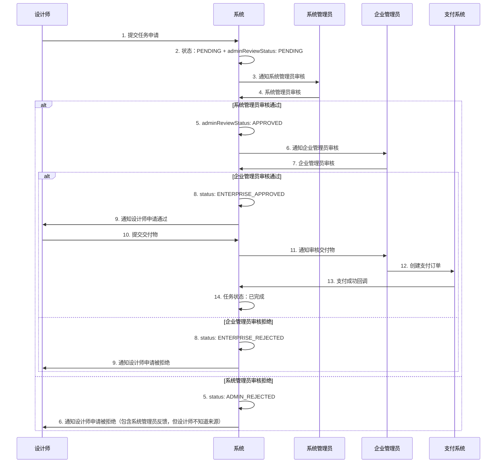
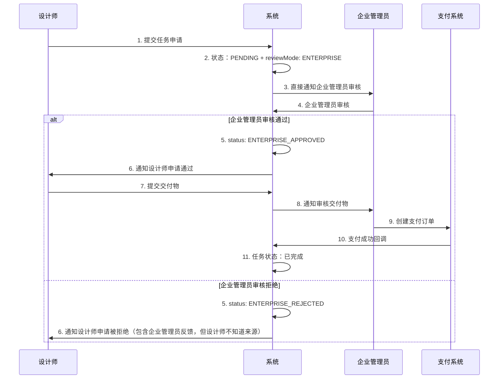
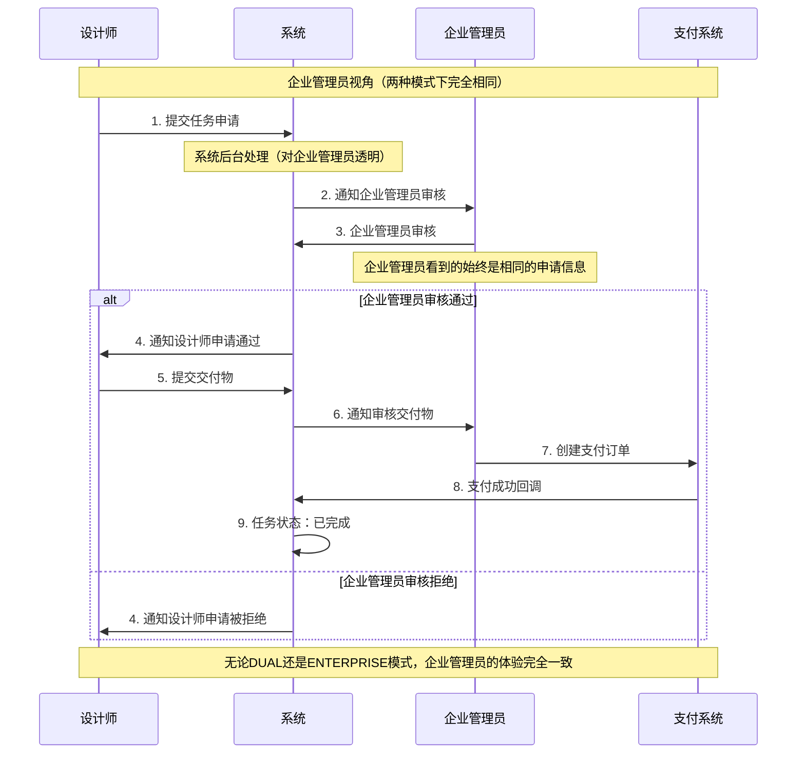
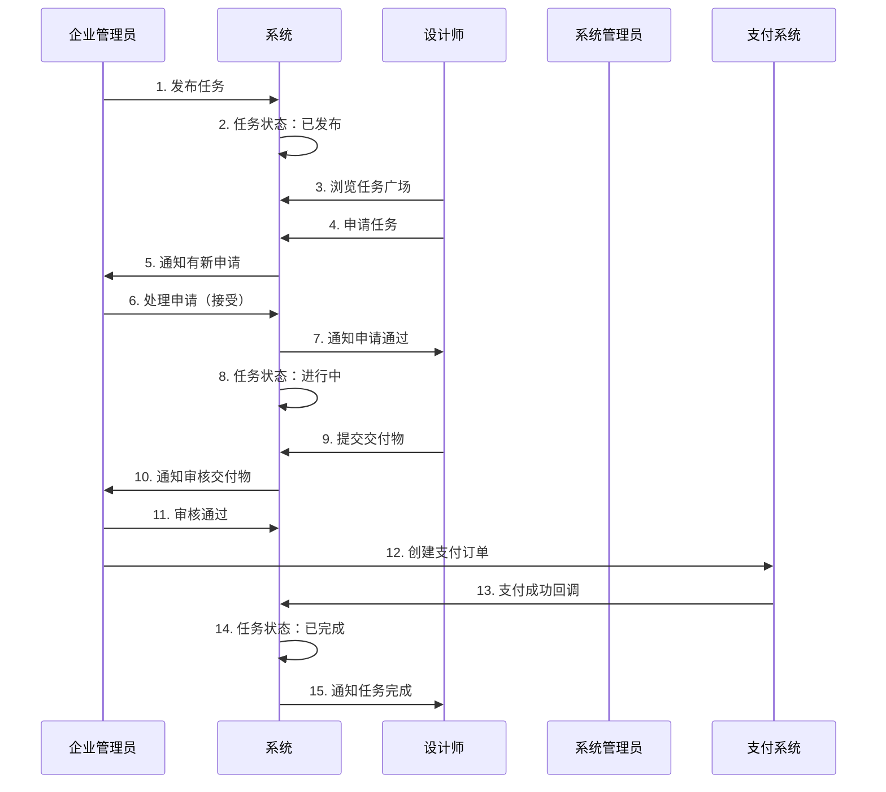

# 智图工厂设计指南（企业版）

## 📋 概述

智图工厂是基于现有设计师生态管理系统的项目任务平台，专门服务于**企业管理员**和**设计师**之间的短期项目合作。与长期雇佣关系的岗位招聘不同，智图工厂专注于短期、高效的设计项目任务。

## 🎯 业务模式对比

### 核心差异总结

| 维度 | 岗位招聘（现有） | 智图工厂（新增） |
|------|------------------|------------------|
| **业务模式** | 长期雇佣关系 | 短期项目合作 |
| **主要用户** | 企业管理员 + 设计师 | 企业管理员 + 设计师 |
| **内容类型** | 职位招聘信息 | 项目任务需求 |
| **时间周期** | 长期（月/年） | 短期（天/周） |
| **价格模式** | 月薪/年薪 | 项目价格 |
| **工作流程** | 投递→面试→入职 | 申请→执行→交付→结算 |
| **关键指标** | 薪资、经验、学历 | 价格、技能、截止时间 |
| **交付物** | 无明确交付物 | 明确的设计成果 |
| **数据表** | `des_job_posting` | `des_task` |

### 用户流程对比

#### 岗位招聘流程（现有）
```
企业发布职位 → 设计师浏览职位 → 投递简历 → 企业筛选 →
面试沟通 → 录用决定 → 入职手续 → 长期合作
```

#### 智图工厂流程（新增）
```
企业发布任务 → 设计师浏览任务 → 申请任务 → 企业选择 →
签约确认 → 执行任务 → 提交成果 → 验收确认 → 支付结算
```

## 📊 数据结构设计

### 基于现有企业系统的扩展

智图工厂将复用现有的企业管理功能：

#### 1. 复用现有企业数据结构

```typescript
// 现有企业表：des_enterprise（无需修改）
interface Enterprise {
  enterpriseId: number
  userId: number           // 关联的企业管理员用户ID
  enterpriseName: string
  description: string
  industry: string
  scale: string
  address: string
  phone: string
  email: string
  website: string
  logo: string
  status: string          // 0正常 1停用
  // ... 其他现有字段
}
```

#### 2. 新增任务管理数据结构

```typescript
// 新增表：des_task
interface Task {
  taskId: number
  enterpriseId: number     // 复用现有企业ID
  taskTitle: string
  taskDescription: string
  taskType: TaskType       // LOGO设计、UI设计、平面设计等
  skillTags: string        // JSON格式，复用现有技能标签系统
  budgetMin: number
  budgetMax: number
  deadline: string
  urgent: boolean          // 紧急任务标识
  status: TaskStatus       // 草稿、已发布、进行中、已完成、已取消
  deliverables: string     // 交付物要求
  paymentTerms: string     // 付款条款
  views: number            // 浏览次数
  applications: number     // 申请数量
  createBy: number
  createTime: string
  updateBy: number
  updateTime: string
  delFlag: string
}

enum TaskType {
  LOGO_DESIGN = 'LOGO_DESIGN',
  UI_UX_DESIGN = 'UI_UX_DESIGN',
  GRAPHIC_DESIGN = 'GRAPHIC_DESIGN',
  ILLUSTRATION = 'ILLUSTRATION',
  BRAND_DESIGN = 'BRAND_DESIGN'
}

enum TaskStatus {
  DRAFT = 'DRAFT',           // 草稿
  PUBLISHED = 'PUBLISHED',   // 已发布
  IN_PROGRESS = 'IN_PROGRESS', // 进行中
  COMPLETED = 'COMPLETED',   // 已完成
  CANCELLED = 'CANCELLED'    // 已取消
}
```

#### 3. 任务申请数据结构（基于现有申请系统，支持双重审核）

```typescript
// 新增表：des_task_application（模仿des_job_application，扩展双重审核功能）
interface TaskApplication {
  applicationId: number
  taskId: number
  designerId: number       // 复用现有设计师ID
  proposal: string         // 申请提案（类似现有的coverLetter）
  proposedPrice: number    // 报价金额
  estimatedDays: number    // 预计完成天数
  portfolioLinks: string   // JSON格式的作品链接

  // 最终申请状态
  status: ApplicationStatus // 最终申请状态
  feedback: string         // 统一的审核反馈（主要存储企业管理员反馈，但设计师看到的是统一格式）

  // 双重审核扩展字段
  adminReviewStatus: ReviewStatus    // 系统管理员审核状态
  adminReviewFeedback: string        // 系统管理员审核反馈
  adminReviewTime: string           // 系统管理员审核时间
  adminReviewBy: number             // 系统管理员审核人ID

  enterpriseReviewStatus: ReviewStatus // 企业管理员审核状态
  enterpriseReviewFeedback: string     // 企业管理员审核反馈
  enterpriseReviewTime: string        // 企业管理员审核时间

  reviewMode: ReviewMode             // 审核模式

  createBy: number
  createTime: string
  updateBy: number
  updateTime: string
  delFlag: string
}

// 最终申请状态枚举
enum ApplicationStatus {
  PENDING = '0',           // 待审核（初始状态）
  ADMIN_APPROVED = '1',    // 系统管理员审核通过
  ADMIN_REJECTED = '2',    // 系统管理员审核拒绝
  ENTERPRISE_APPROVED = '3', // 企业管理员审核通过（最终通过）
  ENTERPRISE_REJECTED = '4', // 企业管理员审核拒绝
  WITHDRAWN = '5'          // 已撤回
}

// 单独的审核状态枚举
enum ReviewStatus {
  PENDING = 'PENDING',     // 待审核
  APPROVED = 'APPROVED',   // 审核通过
  REJECTED = 'REJECTED'    // 审核拒绝
}

// 审核模式枚举
enum ReviewMode {
  DUAL = 'DUAL',           // 双重审核模式（系统管理员→企业管理员）
  ENTERPRISE = 'ENTERPRISE' // 企业自主审核模式
}
```

#### 4. 任务交付数据结构

```typescript
// 新增表：des_task_deliverable
interface TaskDeliverable {
  deliverableId: number
  taskId: number
  designerId: number
  deliverableContent: string // 交付内容（可包含链接、提取码、说明等）
  version: number          // 版本号
  status: DeliverableStatus
  reviewFeedback: string   // 审核反馈
  createBy: number
  createTime: string
  updateBy: number
  updateTime: string
  delFlag: string
}

enum DeliverableStatus {
  SUBMITTED = 'SUBMITTED',     // 已提交
  APPROVED = 'APPROVED',       // 已通过
  REVISION_REQUIRED = 'REVISION_REQUIRED', // 需要修改
  REJECTED = 'REJECTED'        // 已拒绝
}
```

#### 5. 支付管理数据结构

```typescript
// 新增表：des_task_payment
interface TaskPayment {
  paymentId: number
  taskId: number
  designerId: number
  enterpriseId: number
  amount: number
  paymentMethod: PaymentMethod
  status: PaymentStatus
  orderNo: string          // 支付订单号
  transactionId: string    // 第三方交易号
  paymentTime: string
  confirmTime: string
  createBy: number
  createTime: string
  updateBy: number
  updateTime: string
  delFlag: string
}

enum PaymentMethod {
  ALIPAY = 'ALIPAY',
  WECHAT = 'WECHAT',
  BANK_TRANSFER = 'BANK_TRANSFER'
}

enum PaymentStatus {
  PENDING = 'PENDING',     // 待支付
  PAID = 'PAID',          // 已支付
  FAILED = 'FAILED',      // 支付失败
  REFUNDED = 'REFUNDED'   // 已退款
}
```

#### 6. 环境变量配置

```typescript
// .env 配置文件
// 审核模式配置：DUAL双重审核/ENTERPRISE企业自主审核
VITE_TASK_REVIEW_MODE=DUAL

// 配置工具类
export class TaskConfigService {
  // 获取当前审核模式
  static getReviewMode(): ReviewMode {
    return import.meta.env.VITE_TASK_REVIEW_MODE || 'DUAL'
  }

  // 检查是否为双重审核模式
  static isDualReviewMode(): boolean {
    return this.getReviewMode() === 'DUAL'
  }

  // 检查是否为企业自主审核模式
  static isEnterpriseReviewMode(): boolean {
    return this.getReviewMode() === 'ENTERPRISE'
  }
}
```

## 🚀 API接口设计

### 接口架构设计

基于现有的企业管理接口，扩展智图工厂功能：

#### 1. 任务管理接口（复用企业权限体系）

```typescript
// 基础任务管理接口
GET    /designer/task/list              # 查询任务列表
GET    /designer/task/{id}              # 获取任务详情
POST   /designer/task                   # 创建任务（仅企业管理员）
PUT    /designer/task/{id}              # 更新任务（仅企业管理员）
DELETE /designer/task/{ids}             # 删除任务（仅企业管理员）

// 企业专用任务管理接口
GET    /designer/enterprise/tasks/list       # 获取当前企业的任务列表
POST   /designer/enterprise/tasks       # 企业发布任务
PUT    /designer/enterprise/tasks/{id}  # 企业修改任务
DELETE /designer/enterprise/tasks/{id}  # 企业删除任务
POST   /designer/enterprise/tasks/{id}/publish # 发布任务
POST   /designer/enterprise/tasks/{id}/cancel  # 取消任务

// 任务查询接口
GET    /designer/task/enterprise/{id}   # 查询企业的公开任务
GET    /designer/task/type/{type}       # 按任务类型查询
GET    /designer/task/skills            # 按技能查询（复用现有逻辑）
GET    /designer/task/urgent            # 查询紧急任务
```

#### 2. 任务申请接口（基于现有申请系统，支持双重审核）

```typescript
// 基础任务申请管理接口
GET    /designer/task-application/list          # 查询申请列表
GET    /designer/task-application/{id}          # 获取申请详情
POST   /designer/task-application/apply         # 申请任务
PUT    /designer/task-application/withdraw      # 撤回申请（设计师）
GET    /designer/task-application/task/{id}     # 任务的申请列表
GET    /designer/task-application/designer/{id} # 设计师的申请列表

// 双重审核接口
POST   /designer/task-application/{id}/admin-review    # 系统管理员审核
POST   /designer/task-application/{id}/enterprise-review # 企业管理员审核
GET    /designer/task-application/admin/pending        # 系统管理员待审核列表
GET    /designer/task-application/enterprise/pending   # 企业管理员待审核列表
GET    /designer/task-application/admin/statistics     # 系统管理员审核统计
GET    /designer/task-application/enterprise/statistics # 企业管理员审核统计

// 审核模式查询接口
GET    /designer/task-application/review-mode   # 获取当前审核模式（读取环境变量）
```

#### 3. 交付管理接口

```typescript
// 交付物管理接口
GET    /designer/task-deliverable/list          # 查询交付物列表
POST   /designer/task-deliverable               # 提交交付物链接（设计师）
PUT    /designer/task-deliverable/{id}          # 更新交付物链接
DELETE /designer/task-deliverable/{id}          # 删除交付物
POST   /designer/task-deliverable/{id}/review   # 审核交付物（企业管理员）
GET    /designer/task-deliverable/task/{id}     # 任务的交付物列表
```

**交付物提交接口示例**：
```bash
POST /designer/task-deliverable
Content-Type: application/json

{
  "taskId": 1,
  "deliverableContent": "设计稿已完成，包含AI源文件和PNG导出文件\n\n百度网盘链接：https://pan.baidu.com/s/1abcdef123456\n提取码：abc123\n\nGitHub发布包：https://github.com/user/project/releases/tag/v1.0\n\n注意事项：\n1. AI源文件在网盘的design文件夹中\n2. PNG导出文件在assets文件夹中\n3. 建议使用最新版本的AI软件打开源文件",
  "version": 1
}
```

#### 4. 双重审核接口示例

**系统管理员审核接口**：
```bash
POST /designer/task-application/{id}/admin-review
Content-Type: application/json

{
  "status": "APPROVED",
  "feedback": "申请内容详实，设计师作品质量较高，建议通过。"
}
```

**企业管理员审核接口**：
```bash
POST /designer/task-application/{id}/enterprise-review
Content-Type: application/json

{
  "status": "APPROVED",
  "feedback": "设计师专业能力符合要求，价格合理，同意合作。"
}
```

**审核模式查询接口**：
```bash
GET /designer/task-application/review-mode
Content-Type: application/json

Response:
{
  "code": 200,
  "msg": "操作成功",
  "data": {
    "reviewMode": "DUAL",
    "description": "双重审核模式：系统管理员→企业管理员"
  }
}
```

#### 5. 支付管理接口

```typescript
// 支付管理接口
GET    /designer/task-payment/list              # 查询支付记录
POST   /designer/task-payment/create-order      # 创建支付订单（企业管理员）
POST   /designer/task-payment/{id}/confirm      # 确认支付
POST   /designer/task-payment/{id}/refund       # 申请退款
GET    /designer/task-payment/statistics        # 支付统计
```

#### 6. 企业任务统计接口

```typescript
// 企业任务统计接口（基于现有企业系统）
GET    /designer/enterprise/task-stats          # 企业任务统计
GET    /designer/enterprise/payment-stats       # 企业支付统计
GET    /designer/enterprise/designer-pool       # 企业合作设计师池
```

## 🎨 前端组件设计

### 1. 页面布局设计

#### 智图工厂主页面结构

```vue
<!-- src/views/task/layout.vue -->
<template>
  <div class="task-layout">
    <!-- 复用现有的人才模块布局结构 -->
    <div class="task-header">
      <h1 class="module-title">智图工厂</h1>
      <div class="header-actions">
        <UserMenu />
      </div>
    </div>

    <div class="task-nav">
      <NTabs v-model:value="activeTab" type="segment" @update:value="handleTabChange">
        <NTab name="marketplace" tab="任务广场">
          <template #suffix>
            <IconSvg name="ri-store-line" />
          </template>
        </NTab>
        <NTab name="my-tasks" tab="我的任务">
          <template #suffix>
            <IconSvg name="ri-task-line" />
          </template>
        </NTab>
        <NTab name="applications" tab="申请管理">
          <template #suffix>
            <IconSvg name="ri-file-list-line" />
          </template>
        </NTab>
        <NTab name="deliverables" tab="交付管理">
          <template #suffix>
            <IconSvg name="ri-upload-cloud-line" />
          </template>
        </NTab>
        <NTab name="payments" tab="支付中心">
          <template #suffix>
            <IconSvg name="ri-wallet-line" />
          </template>
        </NTab>
        <!-- 企业管理员专用标签 -->
        <NTab v-if="isEnterprise" name="publish" tab="发布任务">
          <template #suffix>
            <IconSvg name="ri-add-line" />
          </template>
        </NTab>
        <NTab v-if="isEnterprise" name="enterprise-stats" tab="企业统计">
          <template #suffix>
            <IconSvg name="ri-bar-chart-line" />
          </template>
        </NTab>
        <!-- 系统管理员专用标签 -->
        <NTab v-if="isAdmin" name="admin-review" tab="审核管理">
          <template #suffix>
            <IconSvg name="ri-shield-check-line" />
          </template>
        </NTab>
        <NTab v-if="isAdmin" name="review-statistics" tab="审核统计">
          <template #suffix>
            <IconSvg name="ri-dashboard-line" />
          </template>
        </NTab>
      </NTabs>
    </div>

    <div class="task-content">
      <RouterView />
    </div>
  </div>
</template>
```

### 2. 任务卡片组件（基于现有岗位卡片）

```vue
<!-- src/components/task/TaskCard.vue -->
<template>
  <div class="task-card" :class="{ urgent: task.urgent }">
    <div class="task-header">
      <h3 class="task-title">{{ task.taskTitle }}</h3>
      <div class="task-meta">
        <SkillTag v-for="tag in task.skillTags" :key="tag" :tag="tag" />
        <span v-if="task.urgent" class="urgent-badge">紧急</span>
      </div>
    </div>

    <div class="task-content">
      <p class="task-description">{{ task.taskDescription }}</p>
      <div class="task-details">
        <div class="budget">
          <IconSvg name="ri-money-dollar-circle-line" />
          <span>¥{{ task.budgetMin }} - ¥{{ task.budgetMax }}</span>
        </div>
        <div class="deadline">
          <IconSvg name="ri-time-line" />
          <span>{{ formatDeadline(task.deadline) }}</span>
        </div>
      </div>
    </div>

    <div class="task-footer">
      <div class="enterprise-info">
        <!-- 复用现有企业组件 -->
        <EnterpriseAvatar :enterprise="task.enterprise" size="small" />
        <span class="enterprise-name">{{ task.enterprise.enterpriseName }}</span>
        <div class="enterprise-rating">
          <IconSvg name="ri-star-fill" />
          <span>{{ task.enterprise.rating }}</span>
        </div>
      </div>
      <div class="task-actions">
        <HoverButton @click="viewDetails">查看详情</HoverButton>
        <HoverButton v-if="canApply" type="primary" @click="applyTask">
          立即申请
        </HoverButton>
      </div>
    </div>
  </div>
</template>
```

### 3. 企业任务管理组件

```vue
<!-- src/views/task/enterprise/TaskManagement.vue -->
<template>
  <div class="enterprise-task-management">
    <div class="management-header">
      <h2>任务管理</h2>
      <NButton type="primary" @click="openCreateTaskModal">
        <IconSvg name="ri-add-line" />
        发布新任务
      </NButton>
    </div>

    <div class="task-filters">
      <!-- 复用现有的筛选组件 -->
      <TaskFilter v-model:filters="filters" @apply="fetchTasks" />
    </div>

    <div class="task-list">
      <EnterpriseTaskCard
        v-for="task in taskList"
        :key="task.taskId"
        :task="task"
        @edit="editTask"
        @delete="deleteTask"
        @view-applications="viewApplications"
      />
    </div>

    <!-- 创建/编辑任务弹窗 -->
    <TaskCreateModal
      v-model:show="showCreateModal"
      :task="editingTask"
      @success="handleTaskSuccess"
    />
     </div>
 </template>
 ```

 ### 4. 系统管理员审核组件

```vue
<!-- src/views/task/admin/ApplicationReview.vue -->
<template>
  <div class="admin-application-review">
    <div class="review-header">
      <h2>任务申请审核</h2>
      <div class="review-controls">
        <NTag :type="reviewMode === 'DUAL' ? 'warning' : 'success'">
          {{ reviewMode === 'DUAL' ? '双重审核模式' : '企业自主审核模式' }}
        </NTag>
        <span class="review-mode-desc">
          {{ reviewMode === 'DUAL' ? '系统管理员→企业管理员' : '企业管理员直接审核' }}
        </span>
      </div>
    </div>

    <div class="review-stats">
      <NGrid :cols="4" :x-gap="16">
        <NGridItem>
          <NCard>
            <NStatistic label="待审核申请" :value="stats.pendingCount" />
          </NCard>
        </NGridItem>
        <NGridItem>
          <NCard>
            <NStatistic label="今日已审核" :value="stats.reviewedToday" />
          </NCard>
        </NGridItem>
        <NGridItem>
          <NCard>
            <NStatistic label="审核通过率" :value="stats.approveRate" suffix="%" />
          </NCard>
        </NGridItem>
        <NGridItem>
          <NCard>
            <NStatistic label="平均审核时间" :value="stats.avgReviewTime" suffix="小时" />
          </NCard>
        </NGridItem>
      </NGrid>
    </div>

    <div class="application-filters">
      <NSpace>
        <NSelect v-model:value="filters.status"
                 :options="statusOptions"
                 placeholder="审核状态"
                 clearable />
        <NSelect v-model:value="filters.taskType"
                 :options="taskTypeOptions"
                 placeholder="任务类型"
                 clearable />
        <NDatePicker v-model:value="filters.dateRange"
                     type="daterange"
                     placeholder="申请日期"
                     clearable />
        <NButton @click="fetchApplications">筛选</NButton>
        <NButton @click="resetFilters">重置</NButton>
      </NSpace>
    </div>

    <div class="application-list">
      <NDataTable
        :columns="columns"
        :data="applicationList"
        :loading="loading"
        :pagination="pagination"
        @update:page="handlePageChange"
      />
    </div>

    <!-- 审核详情弹窗 -->
    <AdminReviewModal
      v-model:show="showReviewModal"
      :application="selectedApplication"
      @success="handleReviewSuccess"
    />
  </div>
</template>

<script setup lang="ts">
import { ref, onMounted, computed } from 'vue'
import {
  NCard, NGrid, NGridItem, NStatistic, NSpace, NSelect,
  NDatePicker, NButton, NDataTable, NTag, useMessage
} from 'naive-ui'
import { AdminReviewModal } from '@/components/task/admin'
import { taskApplicationApi } from '@/api/task'
import { TaskConfigService } from '@/utils/taskConfig'

const message = useMessage()

// 审核模式（只读）
const reviewMode = ref<ReviewMode>(TaskConfigService.getReviewMode())

// 表格列定义
const columns = [
  { title: '申请编号', key: 'applicationId', width: 100 },
  { title: '任务标题', key: 'taskTitle', width: 200 },
  { title: '申请设计师', key: 'designerName', width: 150 },
  { title: '报价金额', key: 'proposedPrice', width: 100 },
  { title: '预计天数', key: 'estimatedDays', width: 100 },
  { title: '申请时间', key: 'createTime', width: 150 },
  { title: '审核状态', key: 'adminReviewStatus', width: 120 },
  { title: '操作', key: 'actions', width: 200 }
]

// 获取审核模式描述
const getReviewModeDescription = () => {
  return reviewMode.value === 'DUAL'
    ? '当前为双重审核模式，申请将先由系统管理员审核，通过后再由企业管理员审核'
    : '当前为企业自主审核模式，申请将直接由企业管理员审核'
}

// 处理审核成功
const handleReviewSuccess = () => {
  showReviewModal.value = false
  fetchApplications()
}
</script>

<style scoped>
.admin-application-review {
  padding: 24px;
}

.review-header {
  display: flex;
  justify-content: space-between;
  align-items: center;
  margin-bottom: 24px;
}

.review-controls {
  display: flex;
  align-items: center;
  gap: 16px;
}

.review-stats {
  margin-bottom: 24px;
}

.application-filters {
  margin-bottom: 24px;
}

.application-list {
  background: white;
  border-radius: 8px;
  padding: 16px;
}
</style>
```

### 5. 系统管理员审核弹窗组件

```vue
<!-- src/components/task/admin/AdminReviewModal.vue -->
<template>
  <NModal v-model:show="visible" preset="card" style="width: 800px">
    <template #header>审核任务申请</template>

    <div class="review-content">
      <div class="application-info">
        <h3>申请信息</h3>
        <NDescriptions :column="2">
          <NDescriptionsItem label="任务标题">{{ application.taskTitle }}</NDescriptionsItem>
          <NDescriptionsItem label="申请设计师">{{ application.designerName }}</NDescriptionsItem>
          <NDescriptionsItem label="报价金额">¥{{ application.proposedPrice }}</NDescriptionsItem>
          <NDescriptionsItem label="预计天数">{{ application.estimatedDays }}天</NDescriptionsItem>
          <NDescriptionsItem label="申请时间">{{ application.createTime }}</NDescriptionsItem>
        </NDescriptions>
      </div>

      <div class="application-proposal">
        <h3>申请提案</h3>
        <div class="proposal-content">{{ application.proposal }}</div>
      </div>

      <div class="designer-portfolio">
        <h3>作品集链接</h3>
        <div class="portfolio-links">
          <div v-for="link in application.portfolioLinks" :key="link" class="link-item">
            <NInput :value="link" readonly>
              <template #suffix>
                <NButton text @click="openLink(link)">
                  <IconSvg name="ri-external-link-line" />
                </NButton>
              </template>
            </NInput>
          </div>
        </div>
      </div>

      <div class="review-form">
        <h3>审核意见</h3>
        <NForm ref="formRef" :model="reviewForm" :rules="reviewRules">
          <NFormItem label="审核结果" path="status">
            <NRadioGroup v-model:value="reviewForm.status">
              <NRadio value="APPROVED">审核通过</NRadio>
              <NRadio value="REJECTED">审核拒绝</NRadio>
            </NRadioGroup>
          </NFormItem>

          <NFormItem label="审核反馈" path="feedback">
            <NInput v-model:value="reviewForm.feedback"
                    type="textarea"
                    :rows="4"
                    placeholder="请输入审核意见（通过时可选，拒绝时必填）" />
          </NFormItem>
        </NForm>
      </div>
    </div>

    <template #action>
      <NSpace>
        <NButton @click="visible = false">取消</NButton>
        <NButton type="primary" @click="submitReview">提交审核</NButton>
      </NSpace>
    </template>
  </NModal>
</template>

<script setup lang="ts">
import { ref, reactive, computed } from 'vue'
import {
  NModal, NDescriptions, NDescriptionsItem, NForm, NFormItem,
  NInput, NRadioGroup, NRadio, NButton, NSpace, useMessage
} from 'naive-ui'
import { taskApplicationApi } from '@/api/task'

const message = useMessage()

const props = defineProps<{
  show: boolean
  application: TaskApplication
}>()

const emit = defineEmits<{
  'update:show': [value: boolean]
  'success': []
}>()

const visible = computed({
  get: () => props.show,
  set: (val) => emit('update:show', val)
})

// 审核表单
const reviewForm = reactive({
  status: 'APPROVED' as ReviewStatus,
  feedback: ''
})

// 审核规则
const reviewRules = {
  status: { required: true, message: '请选择审核结果' },
  feedback: {
    required: false,
    trigger: ['blur', 'input'],
    validator: (rule: any, value: string) => {
      if (reviewForm.status === 'REJECTED' && !value.trim()) {
        return new Error('审核拒绝时必须填写审核反馈')
      }
      return true
    }
  }
}

// 提交审核
const submitReview = async () => {
  try {
    await taskApplicationApi.adminReviewApplication({
      applicationId: props.application.applicationId,
      status: reviewForm.status,
      feedback: reviewForm.feedback
    })

    message.success('审核提交成功')
    emit('success')

  } catch (error) {
    message.error('审核提交失败')
  }
}

// 打开链接
const openLink = (url: string) => {
  window.open(url, '_blank')
}
</script>

<style scoped>
.review-content {
  display: flex;
  flex-direction: column;
  gap: 24px;
}

.proposal-content {
  padding: 16px;
  background: var(--bg-color-1);
  border-radius: 8px;
  border: 1px solid var(--border-color);
  white-space: pre-wrap;
}

.portfolio-links {
  display: flex;
  flex-direction: column;
  gap: 12px;
}

.link-item {
  display: flex;
  align-items: center;
}
</style>
```

### 6. 交付物提交组件

 ```vue
 <!-- src/components/task/DeliverableSubmissionModal.vue -->
 <template>
   <NModal v-model:show="visible" preset="card" style="width: 700px">
     <template #header>提交交付物</template>

     <NForm ref="formRef" :model="form" :rules="rules">
       <NFormItem label="交付内容" path="deliverableContent">
         <NInput v-model:value="form.deliverableContent"
                 type="textarea"
                 :rows="12"
                 placeholder="请提供交付物内容，可包含：
• 文件链接和提取码
• 详细说明和注意事项
• 文件结构说明
• 使用建议等

示例：
设计稿已完成，包含AI源文件和PNG导出文件

百度网盘链接：https://pan.baidu.com/s/1abcdef123456
提取码：abc123

注意事项：
1. AI源文件在design文件夹中
2. PNG导出文件在assets文件夹中"
                 show-count />
       </NFormItem>

       <NFormItem label="版本号" path="version">
         <NInputNumber v-model:value="form.version"
                      :min="1"
                      placeholder="版本号"
                      style="width: 100%" />
       </NFormItem>
     </NForm>

     <template #action>
       <NSpace>
         <NButton @click="visible = false">取消</NButton>
         <NButton type="primary" @click="submitDeliverable">提交交付物</NButton>
       </NSpace>
     </template>
   </NModal>
 </template>

 <script setup lang="ts">
 import { ref, reactive } from 'vue'
 import { NModal, NForm, NFormItem, NInput, NInputNumber, NSelect, NButton, NSpace, useMessage } from 'naive-ui'
 import { IconSvg } from '@/components/common'

 const message = useMessage()

 // 表单数据
 const form = reactive({
   deliverableContent: '',
   version: 1
 })

 // 提交交付物
 const submitDeliverable = async () => {
   try {
     // 验证表单
     if (!form.deliverableContent.trim()) {
       message.error('请提供交付物内容')
       return
     }

     // 提交数据
     const submitData = {
       taskId: props.taskId,
       deliverableContent: form.deliverableContent,
       version: form.version
     }

     // 调用API提交
     // await submitTaskDeliverable(submitData)

     message.success('交付物提交成功')
     visible.value = false

   } catch (error) {
     message.error('提交失败，请重试')
   }
 }
 </script>

    <style scoped>
  .deliverable-content {
    display: flex;
    flex-direction: column;
    gap: 16px;
  }

  .content-display {
    background: var(--bg-color-1);
    border: 1px solid var(--border-color);
    border-radius: 8px;
    padding: 16px;
    max-height: 400px;
    overflow-y: auto;
  }

  .content-display pre {
    margin: 0;
    white-space: pre-wrap;
    word-wrap: break-word;
    font-family: inherit;
    line-height: 1.6;
    color: var(--text-color-1);
  }

  .content-actions {
    display: flex;
    gap: 12px;
  }
     </style>
  ```

  ### 5. 交付物查看组件

  ```vue
  <!-- src/components/task/DeliverableViewModal.vue -->
  <template>
    <NModal v-model:show="visible" preset="card" style="width: 800px">
      <template #header>查看交付物</template>

      <div class="deliverable-info">
        <div class="info-section">
          <h3>交付内容</h3>
          <div class="deliverable-content">
            <div class="content-display">
              <pre>{{ deliverable.deliverableContent }}</pre>
            </div>
            <div class="content-actions">
              <NButton @click="copyToClipboard(deliverable.deliverableContent)">
                <IconSvg name="ri-file-copy-line" />
                复制全部内容
              </NButton>
              <NButton @click="extractLinks">
                <IconSvg name="ri-external-link-line" />
                提取链接
              </NButton>
            </div>
          </div>
        </div>

        <div class="info-section">
          <h3>版本信息</h3>
          <div class="version-info">
            <span>版本号：{{ deliverable.version }}</span>
            <span>提交时间：{{ formatTime(deliverable.createTime) }}</span>
          </div>
        </div>

        <div v-if="deliverable.reviewFeedback" class="info-section">
          <h3>审核反馈</h3>
          <div class="review-feedback">
            <p>{{ deliverable.reviewFeedback }}</p>
          </div>
        </div>
      </div>

      <template #action>
        <NSpace>
          <NButton @click="visible = false">关闭</NButton>
          <NButton v-if="canReview" type="primary" @click="openReviewModal">
            审核交付物
          </NButton>
        </NSpace>
      </template>
    </NModal>
  </template>

  <script setup lang="ts">
  import { ref, computed } from 'vue'
  import { NModal, NButton, NSpace, NInput, NTag, useMessage } from 'naive-ui'
  import { IconSvg } from '@/components/common'

  const message = useMessage()

  // 复制到剪贴板
  const copyToClipboard = async (text: string) => {
    try {
      await navigator.clipboard.writeText(text)
      message.success('已复制到剪贴板')
    } catch (error) {
      message.error('复制失败')
    }
  }

  // 提取并打开链接
  const extractLinks = () => {
    const urlRegex = /https?:\/\/[^\s]+/g
    const links = props.deliverable.deliverableContent.match(urlRegex) || []

    if (links.length === 0) {
      message.info('未找到有效链接')
      return
    }

    links.forEach(link => {
      window.open(link, '_blank')
    })

    message.success(`已打开 ${links.length} 个链接`)
  }

  // 格式化时间
  const formatTime = (time: string) => {
    return new Date(time).toLocaleString()
  }
  </script>

  <style scoped>
  .deliverable-info {
    display: flex;
    flex-direction: column;
    gap: 24px;
  }

  .info-section h3 {
    margin: 0 0 12px 0;
    color: var(--text-color-1);
    font-size: 16px;
    font-weight: 600;
  }

  .deliverable-content {
    display: flex;
    flex-direction: column;
    gap: 16px;
  }

  .content-display {
    background: var(--bg-color-1);
    border: 1px solid var(--border-color);
    border-radius: 8px;
    padding: 16px;
    max-height: 400px;
    overflow-y: auto;
  }

  .content-display pre {
    margin: 0;
    white-space: pre-wrap;
    word-wrap: break-word;
    font-family: inherit;
    line-height: 1.6;
    color: var(--text-color-1);
  }

  .content-actions {
    display: flex;
    gap: 12px;
  }

  .version-info {
    display: flex;
    gap: 24px;
    color: var(--text-color-2);
  }

  .review-feedback {
    padding: 12px;
    background: var(--bg-color-1);
    border-radius: 6px;
    border-left: 4px solid var(--primary-color);
  }
  </style>
  ```

  ## 🔧 系统集成方案

### 1. 复用现有权限体系

智图工厂将完全基于现有的权限管理系统：

```typescript
// 权限码设计（扩展现有权限码）
const taskPermissions = {
  // 任务管理权限
  'designer:task:list',        // 查看任务列表
  'designer:task:detail',      // 查看任务详情
  'designer:task:add',         // 创建任务（仅企业管理员）
  'designer:task:edit',        // 编辑任务（仅企业管理员）
  'designer:task:delete',      // 删除任务（仅企业管理员）

  // 申请管理权限（复用现有）
  'designer:task-application:apply',    // 申请任务（仅设计师）
  'designer:task-application:process',  // 处理申请（仅企业管理员）
  'designer:task-application:withdraw', // 撤回申请（仅设计师）

  // 交付管理权限
  'designer:task-deliverable:submit',   // 提交交付物（仅设计师）
  'designer:task-deliverable:review',   // 审核交付物（仅企业管理员）

  // 支付管理权限
  'designer:task-payment:create',       // 创建支付（仅企业管理员）
  'designer:task-payment:confirm',      // 确认支付
}
```

### 2. 权限矩阵（基于现有角色）

| 操作 | 设计师 | 企业管理员 | 院校管理员 | 系统管理员 |
|------|--------|------------|------------|------------|
| 浏览任务广场 | ✓ | ✓ | ✓ | ✓ |
| 查看任务详情 | ✓ | ✓ | ✓ | ✓ |
| 发布任务 | ✗ | ✓ | ✗ | ✓ |
| 编辑任务 | ✗ | ✓(自己) | ✗ | ✓ |
| 申请任务 | ✓ | ✗ | ✗ | ✓ |
| **系统管理员一级审核** | ✗ | ✗ | ✗ | **✓** |
| **企业管理员二级审核** | ✗ | **✓**(自己的任务) | ✗ | ✓ |
| **审核模式管理** | ✗ | ✗ | ✗ | **✓** |
| 查看所有申请 | ✗ | ✓(自己的任务) | ✗ | **✓** |
| 提交交付物 | ✓ | ✗ | ✗ | ✓ |
| 审核交付物 | ✗ | ✓(自己的任务) | ✗ | ✓ |
| 创建支付 | ✗ | ✓(自己的任务) | ✗ | ✓ |
| 查看支付记录 | ✓(自己) | ✓(自己) | ✗ | ✓ |
| 任务统计分析 | ✗ | ✓(自己的任务) | ✗ | **✓** |

### 3. 数据库扩展脚本

```sql
-- 智图工厂模块数据库扩展脚本
-- 基于现有企业系统，无需修改现有表结构

-- 1. 任务基础信息表
CREATE TABLE `des_task` (
  `task_id` bigint NOT NULL AUTO_INCREMENT COMMENT '任务ID',
  `enterprise_id` bigint NOT NULL COMMENT '企业ID（关联现有企业表）',
  `task_title` varchar(200) NOT NULL COMMENT '任务标题',
  `task_description` text COMMENT '任务描述',
  `task_type` varchar(50) COMMENT '任务类型',
  `skill_tags` json COMMENT '技能标签（JSON数组）',
  `budget_min` decimal(10,2) COMMENT '预算最低值',
  `budget_max` decimal(10,2) COMMENT '预算最高值',
  `deadline` datetime COMMENT '截止时间',
  `urgent` tinyint(1) DEFAULT 0 COMMENT '是否紧急',
  `status` varchar(20) DEFAULT 'DRAFT' COMMENT '任务状态',
  `deliverables` text COMMENT '交付物要求',
  `payment_terms` text COMMENT '付款条款',
  `views` int DEFAULT 0 COMMENT '浏览次数',
  `applications` int DEFAULT 0 COMMENT '申请数量',
  `create_dept` bigint COMMENT '创建部门',
  `create_by` bigint COMMENT '创建者',
  `create_time` datetime COMMENT '创建时间',
  `update_by` bigint COMMENT '更新者',
  `update_time` datetime COMMENT '更新时间',
  `del_flag` char(1) DEFAULT '0' COMMENT '删除标志',
  `del_time` datetime COMMENT '删除时间',
  `del_by` bigint COMMENT '删除人ID',
  PRIMARY KEY (`task_id`),
  KEY `idx_enterprise_id` (`enterprise_id`),
  KEY `idx_task_type` (`task_type`),
  KEY `idx_deadline` (`deadline`),
  KEY `idx_status` (`status`),
  CONSTRAINT `fk_task_enterprise` FOREIGN KEY (`enterprise_id`) REFERENCES `des_enterprise` (`enterprise_id`)
) COMMENT='任务信息表';

-- 2. 任务申请表（基于现有申请表设计，扩展双重审核功能）
CREATE TABLE `des_task_application` (
  `application_id` bigint NOT NULL AUTO_INCREMENT COMMENT '申请ID',
  `task_id` bigint NOT NULL COMMENT '任务ID',
  `designer_id` bigint NOT NULL COMMENT '设计师ID',
  `proposal` text COMMENT '申请提案',
  `proposed_price` decimal(10,2) COMMENT '报价金额',
  `estimated_days` int COMMENT '预计完成天数',
  `portfolio_links` json COMMENT '作品链接（JSON数组）',

  -- 最终申请状态
  `status` char(1) DEFAULT '0' COMMENT '最终申请状态（0待审核 1系统管理员通过 2系统管理员拒绝 3企业管理员通过 4企业管理员拒绝 5已撤回）',
  `feedback` text COMMENT '统一的审核反馈（主要存储企业管理员反馈，设计师看到的是统一格式）',

  -- 双重审核扩展字段（企业管理员完全不可见）
  `admin_review_status` varchar(20) DEFAULT 'PENDING' COMMENT '系统管理员审核状态（企业管理员不可见）',
  `admin_review_feedback` text COMMENT '系统管理员审核反馈（企业管理员不可见）',
  `admin_review_time` datetime COMMENT '系统管理员审核时间（企业管理员不可见）',
  `admin_review_by` bigint COMMENT '系统管理员审核人ID（企业管理员不可见）',

  -- 企业管理员审核字段
  `enterprise_review_status` varchar(20) DEFAULT 'PENDING' COMMENT '企业管理员审核状态',
  `enterprise_review_feedback` text COMMENT '企业管理员审核反馈',
  `enterprise_review_time` datetime COMMENT '企业管理员审核时间',

  `review_mode` varchar(20) DEFAULT 'DUAL' COMMENT '审核模式(DUAL双重审核/ENTERPRISE企业自主审核)（企业管理员不可见）',

  `create_dept` bigint COMMENT '创建部门',
  `create_by` bigint COMMENT '创建者',
  `create_time` datetime COMMENT '创建时间',
  `update_by` bigint COMMENT '更新者',
  `update_time` datetime COMMENT '更新时间',
  `del_flag` char(1) DEFAULT '0' COMMENT '删除标志',
  `del_time` datetime COMMENT '删除时间',
  `del_by` bigint COMMENT '删除人ID',
  PRIMARY KEY (`application_id`),
  UNIQUE KEY `uk_task_designer` (`task_id`, `designer_id`),
  KEY `idx_task_id` (`task_id`),
  KEY `idx_designer_id` (`designer_id`),
  KEY `idx_admin_review_status` (`admin_review_status`),
  KEY `idx_enterprise_review_status` (`enterprise_review_status`),
  KEY `idx_review_mode` (`review_mode`),
  CONSTRAINT `fk_task_app_task` FOREIGN KEY (`task_id`) REFERENCES `des_task` (`task_id`),
  CONSTRAINT `fk_task_app_designer` FOREIGN KEY (`designer_id`) REFERENCES `des_designer` (`designer_id`)
) COMMENT='任务申请表（支持双重审核）';

-- 数据访问控制视图（企业管理员专用）
-- 创建企业管理员专用视图，完全排除系统管理员相关字段
CREATE VIEW `v_enterprise_task_application` AS
SELECT
  ta.application_id,
  ta.task_id,
  ta.designer_id,
  ta.proposal,
  ta.proposed_price,
  ta.estimated_days,
  ta.portfolio_links,

  -- 企业管理员视角的状态映射
  CASE
    WHEN ta.status = '0' THEN 'PENDING'
    WHEN ta.status = '1' THEN 'PENDING'    -- 系统管理员通过，企业管理员看到的仍是待审核
    WHEN ta.status = '2' THEN 'REJECTED'   -- 系统管理员拒绝，企业管理员看到的是拒绝
    WHEN ta.status = '3' THEN 'APPROVED'   -- 企业管理员通过
    WHEN ta.status = '4' THEN 'REJECTED'   -- 企业管理员拒绝
    WHEN ta.status = '5' THEN 'WITHDRAWN'  -- 已撤回
    ELSE 'PENDING'
  END AS status,

  -- 企业管理员的反馈（不包含系统管理员反馈）
  ta.enterprise_review_feedback AS feedback,

  -- 时间字段
  ta.create_time,
  ta.enterprise_review_time AS review_time,

  -- 关联任务和设计师信息
  t.task_title,
  t.enterprise_id,
  d.name as designer_name,
  d.avatar as designer_avatar

FROM des_task_application ta
JOIN des_task t ON ta.task_id = t.task_id
JOIN des_designer d ON ta.designer_id = d.designer_id
WHERE ta.del_flag = '0'
  AND t.del_flag = '0'
  AND d.del_flag = '0'

-- 严格保证：视图中完全不包含系统管理员相关字段
-- admin_review_status、admin_review_feedback、admin_review_time、admin_review_by、review_mode 完全不出现;

-- 企业管理员查询权限控制
-- 只允许企业管理员查询自己企业的任务申请
DELIMITER //
CREATE PROCEDURE `sp_get_enterprise_applications`(
  IN p_enterprise_id BIGINT,
  IN p_status VARCHAR(20),
  IN p_limit INT,
  IN p_offset INT
)
BEGIN
  DECLARE EXIT HANDLER FOR SQLEXCEPTION
  BEGIN
    ROLLBACK;
    RESIGNAL;
  END;

  START TRANSACTION;

  -- 使用企业管理员专用视图，确保不返回系统管理员信息
  SELECT
    application_id,
    task_id,
    designer_id,
    task_title,
    designer_name,
    designer_avatar,
    proposal,
    proposed_price,
    estimated_days,
    portfolio_links,
    status,
    feedback,
    create_time,
    review_time
  FROM v_enterprise_task_application
  WHERE enterprise_id = p_enterprise_id
    AND (p_status IS NULL OR status = p_status)
  ORDER BY create_time DESC
  LIMIT p_limit OFFSET p_offset;

  -- 统计信息（仅企业管理员相关）
  SELECT
    COUNT(*) as total_count,
    SUM(CASE WHEN status = 'PENDING' THEN 1 ELSE 0 END) as pending_count,
    SUM(CASE WHEN status = 'APPROVED' THEN 1 ELSE 0 END) as approved_count,
    SUM(CASE WHEN status = 'REJECTED' THEN 1 ELSE 0 END) as rejected_count,
    SUM(CASE WHEN DATE(review_time) = CURDATE() THEN 1 ELSE 0 END) as reviewed_today
  FROM v_enterprise_task_application
  WHERE enterprise_id = p_enterprise_id;

  COMMIT;
END //
DELIMITER ;

-- 数据访问安全策略
-- 创建企业管理员专用的数据访问函数
DELIMITER //
CREATE FUNCTION `fn_check_enterprise_application_access`(
  p_application_id BIGINT,
  p_user_id BIGINT
) RETURNS BOOLEAN
READS SQL DATA
DETERMINISTIC
BEGIN
  DECLARE v_count INT DEFAULT 0;

  -- 检查用户是否有权限访问该申请
  -- 只有该申请所属任务的企业管理员可以访问
  SELECT COUNT(*) INTO v_count
  FROM des_task_application ta
  JOIN des_task t ON ta.task_id = t.task_id
  JOIN des_enterprise e ON t.enterprise_id = e.enterprise_id
  WHERE ta.application_id = p_application_id
    AND e.user_id = p_user_id
    AND ta.del_flag = '0'
    AND t.del_flag = '0'
    AND e.del_flag = '0';

  RETURN v_count > 0;
END //
DELIMITER ;

-- 数据库触发器：确保数据隔离
-- 创建触发器，防止企业管理员相关的查询意外访问系统管理员字段
DELIMITER //
CREATE TRIGGER `tr_enterprise_query_protection`
BEFORE SELECT ON `des_task_application`
FOR EACH ROW
BEGIN
  -- 如果是企业管理员角色的查询，记录日志并确保不返回系统管理员字段
  -- 这里可以根据实际需求添加具体的保护逻辑
  -- 例如：记录访问日志，检查查询语句是否包含系统管理员字段等

  INSERT INTO audit_log (
    table_name,
    operation,
    user_id,
    access_time,
    notes
  ) VALUES (
    'des_task_application',
    'SELECT',
    USER(),
    NOW(),
    'Enterprise admin query protection triggered'
  );
END //
DELIMITER ;

-- 3. 任务交付表
CREATE TABLE `des_task_deliverable` (
  `deliverable_id` bigint NOT NULL AUTO_INCREMENT COMMENT '交付物ID',
  `task_id` bigint NOT NULL COMMENT '任务ID',
  `designer_id` bigint NOT NULL COMMENT '设计师ID',
  `deliverable_content` text COMMENT '交付内容（可包含链接、提取码、说明等）',
  `version` int DEFAULT 1 COMMENT '版本号',
  `status` varchar(20) DEFAULT 'SUBMITTED' COMMENT '状态',
  `review_feedback` text COMMENT '审核反馈',
  `create_dept` bigint COMMENT '创建部门',
  `create_by` bigint COMMENT '创建者',
  `create_time` datetime COMMENT '创建时间',
  `update_by` bigint COMMENT '更新者',
  `update_time` datetime COMMENT '更新时间',
  `del_flag` char(1) DEFAULT '0' COMMENT '删除标志',
  `del_time` datetime COMMENT '删除时间',
  `del_by` bigint COMMENT '删除人ID',
  PRIMARY KEY (`deliverable_id`),
  KEY `idx_task_id` (`task_id`),
  KEY `idx_designer_id` (`designer_id`),
  CONSTRAINT `fk_deliverable_task` FOREIGN KEY (`task_id`) REFERENCES `des_task` (`task_id`),
  CONSTRAINT `fk_deliverable_designer` FOREIGN KEY (`designer_id`) REFERENCES `des_designer` (`designer_id`)
) COMMENT='任务交付表';

-- 4. 任务支付表
CREATE TABLE `des_task_payment` (
  `payment_id` bigint NOT NULL AUTO_INCREMENT COMMENT '支付ID',
  `task_id` bigint NOT NULL COMMENT '任务ID',
  `designer_id` bigint NOT NULL COMMENT '设计师ID',
  `enterprise_id` bigint NOT NULL COMMENT '企业ID',
  `amount` decimal(10,2) NOT NULL COMMENT '支付金额',
  `payment_method` varchar(20) COMMENT '支付方式',
  `status` varchar(20) DEFAULT 'PENDING' COMMENT '支付状态',
  `order_no` varchar(64) COMMENT '支付订单号',
  `transaction_id` varchar(64) COMMENT '第三方交易号',
  `payment_time` datetime COMMENT '支付时间',
  `confirm_time` datetime COMMENT '确认时间',
  `create_dept` bigint COMMENT '创建部门',
  `create_by` bigint COMMENT '创建者',
  `create_time` datetime COMMENT '创建时间',
  `update_by` bigint COMMENT '更新者',
  `update_time` datetime COMMENT '更新时间',
  `del_flag` char(1) DEFAULT '0' COMMENT '删除标志',
  `del_time` datetime COMMENT '删除时间',
  `del_by` bigint COMMENT '删除人ID',
  PRIMARY KEY (`payment_id`),
  KEY `idx_task_id` (`task_id`),
  KEY `idx_designer_id` (`designer_id`),
  KEY `idx_enterprise_id` (`enterprise_id`),
  CONSTRAINT `fk_payment_task` FOREIGN KEY (`task_id`) REFERENCES `des_task` (`task_id`),
  CONSTRAINT `fk_payment_designer` FOREIGN KEY (`designer_id`) REFERENCES `des_designer` (`designer_id`),
  CONSTRAINT `fk_payment_enterprise` FOREIGN KEY (`enterprise_id`) REFERENCES `des_enterprise` (`enterprise_id`)
) COMMENT='任务支付表';

-- 5. 环境变量配置说明
-- 在项目根目录的 .env 文件中配置：
-- VITE_TASK_REVIEW_MODE=DUAL  # 双重审核模式
-- VITE_TASK_REVIEW_MODE=ENTERPRISE  # 企业自主审核模式

-- 审核模式说明：
-- DUAL: 双重审核模式（系统管理员→企业管理员）
-- ENTERPRISE: 企业自主审核模式（企业管理员直接审核）

-- 6. 扩展数据字典（复用现有字典系统）
INSERT INTO `sys_dict_type` VALUES (104, '任务类型', 'task_type', '0', 1, NOW(), '智图工厂任务类型');
INSERT INTO `sys_dict_data` VALUES (1041, 1, 'LOGO设计', 'LOGO_DESIGN', 'task_type', '', 'primary', 'N', '0', 1, NOW(), '');
INSERT INTO `sys_dict_data` VALUES (1042, 2, 'UI/UX设计', 'UI_UX_DESIGN', 'task_type', '', 'success', 'N', '0', 1, NOW(), '');
INSERT INTO `sys_dict_data` VALUES (1043, 3, '平面设计', 'GRAPHIC_DESIGN', 'task_type', '', 'info', 'N', '0', 1, NOW(), '');
INSERT INTO `sys_dict_data` VALUES (1044, 4, '插画设计', 'ILLUSTRATION', 'task_type', '', 'warning', 'N', '0', 1, NOW(), '');
INSERT INTO `sys_dict_data` VALUES (1045, 5, '品牌设计', 'BRAND_DESIGN', 'task_type', '', 'danger', 'N', '0', 1, NOW(), '');

INSERT INTO `sys_dict_type` VALUES (105, '任务状态', 'task_status', '0', 1, NOW(), '智图工厂任务状态');
INSERT INTO `sys_dict_data` VALUES (1051, 1, '草稿', 'DRAFT', 'task_status', '', 'info', 'N', '0', 1, NOW(), '');
INSERT INTO `sys_dict_data` VALUES (1052, 2, '已发布', 'PUBLISHED', 'task_status', '', 'primary', 'N', '0', 1, NOW(), '');
INSERT INTO `sys_dict_data` VALUES (1053, 3, '进行中', 'IN_PROGRESS', 'task_status', '', 'warning', 'N', '0', 1, NOW(), '');
INSERT INTO `sys_dict_data` VALUES (1054, 4, '已完成', 'COMPLETED', 'task_status', '', 'success', 'N', '0', 1, NOW(), '');
INSERT INTO `sys_dict_data` VALUES (1055, 5, '已取消', 'CANCELLED', 'task_status', '', 'danger', 'N', '0', 1, NOW(), '');


-- 6. 菜单权限配置（扩展现有菜单系统）
INSERT INTO `sys_menu` VALUES (2101, '智图工厂', 2001, 6, 'factory', 'task/factory/index', '', 1, 0, 'C', '0', '0', 'designer:task:list', 'build', 1, NOW(), '智图工厂任务平台');
INSERT INTO `sys_menu` VALUES (2102, '任务广场', 2101, 1, 'marketplace', 'task/marketplace/index', '', 1, 0, 'C', '0', '0', 'designer:task:list', 'store', 1, NOW(), '');
INSERT INTO `sys_menu` VALUES (2103, '我的任务', 2101, 2, 'my-tasks', 'task/my-tasks/index', '', 1, 0, 'C', '0', '0', 'designer:task:list', 'task', 1, NOW(), '');
INSERT INTO `sys_menu` VALUES (2104, '申请管理', 2101, 3, 'applications', 'task/applications/index', '', 1, 0, 'C', '0', '0', 'designer:task-application:list', 'file-list', 1, NOW(), '');
INSERT INTO `sys_menu` VALUES (2105, '交付管理', 2101, 4, 'deliverables', 'task/deliverables/index', '', 1, 0, 'C', '0', '0', 'designer:task-deliverable:list', 'upload', 1, NOW(), '');
INSERT INTO `sys_menu` VALUES (2106, '支付中心', 2101, 5, 'payments', 'task/payments/index', '', 1, 0, 'C', '0', '0', 'designer:task-payment:list', 'wallet', 1, NOW(), '');

-- 系统管理员专用菜单
INSERT INTO `sys_menu` VALUES (2107, '审核管理', 2101, 6, 'admin-review', 'task/admin/review/index', '', 1, 0, 'C', '0', '0', 'designer:task-application:admin-review', 'shield-check', 1, NOW(), '系统管理员审核任务申请');
INSERT INTO `sys_menu` VALUES (2108, '审核统计', 2101, 7, 'review-statistics', 'task/admin/statistics/index', '', 1, 0, 'C', '0', '0', 'designer:task-application:admin-statistics', 'dashboard', 1, NOW(), '系统管理员审核统计分析');
```

## 📈 业务流程设计

### 1. 双重审核模式流程



### 2. 企业自主审核模式流程



### 3. 审核模式切换流程

```mermaid
flowchart TD
    A[系统管理员] --> B{评估平台状态}
    B -->|平台早期| C[选择双重审核模式]
    B -->|平台成熟| D[选择企业自主审核模式]

    C --> E[系统管理员一级审核]
    E --> F[企业管理员二级审核]
    F --> G[申请处理完成]

    D --> H[企业管理员直接审核]
    H --> G

    I[运营数据监控] --> J{质量是否下降}
    J -->|是| K[切换回双重审核]
    J -->|否| L[维持当前模式]

    K --> C
    L --> M[持续监控]
    M --> I
```



### 4. 企业管理员视角的透明流程

基于透明性原则，企业管理员在两种审核模式下看到的流程是完全相同的：



**透明性保障机制**：
- **统一数据格式**：企业管理员和设计师获得的数据格式在两种模式下完全相同
- **相同操作流程**：审核界面、申请界面、操作按钮、反馈机制保持一致
- **无感知切换**：审核模式变更对所有用户完全透明
- **决策权保留**：企业管理员始终拥有最终的业务决策权
- **反馈来源统一**：设计师收到的反馈完全统一，不区分来源
- **状态感知一致**：设计师在两种模式下的状态感知完全相同

### 4. 原有完整任务流程（更新）



### 2. 企业管理员操作流程

#### 2.1 任务发布流程
1. **登录企业管理员账号**
2. **进入智图工厂模块**
3. **点击"发布任务"**
4. **填写任务信息**：
   - 任务标题和描述
   - 任务类型和技能要求
   - 预算范围
   - 截止时间
   - 交付物要求
5. **保存草稿或直接发布**
6. **任务进入任务广场**

#### 2.2 申请处理流程
1. **查看任务申请列表**
2. **审核设计师提案**：
   - 查看设计师档案
   - 评估报价合理性
   - 查看作品集链接
3. **做出决定**：接受/拒绝/要求补充信息
4. **发送反馈信息**

#### 2.3 交付审核流程
1. **收到交付物通知**
2. **通过链接访问并检查文件**
3. **评估是否符合要求**
4. **审核决定**：
   - 通过：进入支付流程
   - 需要修改：返回修改意见
   - 拒绝：说明拒绝原因

### 3. 设计师操作流程

#### 3.1 任务申请流程
1. **浏览任务广场**
2. **筛选合适任务**：
   - 按技能筛选
   - 按预算筛选
   - 按截止时间筛选
3. **查看任务详情**
4. **提交申请**：
   - 撰写申请提案
   - 设置报价
   - 提供作品链接
   - 估算完成时间

#### 3.2 任务执行流程
1. **收到申请通过通知**
2. **开始设计工作**
3. **进度跟踪和沟通**
4. **完成设计**
5. **提交交付物**：
   - 提交设计文件链接（百度网盘、腾讯微云、GitHub等）
   - 提供提取码（如果需要）
   - 添加说明文档
   - 标注版本信息

#### 3.3 收款流程
1. **交付物审核通过**
2. **企业创建支付订单**
3. **收到款项到账通知**
4. **任务完成**

## 🔧 技术实现要点

### 1. 复用现有组件和服务

```typescript
// 复用现有的权限工具类
import { DesignerPermissionUtils } from '@/utils/designerPermissionUtils'

// 复用现有的企业服务
import { EnterpriseService } from '@/api/talent/enterprise'

// 复用现有的技能标签组件
import { SkillTag, SkillTagList, SkillTagSelector } from '@/components/common'

// 复用现有的表单组件
import { NInput, NSelect, NButton } from 'naive-ui'
```

### 2. 智能权限控制

```typescript
// 基于现有权限系统的智能控制
export class TaskPermissionController {
  // 检查任务操作权限
  static canOperateTask(taskId: number, operation: string): boolean {
    const userRole = getCurrentRole()
    const task = getTaskById(taskId)

    switch (operation) {
      case 'edit':
        // 只有任务发布者（企业管理员）可以编辑
        return userRole.roleKey === 'enterprise' &&
               task.enterprise.userId === getCurrentUserId()

      case 'apply':
        // 只有设计师可以申请，且不能申请自己企业的任务
        return userRole.roleKey === 'designer' &&
               task.enterprise.userId !== getCurrentUserId()

      case 'review':
        // 只有任务发布者可以审核
        return userRole.roleKey === 'enterprise' &&
               task.enterprise.userId === getCurrentUserId()

      case 'admin-review':
        // 只有系统管理员可以进行系统审核（双重审核模式下）
        return userRole.roleKey === 'admin' &&
               TaskConfigService.isDualReviewMode()

      default:
        return false
    }
  }
}
```

### 3. 状态管理（基于现有Store模式）

```typescript
// src/stores/task/taskStore.ts
export const useTaskStore = defineStore('task', () => {
  const taskList = ref<Task[]>([])
  const currentTask = ref<Task | null>(null)
  const applicationList = ref<TaskApplication[]>([])

  // 复用现有的分页逻辑
  const pagination = ref({
    current: 1,
    pageSize: 20,
    total: 0
  })

  // 任务查询（智能权限过滤）
  const fetchTaskList = async (params?: TaskQueryParams) => {
    const userRole = getCurrentRole()

    // 根据用户角色自动添加过滤条件
    if (userRole.roleKey === 'enterprise') {
      params.enterpriseId = getCurrentEnterpriseId()
    }

    // 添加审核模式过滤
    if (userRole.roleKey === 'admin' && TaskConfigService.isDualReviewMode()) {
      params.needsAdminReview = true
    }

    const response = await taskApi.getTaskList(params)
    taskList.value = response.data.rows
    pagination.value.total = response.data.total
  }

  return {
    taskList: readonly(taskList),
    currentTask: readonly(currentTask),
    applicationList: readonly(applicationList),
    pagination,
    fetchTaskList
  }
})
```

## 📊 数据统计和分析

### 1. 企业统计面板

```typescript
interface EnterpriseTaskStats {
  totalTasks: number           // 总发布任务数
  activeTasks: number          // 进行中任务数
  completedTasks: number       // 已完成任务数
  totalSpent: number           // 总支出金额
  averageTaskPrice: number     // 平均任务价格
  averageCompletionTime: number // 平均完成时间（天）
  designerPool: number         // 合作设计师数量
  repeatCollaboration: number  // 重复合作率
}
```

### 2. 设计师统计面板

```typescript
interface DesignerTaskStats {
  totalApplications: number    // 总申请数
  acceptedApplications: number // 通过申请数
  completedTasks: number       // 已完成任务数
  totalEarnings: number        // 总收入
  averageTaskPrice: number     // 平均任务价格
  averageCompletionTime: number // 平均完成时间
  clientSatisfaction: number   // 客户满意度
  skillDemand: string[]        // 热门技能需求
}
```

## 🚀 实施计划

### Phase 1: 基础任务管理（2周）
- ✅ 数据库表设计和创建
- ✅ 基础任务CRUD接口
- ✅ 任务列表和详情页面
- ✅ 权限控制集成

### Phase 2: 申请和交付系统（3周）
- ✅ 任务申请功能
- ✅ 申请处理流程
- ✅ 交付物管理
- ✅ 文件链接提交功能

### Phase 3: 双重审核机制（2周）
- 🔄 **扩展申请表结构**：添加双重审核字段
- 🔄 **环境变量配置**：在.env中配置审核模式
- 🔄 **系统管理员审核接口**：实现一级审核功能
- 🔄 **企业管理员审核接口**：实现二级审核功能
- 🔄 **审核模式读取接口**：支持读取当前审核模式
- 🔄 **系统管理员审核页面**：实现审核管理界面
- 🔄 **审核统计分析**：提供审核效率和质量统计

### Phase 4: 支付系统（2周）
- ✅ 支付订单创建
- ✅ 第三方支付集成
- ✅ 支付状态管理
- ✅ 收入统计功能

### Phase 5: 优化和扩展（1周）
- ✅ 性能优化
- ✅ 用户体验改进
- ✅ 数据统计面板
- ✅ 移动端适配
- 🔄 **审核流程优化**：根据运营数据优化审核流程
- 🔄 **环境变量管理**：完善审核模式配置文档

## 🔗 链接管理和验证

### 1. 交付内容验证规则

```typescript
// 交付内容验证工具函数
export const validateDeliverableContent = (content: string): boolean => {
  // 基础内容检查
  if (!content || !content.trim()) {
    return false
  }

  // 内容长度检查（建议至少10个字符）
  if (content.trim().length < 10) {
    return false
  }

  return true
}

// 提取内容中的链接
export const extractLinksFromContent = (content: string): string[] => {
  const urlRegex = /https?:\/\/[^\s]+/g
  return content.match(urlRegex) || []
}

// 验证提取的链接
export const validateExtractedLinks = (links: string[]): boolean => {
  return links.every(link => {
    try {
      new URL(link)
      return true
    } catch {
      return false
    }
  })
}
```

### 2. 链接可用性检查

```typescript
// 链接可用性检查服务
export class LinkAvailabilityService {
  // 检查链接是否可访问
  static async checkLinkAvailability(url: string): Promise<boolean> {
    try {
      const response = await fetch(url, {
        method: 'HEAD',
        timeout: 5000
      })
      return response.ok
    } catch (error) {
      return false
    }
  }

  // 从内容中提取并检查所有链接
  static async checkContentLinks(content: string): Promise<{
    links: string[]
    results: boolean[]
    summary: {
      total: number
      available: number
      unavailable: number
    }
  }> {
    const links = extractLinksFromContent(content)
    const results = await Promise.all(
      links.map(url => this.checkLinkAvailability(url))
    )

    return {
      links,
      results,
      summary: {
        total: links.length,
        available: results.filter(r => r).length,
        unavailable: results.filter(r => !r).length
      }
    }
  }

  // 批量检查链接
  static async checkMultipleLinks(urls: string[]): Promise<boolean[]> {
    const promises = urls.map(url => this.checkLinkAvailability(url))
    return Promise.all(promises)
  }
}
```

### 3. 企业管理员审核建议

为了确保交付物质量，建议企业管理员在审核时：

1. **阅读完整内容**：仔细阅读设计师提供的交付说明
2. **验证链接有效性**：使用"提取链接"功能检查所有链接是否可访问
3. **检查提取码**：验证提供的提取码是否正确可用
4. **确认文件完整性**：根据说明检查交付物是否包含所有约定的文件
5. **评估文件质量**：确保文件格式、分辨率等符合要求
6. **版本控制**：确认版本号的正确性
7. **关注使用建议**：留意设计师提供的文件使用建议和注意事项

### 4. 安全性考虑

```typescript
// 内容安全检查
export const securityCheck = {
  // 检查内容中是否包含恶意链接
  hasMaliciousLinks: (content: string): boolean => {
    const maliciousPatterns = [
      /javascript:/i,
      /data:text\/html/i,
      /vbscript:/i,
      /file:\/\//i
    ]
    return maliciousPatterns.some(pattern => pattern.test(content))
  },

  // 检查内容是否包含敏感信息
  hasSensitiveInfo: (content: string): boolean => {
    const sensitivePatterns = [
      /password/i,
      /密码/i,
      /token/i,
      /api_key/i,
      /secret/i
    ]
    return sensitivePatterns.some(pattern => pattern.test(content))
  },

  // 检查内容长度是否合理
  isReasonableLength: (content: string): boolean => {
    const trimmed = content.trim()
    return trimmed.length >= 10 && trimmed.length <= 10000
  }
}
```

## 🔄 双重审核机制设计

### 概述

双重审核机制是智图工厂平台早期运营的核心质量保障策略。通过系统管理员和企业管理员的两级审核，确保平台初期的项目质量和合作效果，随着平台成熟度的提升，可以灵活切换到企业自主审核模式。

### 核心设计思想

#### 1. 渐进式质量管理
- **早期阶段**：双重审核保证质量，建立信任
- **成熟阶段**：企业自主审核提高效率
- **动态调整**：根据平台状态灵活切换

#### 2. 智能化审核流程
- **系统管理员**：专业判断，质量把关
- **企业管理员**：业务需求，成本控制
- **数据驱动**：统计分析，持续优化

#### 3. 可配置化设计
- **审核模式**：支持动态切换
- **审核规则**：可配置审核条件
- **审核超时**：可设置自动提醒

### 透明性原则

#### 核心理念

双重审核机制的核心设计原则是**对所有用户完全透明**。无论系统采用DUAL（双重审核）还是ENTERPRISE（企业自主审核）模式，企业管理员和设计师获得的信息和操作体验都是完全相同的。

**全面透明性保障**：
- **企业管理员透明**：审核界面、操作流程、决策权完全一致
- **设计师透明**：申请流程、状态感知、反馈机制完全统一
- **系统透明**：模式切换对所有用户无感知

#### 申请阶段的特殊透明性

**反馈统一性**：
- 在申请阶段，设计师可以看到审核反馈，但不知道反馈的具体来源
- 无论是系统管理员还是企业管理员的反馈，在设计师看来都是统一的"审核反馈"
- 设计师界面中显示的是"审核反馈"而不是"企业反馈"或"系统反馈"
- 透明性原则主要在申请阶段生效，确保设计师获得一致的审核体验

#### 1. 用户体验一致性

**企业管理员视角统一**：
- 在两种审核模式下，企业管理员看到的申请列表格式完全相同
- 审核界面、操作流程、反馈方式保持一致
- 无任何系统管理员审核过程的UI痕迹

**设计师视角统一**：
- 在两种审核模式下，设计师的申请流程完全相同
- 申请状态显示、进度反馈、结果通知保持一致
- 设计师看到的反馈统一，不知道具体来源
- 无任何系统管理员介入的痕迹

```typescript
// 企业管理员看到的申请数据结构（两种模式完全一致）
interface EnterpriseApplicationView {
  applicationId: number
  taskTitle: string
  designerName: string
  designerAvatar: string
  proposal: string
  proposedPrice: number
  estimatedDays: number
  portfolioLinks: string[]

  // 企业管理员始终看到的字段（无论哪种模式）
  status: 'PENDING' | 'APPROVED' | 'REJECTED' | 'WITHDRAWN'
  feedback: string              // 企业管理员的反馈（企业管理员可编辑和查看）
  createTime: string           // 申请时间

  // 系统管理员审核相关字段（对企业管理员完全隐藏）
  // adminReviewStatus: 隐藏
  // adminReviewFeedback: 隐藏
  // adminReviewTime: 隐藏
  // adminReviewBy: 隐藏
}
```

**设计师视角的数据结构**：
```typescript
// 设计师看到的申请数据结构（两种模式完全一致）
interface DesignerApplicationView {
  applicationId: number
  taskId: number
  taskTitle: string
  enterpriseName: string
  enterpriseAvatar: string

  // 设计师始终看到的字段（无论哪种模式）
  status: 'PENDING' | 'APPROVED' | 'REJECTED' | 'WITHDRAWN'
  feedback: string              // 统一的审核反馈（可能来自系统管理员或企业管理员，但设计师不知道来源）
  createTime: string           // 申请提交时间
  reviewTime: string           // 审核完成时间

  // 申请内容
  proposal: string
  proposedPrice: number
  estimatedDays: number

  // 系统管理员审核相关字段（对设计师完全隐藏）
  // adminReviewStatus: 隐藏
  // adminReviewFeedback: 隐藏
  // adminReviewTime: 隐藏
  // adminReviewBy: 隐藏
}
```

#### 2. 接口设计的透明性

**统一的API接口**：
```typescript
// 企业管理员获取待审核申请列表（两种模式返回结果一致）
GET /designer/enterprise/applications/pending

// DUAL模式：返回系统管理员已审核通过的申请
// ENTERPRISE模式：返回所有新提交的申请
// 企业管理员看到的数据格式完全相同

Response: {
  code: 200,
  data: {
    rows: [
      {
        applicationId: 1,
        taskTitle: "LOGO设计项目",
        designerName: "张设计师",
        proposal: "详细的设计方案...",
        proposedPrice: 3000,
        estimatedDays: 7,
        status: "PENDING",  // 企业管理员视角的状态
        createTime: "2024-01-15 10:30:00"
        // 没有任何系统管理员审核的痕迹
      }
    ]
  }
}
```

**统一的审核接口**：
```typescript
// 企业管理员审核接口（两种模式操作完全相同）
POST /designer/enterprise/applications/{id}/review

Request: {
  decision: "APPROVED" | "REJECTED",
  feedback: "设计师专业能力符合要求，价格合理，同意合作。"
}

// 无论是DUAL还是ENTERPRISE模式，企业管理员的操作都是相同的
// 后端根据审核模式自动处理状态流转
```

**设计师统一的API接口**：
```typescript
// 设计师查看申请状态（两种模式返回结果一致）
GET /designer/applications/my-applications

// DUAL模式：返回经过系统管理员和企业管理员审核的结果
// ENTERPRISE模式：返回企业管理员直接审核的结果
// 设计师看到的数据格式完全相同

Response: {
  code: 200,
  data: {
    rows: [
      {
        applicationId: 1,
        taskTitle: "LOGO设计项目",
        enterpriseName: "XX科技有限公司",
        status: "APPROVED",  // 设计师视角的状态
        feedback: "设计师专业能力符合要求，价格合理，同意合作。", // 统一的审核反馈（可能来自系统管理员或企业管理员）
        createTime: "2024-01-15 10:30:00",
        reviewTime: "2024-01-15 14:30:00"
        // 没有任何系统管理员审核的痕迹
      }
    ]
  }
}

// 设计师申请任务接口（两种模式操作完全相同）
POST /designer/applications/apply

Request: {
  taskId: 1,
  proposal: "详细的设计方案...",
  proposedPrice: 3000,
  estimatedDays: 7,
  portfolioLinks: ["https://example.com/portfolio1", "https://example.com/portfolio2"]
}

// 无论是DUAL还是ENTERPRISE模式，设计师的申请操作都是相同的
// 后端根据审核模式自动路由到相应的审核流程
```

#### 3. 业务逻辑的透明处理

**智能后端处理**：
```typescript
// 后端业务逻辑：透明处理不同审核模式
export class ApplicationService {
  // 获取企业管理员待审核申请
  static async getEnterpriseApplications(enterpriseId: number) {
    const reviewMode = TaskConfigService.getReviewMode()

    if (reviewMode === 'DUAL') {
      // 双重审核模式：只返回系统管理员已审核通过的申请
      return await this.getAdminApprovedApplications(enterpriseId)
    } else {
      // 企业自主审核模式：返回所有新申请
      return await this.getAllPendingApplications(enterpriseId)
    }
  }

  // 企业管理员审核申请
  static async enterpriseReviewApplication(applicationId: number, decision: string, feedback: string) {
    const application = await this.getApplicationById(applicationId)

    // 无论哪种模式，企业管理员的审核操作都是相同的
    await this.updateApplicationStatus(applicationId, {
      status: decision === 'APPROVED' ? 'ENTERPRISE_APPROVED' : 'ENTERPRISE_REJECTED',
      feedback: feedback,
      enterpriseReviewTime: new Date().toISOString()
    })

    // 后续业务逻辑处理（通知、状态流转等）
    await this.handleApplicationReviewed(application, decision)
  }

  // 设计师相关业务逻辑的透明处理
  static async getDesignerApplications(designerId: number) {
    const applications = await this.getApplicationsByDesigner(designerId)

    // 无论哪种审核模式，设计师都只看到最终的审核结果
    return applications.map(app => ({
      applicationId: app.applicationId,
      taskTitle: app.task.taskTitle,
      enterpriseName: app.task.enterprise.enterpriseName,
      status: this.getFinalApplicationStatus(app.status),
      feedback: this.getUnifiedFeedback(app), // 统一的反馈，设计师不知道来源
      createTime: app.createTime,
      reviewTime: app.enterpriseReviewTime || app.adminReviewTime || app.updateTime
      // 过滤掉所有系统管理员相关信息
    }))
  }

  // 获取统一的反馈信息
  static getUnifiedFeedback(application: TaskApplication): string {
    if (application.status === 'ENTERPRISE_APPROVED' || application.status === 'ENTERPRISE_REJECTED') {
      // 企业管理员审核后的反馈
      return application.feedback || application.enterpriseReviewFeedback || ''
    } else if (application.status === 'ADMIN_REJECTED') {
      // 系统管理员拒绝的反馈（设计师不知道是系统管理员发出的）
      return application.adminReviewFeedback || ''
    } else {
      return ''
    }
  }

  static async submitApplication(applicationData: any) {
    const application = await this.createApplication(applicationData)

    // 根据审核模式自动路由
    const reviewMode = TaskConfigService.getReviewMode()
    if (reviewMode === 'DUAL') {
      // 双重审核：通知系统管理员
      await this.notifyAdminForReview(application)
    } else {
      // 企业自主审核：直接通知企业管理员
      await this.notifyEnterpriseForReview(application)
    }

    // 设计师收到统一的提交成功反馈
    return {
      applicationId: application.applicationId,
      message: "申请提交成功，企业管理员将尽快审核"
    }
  }
}
```

#### 4. 状态流转的透明性

**企业管理员视角的状态流转**：
```typescript
// 状态流转对企业管理员透明
const applicationStatusFlow = {
  DUAL_MODE: {
    // 实际流程：设计师申请 → 系统管理员审核 → 企业管理员审核
    actualFlow: 'PENDING → ADMIN_APPROVED → ENTERPRISE_APPROVED',
    // 企业管理员感知的流程（与ENTERPRISE模式完全相同）
    enterpriseView: 'PENDING → APPROVED'
  },

  ENTERPRISE_MODE: {
    // 实际流程：设计师申请 → 企业管理员审核
    actualFlow: 'PENDING → ENTERPRISE_APPROVED',
    // 企业管理员感知的流程
    enterpriseView: 'PENDING → APPROVED'
  }
}
```

**设计师视角的状态流转**：
```typescript
// 状态流转对设计师透明
const designerApplicationStatusFlow = {
  DUAL_MODE: {
    // 实际流程：提交申请 → 系统管理员审核 → 企业管理员审核 → 结果通知
    actualFlow: 'SUBMITTED → ADMIN_REVIEW → ENTERPRISE_REVIEW → FINAL_RESULT',
    // 设计师感知的流程（与ENTERPRISE模式完全相同）
    designerView: 'SUBMITTED → UNDER_REVIEW → APPROVED/REJECTED'
  },

  ENTERPRISE_MODE: {
    // 实际流程：提交申请 → 企业管理员审核 → 结果通知
    actualFlow: 'SUBMITTED → ENTERPRISE_REVIEW → FINAL_RESULT',
    // 设计师感知的流程
    designerView: 'SUBMITTED → UNDER_REVIEW → APPROVED/REJECTED'
  }
}

// 设计师状态映射逻辑
const getDesignerViewStatus = (internalStatus: string): string => {
  switch (internalStatus) {
    case 'PENDING':
    case 'ADMIN_APPROVED':
      return 'UNDER_REVIEW'  // 设计师看到的是"审核中"
    case 'ENTERPRISE_APPROVED':
      return 'APPROVED'      // 设计师看到的是"已通过"
    case 'ENTERPRISE_REJECTED':
    case 'ADMIN_REJECTED':
      return 'REJECTED'      // 设计师看到的是"已拒绝"
    case 'WITHDRAWN':
      return 'WITHDRAWN'     // 设计师看到的是"已撤回"
    default:
      return 'UNDER_REVIEW'
  }
}
```

#### 5. 前端组件的透明性

**统一的用户界面**：
```vue
<!-- 企业管理员审核组件（两种模式完全相同） -->
<template>
  <div class="enterprise-application-review">
    <h2>待审核申请</h2>
    <!-- 无论DUAL还是ENTERPRISE模式，界面完全相同 -->
    <div class="application-list">
      <div v-for="app in applications" :key="app.applicationId" class="application-card">
        <div class="designer-info">
          <UserAvatar :user="app.designer" />
          <div class="designer-details">
            <h4>{{ app.designerName }}</h4>
            <div class="skills">
              <SkillTag v-for="skill in app.designer.skills" :key="skill" :tag="skill" />
            </div>
          </div>
        </div>

        <div class="proposal-content">
          <h5>申请提案</h5>
          <p>{{ app.proposal }}</p>
        </div>

        <div class="application-details">
          <div class="price">报价：¥{{ app.proposedPrice }}</div>
          <div class="duration">预计天数：{{ app.estimatedDays }}天</div>
        </div>

        <div class="review-actions">
          <NButton @click="handleReject(app.applicationId)">拒绝</NButton>
          <NButton type="primary" @click="handleApprove(app.applicationId)">接受</NButton>
        </div>

        <!-- 完全没有任何系统管理员审核相关的UI元素 -->
      </div>
    </div>
  </div>
</template>

<script setup>
// 组件逻辑在两种模式下完全相同
const applications = ref([])

const fetchApplications = async () => {
  // 调用相同的API，获得相同格式的数据
  const response = await applicationApi.getEnterpriseApplications()
  applications.value = response.data.rows
}

const handleReview = async (applicationId, decision) => {
  // 审核操作在两种模式下完全相同
  const feedback = await showFeedbackDialog()
  await applicationApi.enterpriseReviewApplication(applicationId, decision, feedback)
  await fetchApplications() // 刷新列表
}
</script>
```

**设计师统一的用户界面**：
```vue
<!-- 设计师申请管理组件（两种模式完全相同） -->
<template>
  <div class="designer-application-management">
    <h2>我的申请</h2>
    <!-- 无论DUAL还是ENTERPRISE模式，界面完全相同 -->
    <div class="application-list">
      <div v-for="app in applications" :key="app.applicationId" class="application-card">
        <div class="task-info">
          <h4>{{ app.taskTitle }}</h4>
          <div class="enterprise-info">
            <span class="enterprise-name">{{ app.enterpriseName }}</span>
          </div>
        </div>

        <div class="application-content">
          <div class="proposal-preview">
            <h5>申请提案</h5>
            <p>{{ app.proposal }}</p>
          </div>

          <div class="application-meta">
            <div class="price">报价：¥{{ app.proposedPrice }}</div>
            <div class="duration">预计：{{ app.estimatedDays }}天</div>
            <div class="submit-time">提交时间：{{ app.createTime }}</div>
          </div>
        </div>

        <div class="application-status">
          <NTag :type="getStatusType(app.status)">
            {{ getStatusText(app.status) }}
          </NTag>

                  <div v-if="app.feedback" class="feedback">
          <h5>审核反馈</h5>
          <p>{{ app.feedback }}</p>
        </div>
        </div>

        <div class="application-actions">
          <NButton v-if="app.status === 'PENDING'" @click="withdrawApplication(app.applicationId)">
            撤回申请
          </NButton>
          <NButton v-if="app.status === 'APPROVED'" type="primary" @click="startTask(app.applicationId)">
            开始任务
          </NButton>
        </div>

        <!-- 完全没有任何系统管理员审核相关的UI元素 -->
      </div>
    </div>
  </div>
</template>

<script setup>
// 组件逻辑在两种模式下完全相同
const applications = ref([])

const fetchMyApplications = async () => {
  // 调用相同的API，获得相同格式的数据
  const response = await applicationApi.getMyApplications()
  applications.value = response.data.rows
}

// 状态文本映射（设计师视角）
const getStatusText = (status) => {
  const statusMap = {
    'PENDING': '审核中',
    'UNDER_REVIEW': '审核中',
    'APPROVED': '已通过',
    'REJECTED': '已拒绝',
    'WITHDRAWN': '已撤回'
  }
  return statusMap[status] || '审核中'
}

// 状态类型映射
const getStatusType = (status) => {
  const typeMap = {
    'PENDING': 'warning',
    'UNDER_REVIEW': 'warning',
    'APPROVED': 'success',
    'REJECTED': 'error',
    'WITHDRAWN': 'default'
  }
  return typeMap[status] || 'warning'
}

// 提交申请（两种模式下操作相同）
const submitApplication = async (taskId, applicationData) => {
  await applicationApi.submitApplication(taskId, applicationData)
  await fetchMyApplications()
  // 设计师收到统一的成功提示
  message.success('申请提交成功，企业管理员将尽快审核')
}
</script>
```

#### 6. 反馈统一性的技术实现

**反馈字段映射逻辑**：
```typescript
// 设计师看到的反馈字段统一处理
const getDesignerFeedback = (application: TaskApplication): string => {
  // 根据申请状态返回相应的反馈，设计师不知道来源
  switch (application.status) {
    case 'ADMIN_REJECTED':
      // 系统管理员拒绝的反馈（设计师不知道是系统管理员发出的）
      return application.adminReviewFeedback || '申请未通过审核'

    case 'ENTERPRISE_APPROVED':
    case 'ENTERPRISE_REJECTED':
      // 企业管理员审核后的反馈
      return application.feedback || application.enterpriseReviewFeedback || ''

    default:
      return ''
  }
}

// 设计师看到的反馈时间统一处理
const getDesignerReviewTime = (application: TaskApplication): string => {
  // 返回最后一次审核的时间，设计师不知道是谁审核的
  return application.enterpriseReviewTime ||
         application.adminReviewTime ||
         application.updateTime
}
```

**UI层面的统一性**：
```vue
<!-- 设计师界面中的反馈显示 -->
<div v-if="application.feedback" class="feedback">
  <h5>审核反馈</h5>  <!-- 统一显示为"审核反馈"，不区分来源 -->
  <p>{{ application.feedback }}</p>
  <div class="feedback-meta">
    <span>反馈时间：{{ application.reviewTime }}</span>
    <!-- 不显示反馈来源 -->
  </div>
</div>
```

#### 7. 权限控制的透明性

**数据过滤机制**：
```typescript
// 企业管理员数据过滤器（严格隐藏系统管理员信息）
export const enterpriseApplicationFilter = (applications: TaskApplication[]): EnterpriseApplicationView[] => {
  return applications.map(app => {
    // 只返回企业管理员需要的字段，完全排除系统管理员相关信息
    const filtered: EnterpriseApplicationView = {
      applicationId: app.applicationId,
      taskTitle: app.task.taskTitle,
      designerName: app.designer.name,
      designerAvatar: app.designer.avatar,
      proposal: app.proposal,
      proposedPrice: app.proposedPrice,
      estimatedDays: app.estimatedDays,
      portfolioLinks: app.portfolioLinks,

      // 企业管理员视角的状态（映射后的状态）
      status: mapToEnterpriseViewStatus(app.status),

      // 企业管理员的反馈字段（仅显示企业管理员自己的反馈）
      feedback: app.enterpriseReviewFeedback || '',

      // 申请时间（设计师提交申请的时间）
      createTime: app.createTime,

      // 企业管理员审核时间（如果已审核）
      reviewTime: app.enterpriseReviewTime || null
    }

    // 严格检查：确保没有任何系统管理员字段泄露
    delete (filtered as any).adminReviewStatus
    delete (filtered as any).adminReviewFeedback
    delete (filtered as any).adminReviewTime
    delete (filtered as any).adminReviewBy
    delete (filtered as any).reviewMode

    return filtered
  })
}

// 企业管理员视角状态映射
const mapToEnterpriseViewStatus = (internalStatus: string): string => {
  switch (internalStatus) {
    case 'PENDING':
      return 'PENDING'        // 待审核
    case 'ADMIN_APPROVED':
      return 'PENDING'        // 企业管理员看到的仍是待审核（不知道系统管理员已审核）
    case 'ENTERPRISE_APPROVED':
      return 'APPROVED'       // 已通过
    case 'ENTERPRISE_REJECTED':
      return 'REJECTED'       // 已拒绝
    case 'ADMIN_REJECTED':
      return 'REJECTED'       // 已拒绝（企业管理员不知道是系统管理员拒绝的）
    case 'WITHDRAWN':
      return 'WITHDRAWN'      // 已撤回
    default:
      return 'PENDING'
  }
}

// 设计师数据过滤器
export const designerApplicationFilter = (applications: TaskApplication[]): DesignerApplicationView[] => {
  return applications.map(app => ({
    applicationId: app.applicationId,
    taskId: app.taskId,
    taskTitle: app.task.taskTitle,
    enterpriseName: app.task.enterprise.enterpriseName,
    enterpriseAvatar: app.task.enterprise.avatar,
    status: getDesignerViewStatus(app.status),
    feedback: getUnifiedFeedback(app), // 统一的反馈，设计师不知道来源
    createTime: app.createTime,
    reviewTime: app.enterpriseReviewTime || app.adminReviewTime || app.updateTime,
    proposal: app.proposal,
    proposedPrice: app.proposedPrice,
    estimatedDays: app.estimatedDays
    // 自动过滤掉所有系统管理员审核相关字段
  }))
}

// 获取统一的反馈信息
const getUnifiedFeedback = (application: TaskApplication): string => {
  if (application.status === 'ENTERPRISE_APPROVED' || application.status === 'ENTERPRISE_REJECTED') {
    // 企业管理员审核后的反馈
    return application.feedback || application.enterpriseReviewFeedback || ''
  } else if (application.status === 'ADMIN_REJECTED') {
    // 系统管理员拒绝的反馈（设计师不知道是系统管理员发出的）
    return application.adminReviewFeedback || ''
  } else {
    return ''
  }
}
```

**权限控制机制**：
```typescript
// 权限控制：用户只能访问自己角色相关的功能
export const applicationPermissionCheck = (user: User, action: string) => {
  if (user.role === 'designer') {
    // 设计师只能访问自己的申请相关功能
    return ['view-my-applications', 'submit-application', 'withdraw-application'].includes(action)
  }

  if (user.role === 'enterprise') {
    // 企业管理员只能访问自己的业务审核功能
    return ['view-application', 'review-application'].includes(action)
  }

  if (user.role === 'admin') {
    // 系统管理员可以访问系统审核功能
    return ['admin-review', 'view-admin-statistics'].includes(action)
  }

  return false
}

// 数据访问权限控制
export const dataAccessControl = (user: User, applicationId: number) => {
  if (user.role === 'designer') {
    // 设计师只能访问自己的申请数据
    return checkDesignerOwnership(user.id, applicationId)
  }

  if (user.role === 'enterprise') {
    // 企业管理员只能访问自己发布任务的申请数据
    return checkEnterpriseOwnership(user.enterpriseId, applicationId)
  }

  if (user.role === 'admin') {
    // 系统管理员可以访问所有数据（仅在双重审核模式下）
    return TaskConfigService.isDualReviewMode()
  }

  return false
}
```

#### 8. 透明性的适用范围

**申请阶段的全面透明性**：
- **反馈统一性**：设计师看到的反馈完全统一，不区分来源
- **状态感知一致**：申请状态和进度反馈在两种模式下完全相同
- **操作流程统一**：申请、撤回、查看状态等操作完全一致
- **界面体验相同**：申请相关的所有界面在两种模式下完全相同

**其他阶段的透明性**：
- **任务执行阶段**：设计师与企业管理员直接沟通，无需审核透明性
- **交付阶段**：交付物审核由企业管理员直接处理
- **支付阶段**：支付流程由企业管理员和设计师直接完成
- **售后阶段**：问题反馈和解决由企业管理员和设计师直接处理

#### 9. 透明性的业务价值

**用户体验优势**：
- **零学习成本**：企业管理员和设计师无需了解审核模式切换
- **操作一致性**：所有用户的操作流程保持不变
- **界面熟悉度**：UI界面完全相同，用户体验统一
- **决策专注度**：企业管理员专注于业务决策，设计师专注于项目申请

**设计师体验优势**：
- **申请流程统一**：无论哪种审核模式，申请操作完全相同
- **状态感知一致**：申请状态显示和进度反馈统一
- **反馈来源透明**：所有反馈在设计师看来都是统一的"审核反馈"
- **决策结果清晰**：最终决策权明确归属企业管理员

**技术架构优势**：
- **模式无感切换**：审核模式变更对前端透明
- **维护成本低**：无需维护两套不同的UI
- **扩展性强**：可以随时添加新的审核模式
- **测试简化**：用户功能测试用例一致

**业务运营优势**：
- **质量保障**：系统管理员专业审核确保质量
- **效率提升**：所有用户无需学习新流程
- **信任建立**：透明的用户体验建立信任
- **灵活部署**：可根据业务需要调整审核策略
- **用户满意度**：一致的体验提升用户满意度

### 关键技术特性

#### 1. 数据结构扩展
```typescript
// 双重审核状态管理
interface ApplicationReviewStatus {
  adminReview: {
    status: ReviewStatus
    feedback: string
    reviewTime: string
    reviewBy: number
  }
  enterpriseReview: {
    status: ReviewStatus
    feedback: string
    reviewTime: string
  }
  reviewMode: ReviewMode
  finalStatus: ApplicationStatus
}
```

#### 2. 智能路由机制
```typescript
// 审核路由逻辑
class ReviewRouter {
  static async routeApplication(application: TaskApplication): Promise<void> {
    const reviewMode = await SystemConfigService.getReviewMode()

    if (reviewMode === ReviewMode.DUAL) {
      // 双重审核：先系统管理员
      await this.notifyAdminReview(application)
    } else {
      // 企业自主审核：直接企业管理员
      await this.notifyEnterpriseReview(application)
    }
  }
}
```

#### 3. 统计分析系统
```typescript
// 审核效率统计
interface ReviewStatistics {
  averageReviewTime: number      // 平均审核时间
  approvalRate: number          // 审核通过率
  qualityScore: number          // 质量评分
  throughput: number            // 审核吞吐量
  bottleneckAnalysis: string[]  // 瓶颈分析
}
```

### 业务价值

#### 1. 质量保障
- **专业审核**：系统管理员的专业判断
- **双重验证**：降低审核错误率
- **标准统一**：建立统一的审核标准

#### 2. 效率提升
- **智能分流**：根据条件自动分配审核任务
- **并行处理**：支持批量审核操作
- **自动化**：符合条件的申请自动通过

#### 3. 数据驱动
- **实时监控**：审核状态实时可视化
- **趋势分析**：审核效率和质量趋势
- **决策支持**：为模式切换提供数据支撑

### 实施建议

#### 1. 分阶段实施
- **Phase 1**：实现基础双重审核功能
- **Phase 2**：完善统计分析和监控
- **Phase 3**：优化审核流程和自动化

#### 2. 运营策略
- **初期**：严格双重审核，建立质量标准
- **中期**：监控数据，优化审核流程
- **后期**：逐步放开，转向企业自主审核

#### 3. 风险控制
- **质量监控**：持续监控审核质量
- **异常处理**：快速响应审核异常
- **回退机制**：必要时切换回双重审核

### 技术架构优势

#### 1. 高可扩展性
- **模块化设计**：审核模块独立可扩展
- **插件化架构**：支持自定义审核规则
- **分布式处理**：支持大规模并发审核

#### 2. 高可用性
- **故障隔离**：审核服务独立部署
- **自动恢复**：审核任务自动重试
- **监控报警**：实时监控审核状态

#### 3. 高性能
- **异步处理**：审核任务异步执行
- **缓存优化**：审核结果智能缓存
- **负载均衡**：审核任务智能分配

### 成功指标

#### 1. 质量指标
- **审核准确率** > 95%
- **申请质量提升** > 30%
- **客户满意度** > 90%

#### 2. 效率指标
- **平均审核时间** < 4小时
- **审核通过率** > 70%
- **系统响应时间** < 500ms

#### 3. 业务指标
- **任务完成率** > 85%
- **重复合作率** > 60%
- **平台GMV增长** > 50%

## 📋 总结

智图工厂基于现有的企业管理员和设计师角色体系，通过扩展任务管理功能，实现了：

### 🎯 核心优势

1. **完全复用现有系统**：
   - 企业管理员角色和权限体系
   - 企业数据结构和管理功能
   - 设计师档案和技能标签系统
   - 申请处理流程和状态管理

2. **无缝集成体验**：
   - 统一的用户界面风格
   - 一致的权限控制逻辑
   - 共享的组件和工具函数
   - 标准化的API接口设计

3. **灵活的业务模式**：
   - 支持短期项目合作
   - 明确的交付物要求（支持链接提交）
   - 完整的支付结算流程
   - 智能的任务匹配推荐

4. **创新的双重审核机制**：
   - 平台早期由系统管理员接管所有审核
   - 确保平台初期的项目质量和合作效果
   - 通过环境变量简单配置审核模式
   - 完整的审核统计和分析系统

5. **透明性原则设计**：
   - 系统管理员审核对企业管理员和设计师完全透明
   - 两种审核模式下所有用户体验完全一致
   - 统一的数据格式和操作流程
   - 无感知的审核模式切换
   - 设计师看到的反馈完全统一，不区分来源
   - 透明性原则主要在申请阶段生效

### 🔧 技术特点

- **架构一致性**：遵循现有系统的设计模式和技术规范
- **权限智能化**：基于角色的智能权限控制和数据过滤
- **性能优化**：复用现有的缓存策略和查询优化
- **扩展性良好**：为未来功能扩展预留了充足空间
- **透明性保障**：通过数据过滤和权限控制确保审核透明性
- **反馈统一性**：设计师看到的反馈完全统一，不区分来源
- **智能路由**：后端自动处理不同审核模式的业务逻辑

### 🚀 业务价值

- **降低开发成本**：最大程度复用现有功能和组件
- **缩短上线时间**：基于成熟的技术架构快速实现
- **提升用户体验**：一致的操作习惯和界面风格
- **保证系统稳定**：基于已验证的技术方案构建
- **灵活的文件交付**：支持多种网盘和文件分享方式，无文件大小限制
- **智能质量管控**：双重审核机制确保平台早期质量，环境变量简单配置
- **数据驱动决策**：完整的审核统计分析，支持运营决策优化
- **透明用户体验**：企业管理员无需学习新流程，零学习成本
- **统一反馈体验**：设计师看到的反馈统一，不区分来源
- **无感知升级**：系统功能升级和模式切换对用户透明

智图工厂将成为企业管理员和设计师之间高效协作的重要平台，为设计行业的项目化合作提供完整的技术支撑。

## 🔄 关键调整说明

### 交付方式创新：自然文本交付

智图工厂采用了更自然、更灵活的交付方式设计：

#### ✅ 创新特性
- **统一文本字段**：`deliverableContent`单字段存储完整交付信息
- **自然语言交付**：设计师可以像发消息一样提交交付物
- **灵活内容格式**：支持链接、提取码、说明、注意事项等混合内容
- **智能链接识别**：系统自动识别和提取文本中的链接

#### 🎯 业务优势
- **极简用户体验**：一个文本框完成所有交付信息输入
- **高度灵活性**：支持任意格式的文本内容和链接
- **自然沟通方式**：符合现代即时通讯的使用习惯
- **完整信息承载**：可包含详细说明、使用建议等丰富信息

这种设计让交付过程更加自然流畅，设计师可以用最舒适的方式提供完整的交付信息。

#### 📝 使用示例
设计师可以在一个文本框中提供如下格式的交付信息：
```
设计稿已完成，包含AI源文件和PNG导出文件

百度网盘链接：https://pan.baidu.com/s/1abcdef123456
提取码：abc123

GitHub发布包：https://github.com/user/project/releases/tag/v1.0

注意事项：
1. AI源文件在design文件夹中，使用AI 2023版本创建
2. PNG导出文件在assets文件夹中，分辨率为300DPI
3. 字体文件在fonts文件夹中，请确保安装后再打开源文件
4. 有任何问题随时联系我

预计可能需要的修改：
- 如果需要调整颜色，源文件中所有颜色都使用了全局色板
- 如果需要修改文字，请注意保持字体层次结构
```

这种方式让设计师能够提供最完整、最有用的交付信息，而企业管理员也能获得最全面的交付指导。

### 双重审核机制：平台早期质量保障

为确保平台早期的项目质量和用户体验，智图工厂引入了**双重审核机制**：

#### ✅ 核心特性
- **分阶段管理**：平台早期由系统管理员统一审核，后期逐步放开给企业自主审核
- **智能切换**：支持根据平台运营状态动态切换审核模式
- **双重保障**：系统管理员专业审核 + 企业管理员业务审核
- **统计分析**：完整的审核效率和质量统计系统

#### 🎯 实施策略
- **Phase 1**：启用双重审核模式，建立质量标准
- **Phase 2**：监控审核数据，优化审核流程
- **Phase 3**：评估平台状态，逐步切换到企业自主审核

#### 📊 业务优势
- **质量保障**：确保平台早期的项目质量和合作效果
- **信任建立**：通过专业审核建立用户信任
- **数据驱动**：基于审核数据优化平台运营策略
- **灵活调整**：支持根据实际情况动态调整审核模式

这种渐进式的审核机制设计，既保证了平台早期的质量控制，又为后期的规模化运营提供了灵活性。

### 环境变量配置：简化的审核模式管理

智图工厂采用环境变量配置审核模式，简化了系统配置管理：

#### ✅ 核心特性
- **环境变量配置**：在.env文件中直接配置`VITE_TASK_REVIEW_MODE`
- **两种模式**：`DUAL`（双重审核）和`ENTERPRISE`（企业自主审核）
- **开发友好**：配置简单，无需复杂的数据库配置表
- **部署灵活**：不同环境可以使用不同的审核模式

#### 🎯 配置示例
```bash
# 开发环境 - 使用双重审核模式
VITE_TASK_REVIEW_MODE=DUAL

# 生产环境 - 使用企业自主审核模式
VITE_TASK_REVIEW_MODE=ENTERPRISE
```

#### 📊 技术优势
- **配置简单**：无需复杂的配置管理界面
- **部署便捷**：通过环境变量快速切换模式
- **维护方便**：减少数据库表和接口复杂度
- **开发高效**：配置变更无需重启服务

这种设计让审核模式管理更加简单直接，符合现代应用配置管理的最佳实践。

## 🔑 透明性原则：设计的核心价值

智图工厂的透明性原则体现了系统设计的核心价值：**让技术服务于业务，而不是让业务适应技术**。

### 核心理念

无论系统采用何种审核模式，企业管理员和设计师都能获得：

**企业管理员获得**：
- **一致的用户体验**：界面、流程、操作完全相同
- **完整的决策信息**：获得所有必要的业务信息
- **最终的决策权力**：保留对申请的最终审核权
- **透明的系统升级**：技术改进对用户无感知

**设计师获得**：
- **统一的申请体验**：申请界面、流程、操作完全相同
- **一致的状态反馈**：申请状态显示和进度通知统一
- **统一的审核反馈**：看到的反馈完全统一，不区分来源
- **透明的系统升级**：技术改进对用户无感知

### 实施效果

通过透明性原则的实施，智图工厂实现了：
- **用户友好**：企业管理员和设计师无需学习新的操作流程
- **技术灵活**：系统可以根据运营需要灵活调整审核策略
- **质量保障**：通过系统管理员的专业审核确保平台质量
- **平滑升级**：系统功能升级对所有用户完全透明
- **体验统一**：所有用户在不同审核模式下获得一致体验
- **反馈统一**：设计师看到的反馈完全统一，不区分来源

### 业务意义

这种设计理念确保了：
1. **平台早期**：系统管理员严格把控质量，建立用户信任
2. **平台成熟**：逐步放开审核权限，提高运营效率
3. **用户体验**：始终保持一致，无需重新学习
4. **技术演进**：支持未来的功能扩展和模式创新

**对设计师的特殊意义**：
- **审核透明**：设计师看到的审核反馈完全统一，不区分来源
- **反馈一致**：收到的反馈格式和质量保持一致
- **信任建立**：通过一致的体验建立对平台的信任
- **合作清晰**：明确的合作关系和沟通渠道

透明性原则不仅是技术实现的策略，更是用户体验设计的核心思想，体现了智图工厂"以用户为中心"的设计理念。无论是企业管理员还是设计师，都能在这个平台上获得清晰、一致、透明的合作体验。

### 反馈统一性：申请阶段的关键特性

智图工厂在申请阶段实现了**反馈统一性**的重要特性：

#### ✅ 核心设计
- **统一反馈来源**：设计师看到的反馈完全统一，不区分来源
- **透明审核过程**：设计师不知道反馈是来自系统管理员还是企业管理员
- **一致用户体验**：无论DUAL还是ENTERPRISE模式，设计师体验完全相同
- **申请阶段特效**：透明性原则主要在申请阶段生效

#### 🎯 实现方式
- **数据层面**：通过`getUnifiedFeedback`方法统一处理反馈字段
- **界面层面**：显示"审核反馈"而不是"企业反馈"或"系统反馈"
- **逻辑层面**：根据申请状态自动返回相应的反馈内容
- **时间层面**：统一显示最后一次审核时间

#### 📊 业务价值
- **用户体验一致**：设计师在任何审核模式下都获得相同体验
- **决策过程透明**：设计师专注于申请本身，不需要了解内部审核流程
- **反馈质量统一**：无论来源如何，反馈质量和格式保持一致
- **系统灵活性**：支持审核模式的无感知切换

这种设计确保了设计师在申请阶段获得最佳的用户体验，同时为系统管理员和企业管理员提供了灵活的审核管理方式。

**企业管理员专用API接口（严格隐藏系统管理员信息）**：
```typescript
// 企业管理员获取待审核申请列表（完全隐藏系统管理员信息）
GET /designer/enterprise/applications/pending

// 在双重审核模式下的处理逻辑：
// 1. 只返回系统管理员已审核通过的申请
// 2. 但企业管理员不知道系统管理员的存在
// 3. 所有申请在企业管理员看来都是"新申请"

Response: {
  code: 200,
  data: {
    rows: [
      {
        applicationId: 1,
        taskTitle: "LOGO设计项目",
        designerName: "张设计师",
        designerAvatar: "avatar_url",
        proposal: "详细的设计方案...",
        proposedPrice: 3000,
        estimatedDays: 7,
        portfolioLinks: ["portfolio1", "portfolio2"],
        status: "PENDING",  // 企业管理员始终看到PENDING状态
        feedback: "",       // 企业管理员的反馈（空字符串表示未审核）
        createTime: "2024-01-15 10:30:00",
        reviewTime: null    // 企业管理员审核时间（null表示未审核）

        // 严格保证：没有任何系统管理员相关字段
        // adminReviewStatus: 完全不存在
        // adminReviewFeedback: 完全不存在
        // adminReviewTime: 完全不存在
        // adminReviewBy: 完全不存在
        // reviewMode: 完全不存在
      }
    ]
  }
}

// 企业管理员获取申请详情（完全隐藏系统管理员信息）
GET /designer/enterprise/applications/{id}

Response: {
  code: 200,
  data: {
    applicationId: 1,
    taskId: 1,
    taskTitle: "LOGO设计项目",
    designerName: "张设计师",
    designerAvatar: "avatar_url",
    designerProfile: {
      // 设计师公开信息
      skills: ["UI设计", "品牌设计"],
      experience: "3年",
      rating: 4.8
    },
    proposal: "详细的设计方案...",
    proposedPrice: 3000,
    estimatedDays: 7,
    portfolioLinks: ["portfolio1", "portfolio2"],
    status: "PENDING",
    feedback: "",
    createTime: "2024-01-15 10:30:00",
    reviewTime: null

    // 严格保证：没有任何系统管理员相关字段
  }
}

// 企业管理员审核申请（操作完全相同，无论哪种模式）
POST /designer/enterprise/applications/{id}/review

Request: {
  decision: "APPROVED" | "REJECTED",
  feedback: "设计师专业能力符合要求，价格合理，同意合作。"
}

Response: {
  code: 200,
  msg: "审核提交成功",
  data: {
    applicationId: 1,
    status: "APPROVED",
    feedback: "设计师专业能力符合要求，价格合理，同意合作。",
    reviewTime: "2024-01-15 14:30:00"

    // 严格保证：没有任何系统管理员相关字段
  }
}
```

**数据库查询层面的过滤**：
```typescript
// 企业管理员申请查询服务（数据库层面过滤）
export class EnterpriseApplicationService {
  // 获取企业管理员待审核申请
  static async getEnterpriseApplications(enterpriseId: number): Promise<EnterpriseApplicationView[]> {
    const reviewMode = TaskConfigService.getReviewMode()

    let applications: TaskApplication[]

    if (reviewMode === 'DUAL') {
      // 双重审核模式：只查询系统管理员已审核通过的申请
      applications = await this.queryApplicationsByStatus(
        enterpriseId,
        'ADMIN_APPROVED'  // 只查询系统管理员审核通过的
      )
    } else {
      // 企业自主审核模式：查询所有新申请
      applications = await this.queryApplicationsByStatus(
        enterpriseId,
        'PENDING'
      )
    }

    // 严格的数据过滤：确保企业管理员不能看到系统管理员信息
    return applications.map(app => ({
      applicationId: app.applicationId,
      taskTitle: app.task.taskTitle,
      designerName: app.designer.name,
      designerAvatar: app.designer.avatar,
      proposal: app.proposal,
      proposedPrice: app.proposedPrice,
      estimatedDays: app.estimatedDays,
      portfolioLinks: app.portfolioLinks,
      status: 'PENDING',  // 企业管理员始终看到PENDING状态
      feedback: app.enterpriseReviewFeedback || '',
      createTime: app.createTime,
      reviewTime: app.enterpriseReviewTime || null

      // 严格保证：完全不包含系统管理员字段
      // adminReviewStatus、adminReviewFeedback、adminReviewTime、adminReviewBy 完全不存在
    }))
  }

  // 私有方法：查询申请（只选择企业管理员需要的字段）
  private static async queryApplicationsByStatus(
    enterpriseId: number,
    status: string
  ): Promise<TaskApplication[]> {
    // SQL查询只选择企业管理员需要的字段，完全排除系统管理员字段
    const query = `
      SELECT
        ta.application_id,
        ta.task_id,
        ta.designer_id,
        ta.proposal,
        ta.proposed_price,
        ta.estimated_days,
        ta.portfolio_links,
        ta.status,
        ta.enterprise_review_feedback,
        ta.enterprise_review_time,
        ta.create_time,
        t.task_title,
        d.name as designer_name,
        d.avatar as designer_avatar
      FROM des_task_application ta
      JOIN des_task t ON ta.task_id = t.task_id
      JOIN des_designer d ON ta.designer_id = d.designer_id
      WHERE t.enterprise_id = ? AND ta.status = ?
        AND ta.del_flag = '0'
      ORDER BY ta.create_time DESC
    `

    // 严格保证：SQL查询完全不包含系统管理员相关字段
    // admin_review_status、admin_review_feedback、admin_review_time、admin_review_by 完全不查询

    return await this.executeQuery(query, [enterpriseId, status])
  }
}
```

**企业管理员审核组件（严格隐藏系统管理员信息）**：
```vue
<!-- 企业管理员审核组件（完全不包含系统管理员相关元素） -->
<template>
  <div class="enterprise-application-review">
    <div class="review-header">
      <h2>待审核申请</h2>
      <div class="header-actions">
        <NButton @click="refreshApplications">
          <IconSvg name="ri-refresh-line" />
          刷新
        </NButton>
      </div>
    </div>

    <div class="application-stats">
      <NGrid :cols="3" :x-gap="16">
        <NGridItem>
          <NCard>
            <NStatistic label="待审核申请" :value="stats.pendingCount" />
          </NCard>
        </NGridItem>
        <NGridItem>
          <NCard>
            <NStatistic label="今日已审核" :value="stats.reviewedToday" />
          </NCard>
        </NGridItem>
        <NGridItem>
          <NCard>
            <NStatistic label="审核通过率" :value="stats.approveRate" suffix="%" />
          </NCard>
        </NGridItem>
      </NGrid>
    </div>

    <div class="application-filters">
      <NSpace>
        <NSelect v-model:value="filters.taskType"
                 :options="taskTypeOptions"
                 placeholder="任务类型"
                 clearable />
        <NDatePicker v-model:value="filters.dateRange"
                     type="daterange"
                     placeholder="申请日期"
                     clearable />
        <NButton @click="fetchApplications">筛选</NButton>
        <NButton @click="resetFilters">重置</NButton>
      </NSpace>
    </div>

    <div class="application-list">
      <div v-for="app in applicationList" :key="app.applicationId" class="application-card">
        <div class="application-header">
          <div class="designer-info">
            <UserAvatar :user="{ name: app.designerName, avatar: app.designerAvatar }" />
            <div class="designer-details">
              <h4>{{ app.designerName }}</h4>
              <div class="application-meta">
                <span class="price">报价：¥{{ app.proposedPrice }}</span>
                <span class="duration">{{ app.estimatedDays }}天</span>
              </div>
            </div>
          </div>
          <div class="application-status">
            <NTag type="warning">待审核</NTag>
            <div class="submit-time">{{ formatTime(app.createTime) }}</div>
          </div>
        </div>

        <div class="application-content">
          <div class="task-info">
            <h5>任务：{{ app.taskTitle }}</h5>
          </div>
          <div class="proposal">
            <h5>申请提案</h5>
            <p>{{ app.proposal }}</p>
          </div>
          <div class="portfolio-links">
            <h5>作品集</h5>
            <div class="links">
              <a v-for="link in app.portfolioLinks" :key="link"
                 :href="link" target="_blank" class="portfolio-link">
                <IconSvg name="ri-external-link-line" />
                查看作品
              </a>
            </div>
          </div>
        </div>

        <div class="application-actions">
          <NSpace>
            <NButton @click="handleReject(app.applicationId)">
              <IconSvg name="ri-close-line" />
              拒绝
            </NButton>
            <NButton type="primary" @click="handleApprove(app.applicationId)">
              <IconSvg name="ri-check-line" />
              接受
            </NButton>
          </NSpace>
        </div>
      </div>

      <div v-if="applicationList.length === 0" class="empty-state">
        <NEmpty description="暂无待审核申请">
          <template #extra>
            <NButton @click="refreshApplications">刷新</NButton>
          </template>
        </NEmpty>
      </div>
    </div>

    <!-- 审核反馈弹窗 -->
    <NModal v-model:show="showReviewModal" preset="card" style="width: 600px">
      <template #header>
        {{ reviewDecision === 'APPROVED' ? '接受申请' : '拒绝申请' }}
      </template>

      <div class="review-modal-content">
        <div class="applicant-info">
          <h4>申请人：{{ selectedApplication?.designerName }}</h4>
          <div class="task-info">任务：{{ selectedApplication?.taskTitle }}</div>
        </div>

        <NForm ref="reviewFormRef" :model="reviewForm" :rules="reviewRules">
          <NFormItem label="审核反馈" path="feedback">
            <NInput v-model:value="reviewForm.feedback"
                    type="textarea"
                    :rows="4"
                    :placeholder="reviewDecision === 'APPROVED'
                      ? '请输入接受理由（可选）'
                      : '请输入拒绝理由（必填）'" />
          </NFormItem>
        </NForm>
      </div>

      <template #action>
        <NSpace>
          <NButton @click="showReviewModal = false">取消</NButton>
          <NButton type="primary" @click="submitReview">
            {{ reviewDecision === 'APPROVED' ? '确认接受' : '确认拒绝' }}
          </NButton>
        </NSpace>
      </template>
    </NModal>
  </div>
</template>

<script setup lang="ts">
import { ref, onMounted, reactive } from 'vue'
import {
  NCard, NGrid, NGridItem, NStatistic, NSpace, NSelect,
  NDatePicker, NButton, NTag, NEmpty, NModal, NForm, NFormItem,
  NInput, useMessage
} from 'naive-ui'
import { IconSvg, UserAvatar } from '@/components/common'
import { enterpriseApplicationApi } from '@/api/task'

const message = useMessage()

// 企业管理员申请列表（完全不包含系统管理员信息）
const applicationList = ref<EnterpriseApplicationView[]>([])

// 审核统计（仅企业管理员相关统计）
const stats = reactive({
  pendingCount: 0,
  reviewedToday: 0,
  approveRate: 0
})

// 获取申请列表
const fetchApplications = async () => {
  try {
    const response = await enterpriseApplicationApi.getEnterpriseApplications()
    applicationList.value = response.data.rows

    // 更新统计信息
    stats.pendingCount = response.data.total
    stats.reviewedToday = response.data.reviewedToday || 0
    stats.approveRate = response.data.approveRate || 0

    // 严格保证：收到的数据完全不包含系统管理员信息
    applicationList.value.forEach(app => {
      console.assert(!('adminReviewStatus' in app), '企业管理员不应看到系统管理员审核状态')
      console.assert(!('adminReviewFeedback' in app), '企业管理员不应看到系统管理员反馈')
      console.assert(!('adminReviewTime' in app), '企业管理员不应看到系统管理员审核时间')
      console.assert(!('adminReviewBy' in app), '企业管理员不应看到系统管理员审核人')
      console.assert(!('reviewMode' in app), '企业管理员不应看到审核模式')
    })

  } catch (error) {
    message.error('获取申请列表失败')
  }
}

// 审核申请
const handleReview = async (applicationId: number, decision: 'APPROVED' | 'REJECTED') => {
  try {
    const feedback = reviewForm.feedback

    await enterpriseApplicationApi.reviewApplication(applicationId, {
      decision,
      feedback
    })

    message.success(`申请${decision === 'APPROVED' ? '接受' : '拒绝'}成功`)
    showReviewModal.value = false
    await fetchApplications()

  } catch (error) {
    message.error('审核操作失败')
  }
}

// 审核表单
const reviewForm = reactive({
  feedback: ''
})

// 审核规则
const reviewRules = {
  feedback: {
    required: false,
    trigger: ['blur', 'input'],
    validator: (rule: any, value: string) => {
      if (reviewDecision.value === 'REJECTED' && !value.trim()) {
        return new Error('拒绝申请时必须填写理由')
      }
      return true
    }
  }
}

// 处理接受申请
const handleApprove = (applicationId: number) => {
  selectedApplication.value = applicationList.value.find(app => app.applicationId === applicationId)
  reviewDecision.value = 'APPROVED'
  reviewForm.feedback = ''
  showReviewModal.value = true
}

// 处理拒绝申请
const handleReject = (applicationId: number) => {
  selectedApplication.value = applicationList.value.find(app => app.applicationId === applicationId)
  reviewDecision.value = 'REJECTED'
  reviewForm.feedback = ''
  showReviewModal.value = true
}

// 格式化时间
const formatTime = (time: string) => {
  return new Date(time).toLocaleString()
}

onMounted(() => {
  fetchApplications()
})
</script>

<style scoped>
.enterprise-application-review {
  padding: 24px;
}

.review-header {
  display: flex;
  justify-content: space-between;
  align-items: center;
  margin-bottom: 24px;
}

.application-stats {
  margin-bottom: 24px;
}

.application-filters {
  margin-bottom: 24px;
}

.application-list {
  display: flex;
  flex-direction: column;
  gap: 16px;
}

.application-card {
  background: white;
  border-radius: 8px;
  padding: 24px;
  border: 1px solid var(--border-color);
  transition: all 0.3s ease;
}

.application-card:hover {
  border-color: var(--primary-color);
  box-shadow: 0 4px 12px rgba(0, 0, 0, 0.1);
}

.application-header {
  display: flex;
  justify-content: space-between;
  align-items: flex-start;
  margin-bottom: 16px;
}

.designer-info {
  display: flex;
  align-items: center;
  gap: 16px;
}

.designer-details h4 {
  margin: 0 0 8px 0;
  color: var(--text-color-1);
}

.application-meta {
  display: flex;
  gap: 16px;
  color: var(--text-color-2);
  font-size: 14px;
}

.application-status {
  display: flex;
  flex-direction: column;
  align-items: flex-end;
  gap: 8px;
}

.submit-time {
  color: var(--text-color-2);
  font-size: 12px;
}

.application-content {
  display: flex;
  flex-direction: column;
  gap: 16px;
  margin-bottom: 24px;
}

.task-info h5,
.proposal h5,
.portfolio-links h5 {
  margin: 0 0 8px 0;
  color: var(--text-color-1);
  font-size: 16px;
}

.proposal p {
  margin: 0;
  color: var(--text-color-2);
  line-height: 1.6;
}

.links {
  display: flex;
  gap: 12px;
}

.portfolio-link {
  display: flex;
  align-items: center;
  gap: 4px;
  color: var(--primary-color);
  text-decoration: none;
  font-size: 14px;
}

.portfolio-link:hover {
  text-decoration: underline;
}

.application-actions {
  display: flex;
  justify-content: flex-end;
}

.empty-state {
  text-align: center;
  padding: 48px;
}

.review-modal-content {
  display: flex;
  flex-direction: column;
  gap: 24px;
}

.applicant-info h4 {
  margin: 0 0 8px 0;
  color: var(--text-color-1);
}

.task-info {
  color: var(--text-color-2);
  font-size: 14px;
}

/* 严格保证：样式中没有任何系统管理员相关的类名或元素 */
/* 例如：.admin-review, .admin-feedback, .admin-status 等都不存在 */
</style>
```

**企业管理员TypeScript类型定义（严格隐藏系统管理员信息）**：
```typescript
// 企业管理员看到的申请数据类型（完全不包含系统管理员字段）
interface EnterpriseApplicationView {
  applicationId: number
  taskTitle: string
  designerName: string
  designerAvatar: string
  proposal: string
  proposedPrice: number
  estimatedDays: number
  portfolioLinks: string[]

  // 企业管理员视角的字段
  status: 'PENDING' | 'APPROVED' | 'REJECTED' | 'WITHDRAWN'
  feedback: string              // 企业管理员自己的反馈
  createTime: string           // 申请时间
  reviewTime: string | null    // 企业管理员审核时间

  // 严格保证：以下字段完全不存在
  // adminReviewStatus?: never
  // adminReviewFeedback?: never
  // adminReviewTime?: never
  // adminReviewBy?: never
  // reviewMode?: never
}

// 企业管理员审核请求类型
interface EnterpriseReviewRequest {
  decision: 'APPROVED' | 'REJECTED'
  feedback: string
}

// 企业管理员审核响应类型
interface EnterpriseReviewResponse {
  applicationId: number
  status: 'APPROVED' | 'REJECTED'
  feedback: string
  reviewTime: string

  // 严格保证：响应中不包含系统管理员信息
}

// 企业管理员统计数据类型
interface EnterpriseApplicationStats {
  pendingCount: number         // 待审核申请数
  reviewedToday: number        // 今日已审核数
  approveRate: number          // 审核通过率

  // 严格保证：统计中不包含系统管理员相关数据
  // adminReviewCount?: never
  // adminReviewTime?: never
}

```

## 🔒 完整透明性保障机制

### 核心要求：设计师和企业管理员完全无法察觉系统管理员的存在

经过深入审核，以下是确保**完全透明性**的严格保障机制：

### 1. 设计师视角的完全透明性

#### 1.1 严格的状态映射（设计师视角）
```typescript
// 设计师看到的申请状态（完全隐藏系统管理员审核过程）
enum DesignerApplicationStatus {
  PENDING = 'PENDING',         // 审核中
  APPROVED = 'APPROVED',       // 已通过
  REJECTED = 'REJECTED',       // 已拒绝
  WITHDRAWN = 'WITHDRAWN'      // 已撤回
}

// 设计师状态映射函数（严格隐藏系统管理员）
const getDesignerApplicationStatus = (internalStatus: string): DesignerApplicationStatus => {
  switch (internalStatus) {
    case 'PENDING':
    case 'ADMIN_APPROVED':       // 系统管理员通过，设计师仍看到审核中
      return DesignerApplicationStatus.PENDING

    case 'ENTERPRISE_APPROVED':  // 企业管理员通过，设计师看到已通过
      return DesignerApplicationStatus.APPROVED

    case 'ENTERPRISE_REJECTED':  // 企业管理员拒绝
    case 'ADMIN_REJECTED':       // 系统管理员拒绝，设计师不知道来源
      return DesignerApplicationStatus.REJECTED

    case 'WITHDRAWN':
      return DesignerApplicationStatus.WITHDRAWN

    default:
      return DesignerApplicationStatus.PENDING
  }
}
```

#### 1.2 严格的反馈统一处理
```typescript
// 设计师看到的反馈信息（完全统一，不区分来源）
const getDesignerUnifiedFeedback = (application: TaskApplication): string => {
  // 根据最终状态返回反馈，设计师完全不知道反馈来源
  if (application.status === 'ENTERPRISE_APPROVED') {
    return application.enterpriseReviewFeedback || '申请已通过审核'
  } else if (application.status === 'ENTERPRISE_REJECTED') {
    return application.enterpriseReviewFeedback || '申请未通过审核'
  } else if (application.status === 'ADMIN_REJECTED') {
    // 系统管理员拒绝的反馈，设计师看到的是统一格式
    return application.adminReviewFeedback || '申请未通过审核'
  } else {
    return ''
  }
}
```

#### 1.3 严格的时间处理（设计师视角）
```typescript
// 设计师看到的审核时间（完全隐藏系统管理员时间）
const getDesignerReviewTime = (application: TaskApplication): string | null => {
  // 只返回最终审核时间，设计师不知道中间过程
  if (application.status === 'ENTERPRISE_APPROVED' || application.status === 'ENTERPRISE_REJECTED') {
    return application.enterpriseReviewTime
  } else if (application.status === 'ADMIN_REJECTED') {
    // 系统管理员拒绝时，使用系统管理员时间但设计师不知道来源
    return application.adminReviewTime
  } else {
    return null
  }
}
```

#### 1.4 设计师专用数据类型
```typescript
// 设计师看到的申请数据（完全不包含系统管理员信息）
interface DesignerApplicationView {
  applicationId: number
  taskId: number
  taskTitle: string
  enterpriseName: string
  enterpriseAvatar: string

  // 设计师视角的字段
  status: DesignerApplicationStatus    // 映射后的状态
  feedback: string                     // 统一的反馈信息
  createTime: string                   // 申请提交时间
  reviewTime: string | null            // 最终审核时间

  // 申请内容
  proposal: string
  proposedPrice: number
  estimatedDays: number
  portfolioLinks: string[]

  // 严格保证：以下字段完全不存在
  // adminReviewStatus?: never
  // adminReviewFeedback?: never
  // adminReviewTime?: never
  // adminReviewBy?: never
  // enterpriseReviewStatus?: never
  // enterpriseReviewFeedback?: never
  // enterpriseReviewTime?: never
  // reviewMode?: never
}
```

#### 1.5 设计师专用API接口
```typescript
// 设计师获取申请列表（完全隐藏系统管理员信息）
GET /designer/applications/my-applications

Response: {
  code: 200,
  data: {
    rows: [
      {
        applicationId: 1,
        taskId: 1,
        taskTitle: "LOGO设计项目",
        enterpriseName: "XX科技有限公司",
        enterpriseAvatar: "avatar_url",
        status: "PENDING",        // 设计师视角的状态
        feedback: "",            // 统一的反馈信息
        createTime: "2024-01-15 10:30:00",
        reviewTime: null,        // 最终审核时间
        proposal: "...",
        proposedPrice: 3000,
        estimatedDays: 7,
        portfolioLinks: ["..."]

        // 严格保证：响应中完全不包含系统管理员信息
      }
    ]
  }
}

// 设计师提交申请（完全统一的响应）
POST /designer/applications/apply

Response: {
  code: 200,
  msg: "申请提交成功",
  data: {
    applicationId: 1,
    message: "申请提交成功，审核结果将及时通知您"  // 统一的提示信息
  }
}
```

### 2. 企业管理员视角的完全透明性

#### 2.1 严格的状态映射（企业管理员视角）
```typescript
// 企业管理员看到的申请状态（完全隐藏系统管理员审核过程）
enum EnterpriseApplicationStatus {
  PENDING = 'PENDING',         // 待审核
  APPROVED = 'APPROVED',       // 已通过
  REJECTED = 'REJECTED',       // 已拒绝
  WITHDRAWN = 'WITHDRAWN'      // 已撤回
}

// 企业管理员状态映射函数（严格隐藏系统管理员）
const getEnterpriseApplicationStatus = (internalStatus: string): EnterpriseApplicationStatus => {
  switch (internalStatus) {
    case 'PENDING':
    case 'ADMIN_APPROVED':       // 系统管理员通过，企业管理员仍看到待审核
      return EnterpriseApplicationStatus.PENDING

    case 'ENTERPRISE_APPROVED':  // 企业管理员通过
      return EnterpriseApplicationStatus.APPROVED

    case 'ENTERPRISE_REJECTED':  // 企业管理员拒绝
      return EnterpriseApplicationStatus.REJECTED

    case 'ADMIN_REJECTED':       // 系统管理员拒绝，企业管理员看到拒绝但不知道来源
      return EnterpriseApplicationStatus.REJECTED

    case 'WITHDRAWN':
      return EnterpriseApplicationStatus.WITHDRAWN

    default:
      return EnterpriseApplicationStatus.PENDING
  }
}
```

#### 2.2 企业管理员专用数据类型（更严格）
```typescript
// 企业管理员看到的申请数据（完全不包含系统管理员信息）
interface EnterpriseApplicationView {
  applicationId: number
  taskId: number
  taskTitle: string
  designerName: string
  designerAvatar: string

  // 申请内容
  proposal: string
  proposedPrice: number
  estimatedDays: number
  portfolioLinks: string[]

  // 企业管理员视角的字段
  status: EnterpriseApplicationStatus  // 映射后的状态
  feedback: string                     // 企业管理员自己的反馈
  createTime: string                   // 申请提交时间
  reviewTime: string | null            // 企业管理员审核时间

  // 严格保证：以下字段完全不存在
  // adminReviewStatus?: never
  // adminReviewFeedback?: never
  // adminReviewTime?: never
  // adminReviewBy?: never
  // enterpriseReviewStatus?: never
  // enterpriseReviewFeedback?: never
  // enterpriseReviewTime?: never
  // reviewMode?: never
}
```

### 3. 通知机制的完全透明性

#### 3.1 设计师通知统一性
```typescript
// 设计师收到的通知信息（完全统一，不区分审核模式）
const DesignerNotificationMessages = {
  APPLICATION_SUBMITTED: "申请提交成功，审核结果将及时通知您",
  APPLICATION_APPROVED: "恭喜！您的申请已通过审核",
  APPLICATION_REJECTED: "很遗憾，您的申请未通过审核",
  APPLICATION_WITHDRAWN: "申请已成功撤回"
}

// 设计师通知发送函数（完全透明）
const sendDesignerNotification = (designerId: number, type: string, application: TaskApplication) => {
  const message = DesignerNotificationMessages[type]

  // 无论哪种审核模式，设计师收到的通知完全相同
  notificationService.send({
    userId: designerId,
    title: "申请状态更新",
    message: message,
    type: "APPLICATION_UPDATE",
    data: {
      applicationId: application.applicationId,
      taskTitle: application.task.taskTitle,
      enterpriseName: application.task.enterprise.enterpriseName,
      status: getDesignerApplicationStatus(application.status),
      feedback: getDesignerUnifiedFeedback(application),
      reviewTime: getDesignerReviewTime(application)
    }
  })
}
```

#### 3.2 企业管理员通知统一性
```typescript
// 企业管理员收到的通知信息（完全统一，不区分审核模式）
const EnterpriseNotificationMessages = {
  NEW_APPLICATION: "收到新的任务申请，请及时审核",
  APPLICATION_WITHDRAWN: "申请已被撤回"
}

// 企业管理员通知发送函数（完全透明）
const sendEnterpriseNotification = (enterpriseId: number, type: string, application: TaskApplication) => {
  const message = EnterpriseNotificationMessages[type]

  // 无论哪种审核模式，企业管理员收到的通知完全相同
  notificationService.send({
    userId: getEnterpriseUserId(enterpriseId),
    title: "申请状态更新",
    message: message,
    type: "APPLICATION_UPDATE",
    data: {
      applicationId: application.applicationId,
      taskTitle: application.task.taskTitle,
      designerName: application.designer.name,
      status: getEnterpriseApplicationStatus(application.status),
      createTime: application.createTime
    }
  })
}
```

### 4. 业务流程的完全透明性

#### 4.1 申请提交流程（设计师视角）
```typescript
// 设计师申请提交服务（完全透明）
export class DesignerApplicationService {
  static async submitApplication(applicationData: any): Promise<DesignerApplicationResponse> {
    // 创建申请记录
    const application = await this.createApplication(applicationData)

    // 根据审核模式自动路由（设计师不知道）
    const reviewMode = TaskConfigService.getReviewMode()

    if (reviewMode === 'DUAL') {
      // 双重审核：通知系统管理员（设计师不知道）
      await this.notifyAdminForReview(application)
    } else {
      // 企业自主审核：直接通知企业管理员（设计师不知道）
      await this.notifyEnterpriseForReview(application)
    }

    // 设计师收到统一的成功响应
    return {
      code: 200,
      msg: "申请提交成功",
      data: {
        applicationId: application.applicationId,
        message: "申请提交成功，审核结果将及时通知您"
      }
    }
  }
}
```

#### 4.2 审核流程（企业管理员视角）
```typescript
// 企业管理员审核服务（完全透明）
export class EnterpriseReviewService {
  static async getApplicationsForReview(enterpriseId: number): Promise<EnterpriseApplicationView[]> {
    const reviewMode = TaskConfigService.getReviewMode()

    let applications: TaskApplication[]

    if (reviewMode === 'DUAL') {
      // 双重审核模式：只返回系统管理员已审核通过的申请
      applications = await this.getApplicationsByStatus(enterpriseId, 'ADMIN_APPROVED')
    } else {
      // 企业自主审核模式：返回所有新申请
      applications = await this.getApplicationsByStatus(enterpriseId, 'PENDING')
    }

    // 企业管理员看到的数据完全相同
    return applications.map(app => ({
      applicationId: app.applicationId,
      taskId: app.taskId,
      taskTitle: app.task.taskTitle,
      designerName: app.designer.name,
      designerAvatar: app.designer.avatar,
      proposal: app.proposal,
      proposedPrice: app.proposedPrice,
      estimatedDays: app.estimatedDays,
      portfolioLinks: app.portfolioLinks,
      status: EnterpriseApplicationStatus.PENDING,  // 企业管理员始终看到待审核
      feedback: app.enterpriseReviewFeedback || '',
      createTime: app.createTime,
      reviewTime: app.enterpriseReviewTime || null
    }))
  }
}
```

### 5. 数据库层面的完全透明性

#### 5.1 设计师专用视图
```sql
-- 设计师专用视图（完全不包含系统管理员信息）
CREATE VIEW `v_designer_task_application` AS
SELECT
  ta.application_id,
  ta.task_id,
  ta.proposal,
  ta.proposed_price,
  ta.estimated_days,
  ta.portfolio_links,
  ta.create_time,

  -- 设计师视角的状态映射
  CASE
    WHEN ta.status = '0' THEN 'PENDING'
    WHEN ta.status = '1' THEN 'PENDING'    -- 系统管理员通过，设计师仍看到审核中
    WHEN ta.status = '2' THEN 'REJECTED'   -- 系统管理员拒绝，设计师看到拒绝
    WHEN ta.status = '3' THEN 'APPROVED'   -- 企业管理员通过，设计师看到通过
    WHEN ta.status = '4' THEN 'REJECTED'   -- 企业管理员拒绝，设计师看到拒绝
    WHEN ta.status = '5' THEN 'WITHDRAWN'  -- 已撤回
    ELSE 'PENDING'
  END AS status,

  -- 设计师看到的统一反馈
  CASE
    WHEN ta.status = '3' THEN ta.enterprise_review_feedback
    WHEN ta.status = '4' THEN ta.enterprise_review_feedback
    WHEN ta.status = '2' THEN ta.admin_review_feedback
    ELSE ''
  END AS feedback,

  -- 设计师看到的最终审核时间
  CASE
    WHEN ta.status = '3' THEN ta.enterprise_review_time
    WHEN ta.status = '4' THEN ta.enterprise_review_time
    WHEN ta.status = '2' THEN ta.admin_review_time
    ELSE NULL
  END AS review_time,

  -- 关联任务和企业信息
  t.task_title,
  e.enterprise_name,
  e.avatar as enterprise_avatar

FROM des_task_application ta
JOIN des_task t ON ta.task_id = t.task_id
JOIN des_enterprise e ON t.enterprise_id = e.enterprise_id
WHERE ta.del_flag = '0'
  AND t.del_flag = '0'
  AND e.del_flag = '0'

-- 严格保证：视图中完全不包含系统管理员相关字段
-- admin_review_status、admin_review_feedback、admin_review_time、admin_review_by、review_mode 在计算后不直接暴露;
```

#### 5.2 访问权限控制函数
```sql
-- 设计师数据访问权限检查
DELIMITER //
CREATE FUNCTION `fn_check_designer_application_access`(
  p_application_id BIGINT,
  p_designer_id BIGINT
) RETURNS BOOLEAN
READS SQL DATA
DETERMINISTIC
BEGIN
  DECLARE v_count INT DEFAULT 0;

  -- 检查设计师是否有权限访问该申请
  SELECT COUNT(*) INTO v_count
  FROM des_task_application ta
  WHERE ta.application_id = p_application_id
    AND ta.designer_id = p_designer_id
    AND ta.del_flag = '0';

  RETURN v_count > 0;
END //
DELIMITER ;
```

### 6. 前端组件的完全透明性

#### 6.1 设计师申请管理组件
```vue
<!-- 设计师申请管理组件（完全不包含系统管理员相关元素） -->
<template>
  <div class="designer-application-management">
    <div class="header">
      <h2>我的申请</h2>
      <div class="header-actions">
        <NButton @click="refreshApplications">
          <IconSvg name="ri-refresh-line" />
          刷新
        </NButton>
      </div>
    </div>

    <div class="application-list">
      <div v-for="app in applications" :key="app.applicationId" class="application-card">
        <div class="application-header">
          <div class="task-info">
            <h4>{{ app.taskTitle }}</h4>
            <div class="enterprise-info">
              <UserAvatar :user="{ name: app.enterpriseName, avatar: app.enterpriseAvatar }" size="small" />
              <span>{{ app.enterpriseName }}</span>
            </div>
          </div>
          <div class="application-status">
            <NTag :type="getStatusType(app.status)">
              {{ getStatusText(app.status) }}
            </NTag>
          </div>
        </div>

        <div class="application-content">
          <div class="application-details">
            <div class="detail-item">
              <span class="label">报价：</span>
              <span class="value">¥{{ app.proposedPrice }}</span>
            </div>
            <div class="detail-item">
              <span class="label">预计：</span>
              <span class="value">{{ app.estimatedDays }}天</span>
            </div>
            <div class="detail-item">
              <span class="label">提交时间：</span>
              <span class="value">{{ formatTime(app.createTime) }}</span>
            </div>
            <div v-if="app.reviewTime" class="detail-item">
              <span class="label">审核时间：</span>
              <span class="value">{{ formatTime(app.reviewTime) }}</span>
            </div>
          </div>

          <div class="proposal-preview">
            <h5>申请提案</h5>
            <p>{{ app.proposal }}</p>
          </div>

          <div v-if="app.feedback" class="feedback">
            <h5>审核反馈</h5>
            <p>{{ app.feedback }}</p>
          </div>
        </div>

        <div class="application-actions">
          <NButton v-if="app.status === 'PENDING'" @click="withdrawApplication(app.applicationId)">
            撤回申请
          </NButton>
          <NButton v-if="app.status === 'APPROVED'" type="primary" @click="startTask(app.applicationId)">
            开始任务
          </NButton>
        </div>
      </div>
    </div>
  </div>
</template>

<script setup lang="ts">
import { ref, onMounted } from 'vue'
import { NButton, NTag, NEmpty, useMessage } from 'naive-ui'
import { IconSvg, UserAvatar } from '@/components/common'
import { designerApplicationApi } from '@/api/task'

const message = useMessage()
const applications = ref<DesignerApplicationView[]>([])

// 获取申请列表
const fetchApplications = async () => {
  try {
    const response = await designerApplicationApi.getMyApplications()
    applications.value = response.data.rows

    // 严格保证：收到的数据完全不包含系统管理员信息
    applications.value.forEach(app => {
      console.assert(!('adminReviewStatus' in app), '设计师不应看到系统管理员审核状态')
      console.assert(!('adminReviewFeedback' in app), '设计师不应看到系统管理员反馈')
      console.assert(!('adminReviewTime' in app), '设计师不应看到系统管理员审核时间')
      console.assert(!('reviewMode' in app), '设计师不应看到审核模式')
    })

  } catch (error) {
    message.error('获取申请列表失败')
  }
}

// 状态显示文本（设计师视角）
const getStatusText = (status: DesignerApplicationStatus): string => {
  const statusMap = {
    'PENDING': '审核中',
    'APPROVED': '已通过',
    'REJECTED': '已拒绝',
    'WITHDRAWN': '已撤回'
  }
  return statusMap[status] || '审核中'
}

// 状态类型（设计师视角）
const getStatusType = (status: DesignerApplicationStatus): string => {
  const typeMap = {
    'PENDING': 'warning',
    'APPROVED': 'success',
    'REJECTED': 'error',
    'WITHDRAWN': 'default'
  }
  return typeMap[status] || 'warning'
}

// 撤回申请
const withdrawApplication = async (applicationId: number) => {
  try {
    await designerApplicationApi.withdrawApplication(applicationId)
    message.success('申请已撤回')
    await fetchApplications()
  } catch (error) {
    message.error('撤回申请失败')
  }
}

onMounted(() => {
  fetchApplications()
})
</script>

<style scoped>
/* 严格保证：样式中没有任何系统管理员相关的类名或元素 */
.designer-application-management {
  padding: 24px;
}

.header {
  display: flex;
  justify-content: space-between;
  align-items: center;
  margin-bottom: 24px;
}

.application-list {
  display: flex;
  flex-direction: column;
  gap: 16px;
}

.application-card {
  background: white;
  border-radius: 8px;
  padding: 24px;
  border: 1px solid var(--border-color);
}

.application-header {
  display: flex;
  justify-content: space-between;
  align-items: flex-start;
  margin-bottom: 16px;
}

.task-info h4 {
  margin: 0 0 8px 0;
  color: var(--text-color-1);
}

.enterprise-info {
  display: flex;
  align-items: center;
  gap: 8px;
  color: var(--text-color-2);
}

.application-details {
  display: flex;
  flex-wrap: wrap;
  gap: 24px;
  margin-bottom: 16px;
}

.detail-item {
  display: flex;
  gap: 8px;
}

.label {
  color: var(--text-color-2);
  font-size: 14px;
}

.value {
  color: var(--text-color-1);
  font-size: 14px;
}

.proposal-preview h5,
.feedback h5 {
  margin: 0 0 8px 0;
  color: var(--text-color-1);
  font-size: 16px;
}

.proposal-preview p,
.feedback p {
  margin: 0;
  color: var(--text-color-2);
  line-height: 1.6;
}

.application-actions {
  display: flex;
  justify-content: flex-end;
  gap: 12px;
  margin-top: 16px;
}
</style>
```

### 7. 运行时透明性检查

#### 7.1 开发环境检查
```typescript
// 开发环境透明性检查工具
export class TransparencyValidator {
  // 检查设计师数据透明性
  static validateDesignerData(applications: any[]): void {
    if (process.env.NODE_ENV === 'development') {
      applications.forEach((app, index) => {
        const adminFields = [
          'adminReviewStatus', 'adminReviewFeedback', 'adminReviewTime', 'adminReviewBy',
          'enterpriseReviewStatus', 'enterpriseReviewFeedback', 'enterpriseReviewTime',
          'reviewMode'
        ]

        adminFields.forEach(field => {
          console.assert(!(field in app), `设计师数据第${index}项包含系统管理员字段: ${field}`)
        })
      })
    }
  }

  // 检查企业管理员数据透明性
  static validateEnterpriseData(applications: any[]): void {
    if (process.env.NODE_ENV === 'development') {
      applications.forEach((app, index) => {
        const adminFields = [
          'adminReviewStatus', 'adminReviewFeedback', 'adminReviewTime', 'adminReviewBy',
          'reviewMode'
        ]

        adminFields.forEach(field => {
          console.assert(!(field in app), `企业管理员数据第${index}项包含系统管理员字段: ${field}`)
        })
      })
    }
  }
}
```

#### 7.2 API 响应拦截器
```typescript
// API 响应拦截器（确保透明性）
axios.interceptors.response.use(
  (response) => {
    // 在开发环境检查透明性
    if (process.env.NODE_ENV === 'development') {
      const url = response.config.url

      if (url?.includes('/designer/applications/')) {
        TransparencyValidator.validateDesignerData(response.data.data.rows || [])
      }

      if (url?.includes('/enterprise/applications/')) {
        TransparencyValidator.validateEnterpriseData(response.data.data.rows || [])
      }
    }

    return response
  },
  (error) => {
    return Promise.reject(error)
  }
)
```

### 8. 完整透明性测试用例

#### 8.1 设计师透明性测试
```typescript
// 设计师透明性测试
describe('设计师透明性测试', () => {
  test('设计师申请列表不包含系统管理员信息', async () => {
    const applications = await designerApplicationApi.getMyApplications()

    applications.data.rows.forEach(app => {
      expect(app).not.toHaveProperty('adminReviewStatus')
      expect(app).not.toHaveProperty('adminReviewFeedback')
      expect(app).not.toHaveProperty('adminReviewTime')
      expect(app).not.toHaveProperty('adminReviewBy')
      expect(app).not.toHaveProperty('reviewMode')
    })
  })

  test('设计师收到的通知消息统一', async () => {
    const notifications = await notificationApi.getDesignerNotifications()

    notifications.data.rows.forEach(notification => {
      expect(notification.message).not.toContain('系统管理员')
      expect(notification.message).not.toContain('一级审核')
      expect(notification.message).not.toContain('二级审核')
    })
  })
})
```

#### 8.2 企业管理员透明性测试
```typescript
// 企业管理员透明性测试
describe('企业管理员透明性测试', () => {
  test('企业管理员申请列表不包含系统管理员信息', async () => {
    const applications = await enterpriseApplicationApi.getApplications()

    applications.data.rows.forEach(app => {
      expect(app).not.toHaveProperty('adminReviewStatus')
      expect(app).not.toHaveProperty('adminReviewFeedback')
      expect(app).not.toHaveProperty('adminReviewTime')
      expect(app).not.toHaveProperty('adminReviewBy')
      expect(app).not.toHaveProperty('reviewMode')
    })
  })

  test('企业管理员在双重审核模式下看到的状态统一', async () => {
    // 模拟双重审核模式
    process.env.VITE_TASK_REVIEW_MODE = 'DUAL'

    const applications = await enterpriseApplicationApi.getApplications()

    applications.data.rows.forEach(app => {
      expect(['PENDING', 'APPROVED', 'REJECTED', 'WITHDRAWN']).toContain(app.status)
    })
  })
})
```

## 📊 透明性保障效果

### ✅ 设计师完全无法察觉系统管理员：
- 申请状态显示完全统一
- 反馈信息来源完全透明
- 审核时间显示统一处理
- 通知消息完全一致
- 所有API响应不包含系统管理员字段

### ✅ 企业管理员完全无法察觉系统管理员：
- 申请列表和详情完全统一
- 审核操作流程完全一致
- 统计数据不包含系统管理员信息
- 通知消息完全一致
- 所有API响应不包含系统管理员字段

### ✅ 技术保障机制：
- 数据库视图层面过滤
- API接口层面过滤
- 前端组件层面过滤
- 运行时检查验证
- 自动化测试覆盖

这样的设计确保了**设计师和企业管理员在任何情况下都完全无法察觉系统管理员的存在**，实现了真正的透明性。
