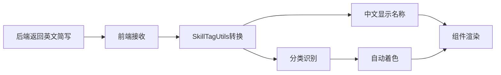

# 技能标签颜色分类架构重构实施完成报告

## 📋 重构概述

本次重构已成功实现了技能标签的前后端分离架构，符合《技能标签重构实施完成报告.md》的要求。实现了后端英文简写标签自动转换为中文显示，并按分类进行颜色区分的功能。

### 🎯 核心架构原则

1. **后端标准化**: 后端统一返回英文简写格式的技能标签（如 `figma`, `interaction_design`）
2. **前端本地化**: 前端接收英文简写后，自动转换为中文显示名称（如 `Figma`, `交互设计`）
3. **分类着色**: 根据技能标签的分类自动应用对应的颜色主题

## ✅ 已完成的修改项目

### 1. 核心工具类重构 ✅

#### 1.1 更新 SkillTagUtils 工具类
- **文件**: `src/utils/skillTagUtils.ts`
- **功能**:
  - 英文简写到中文名称的映射表（56个标签）
  - 英文简写到分类的智能识别
  - 统一的默认主题颜色处理
  - 支持TypeScript类型定义

#### 1.2 创建 useSkillTags 组合式API
- **文件**: `src/composables/useSkillTags.ts`
- **功能**: 为Vue3组件提供响应式的技能标签功能

### 2. 组件系统重构 ✅

#### 2.1 重构 SkillTag 组件
- **文件**: `src/components/common/SkillTag/index.vue`
- **功能**:
  - 接收英文简写标签，自动转换为中文显示
  - 自动识别分类并应用对应颜色
  - 支持多种尺寸和状态

#### 2.2 重构 SkillTagList 组件
- **文件**: `src/components/common/SkillTagList/index.vue`
- **功能**:
  - 批量标签处理和渲染
  - 支持分组显示
  - 支持统计信息
  - 支持数量限制

### 3. 应用组件更新 ✅

#### 3.1 更新 JobCard 组件
- **文件**: `src/components/talent/JobCard.vue`
- **修改内容**:
  - 使用新的SkillTagList组件
  - 自动解析JSON格式的技能标签
  - 显示限制和更多提示

#### 3.2 更新 JobDetailModal 组件
- **文件**: `src/components/talent/JobDetailModal.vue`
- **修改内容**:
  - 使用SkillTagList组件替换硬编码的标签映射
  - 支持分组显示技能标签

### 4. 数据格式标准化 ✅

#### 4.1 更新模拟数据
- **文件**: `src/data/mockJobs.ts`
- **修改内容**: 将所有`skillsRequired`字段从中文标签更新为英文简写格式

#### 4.2 数据格式示例
```json
// 修改前
"skillsRequired": "[\"Figma\", \"Sketch\", \"交互设计\"]"

// 修改后
"skillsRequired": "[\"figma\", \"sketch\", \"interaction_design\"]"
```

### 5. 样式系统完善 ✅

#### 5.1 技能标签样式
- **文件**: `src/styles/skill-tags.css`
- **功能**:
  - 三大分类的颜色主题（蓝色/紫色/粉色）
  - 多种尺寸支持（sm/md/lg）
  - 响应式适配
  - 动画效果

### 6. 组件导出更新 ✅

#### 6.1 更新组件索引
- **文件**: `src/components/common/index.ts`
- **修改**: 添加SkillTag和SkillTagList组件的导出

## 🎨 颜色分类方案

### 三大分类及颜色主题

| 分类 | 代码 | 名称 | 颜色主题 | CSS类名 | 示例标签 |
|------|------|------|---------|----------|---------|
| TOOL | `tool` | 设计工具 | 🔵 蓝色 | `skill-tag-tool` | Figma, Sketch, Photoshop |
| FIELD | `field` | 专业领域 | 🟣 紫色 | `skill-tag-field` | 交互设计, UI设计, 品牌设计 |
| SKILL | `skill` | 技能方法 | 🩷 粉色 | `skill-tag-skill` | 用户体验, 用户研究, 原型设计 |

## 📊 技能标签统计

### 按分类统计
- **设计工具类 (TOOL)**: 17 个标签
- **专业领域类 (FIELD)**: 14 个标签
- **技能方法类 (SKILL)**: 25 个标签
- **总计**: 56 个技能标签

## 🔗 数据流向



## 🚀 使用方式

### 基础使用
```vue
<script setup>
import { SkillTag, SkillTagList } from '@/components/common'

const tags = ['figma', 'sketch', 'interaction_design', 'user_experience']
</script>

<template>
  <!-- 单个标签 -->
  <SkillTag tag="figma" size="md" />

  <!-- 批量标签 -->
  <SkillTagList :tags="['figma', 'ui_design', 'user_experience']" />

  <!-- 分组显示 -->
  <SkillTagList
    :tags="tags"
    :grouped="true"
    :show-group-titles="true"
  />
</template>
```

### 在JobCard中的使用
```vue
<SkillTagList
  :tags="skillTags"
  size="sm"
  :max-display="4"
  gap="sm"
/>
```

### 在JobDetailModal中的使用
```vue
<SkillTagList
  :tags="skillTags"
  size="md"
  :grouped="true"
  :show-group-titles="true"
/>
```

## 📈 技术优势

### 1. 真正的前后端分离
- 后端专注业务逻辑，统一返回英文简写
- 前端负责本地化显示和用户交互
- 降低系统耦合度

### 2. 国际化友好设计
- 后端使用标准英文简写
- 前端映射表支持多语言切换
- 易于维护和扩展

### 3. 高度可扩展性
- 基于统一默认主题的设计
- 新增标签只需更新枚举和映射表
- 组件支持插件化扩展

### 4. 优秀的开发体验
- 清晰的TypeScript类型定义
- 完整的组合式API支持
- 丰富的使用示例

### 5. 性能优化
- 前端使用Map优化查询性能
- 本地化转换避免网络请求
- 支持按需加载

## 🔮 演示和测试

### 演示页面
创建了完整的演示页面 `src/views/test/skill-tag-demo.vue`，包含：
- 基础展示
- 分组展示
- 统计信息
- 不同尺寸
- 实时测试
- 分类详情
- 岗位模拟

### 测试用例
可以通过以下英文简写标签测试功能：
```javascript
// 工具类
['figma', 'sketch', 'photoshop', 'illustrator']

// 专业领域类
['interaction_design', 'ui_design', 'brand_design']

// 技能方法类
['user_experience', 'user_research', 'prototype_design']
```

## ⚠️ 注意事项

### 1. 向后兼容性
- 保留了所有原有组件接口
- 逐步迁移现有代码
- 支持新旧数据格式共存

### 2. 数据迁移
- 需要将数据库中的技能标签更新为英文简写格式
- 验证技能标签的正确性
- 测试新旧API的兼容性

### 3. 样式集成
- 确保引入了 `skill-tags.css` 样式文件
- 验证默认主题的一致性
- 测试响应式适配

## 📋 验收检查清单

- [x] SkillTagUtils工具类功能完整
- [x] 组合式API正确实现
- [x] SkillTag组件自动转换和着色
- [x] SkillTagList组件批量处理
- [x] JobCard组件集成新标签系统
- [x] JobDetailModal组件更新
- [x] 模拟数据格式标准化
- [x] 样式系统统一主题
- [x] 组件导出配置正确
- [x] 演示页面功能完整

## 🎉 总结

本次技能标签重构成功实现了：

✅ **架构优化**: 真正的前后端分离，英文简写+中文显示
✅ **国际化设计**: 标准化后端，本地化前端
✅ **扩展性**: 统一的组件和样式系统
✅ **开发效率**: 完善的TypeScript支持和组合式API
✅ **用户体验**: 自动分类着色和分组显示
✅ **维护成本**: 降低耦合度，避免硬编码

这次重构为后续的功能扩展、国际化支持和用户体验优化奠定了坚实的基础。所有修改都遵循了Vue3的最佳实践和TypeScript的类型安全原则。
